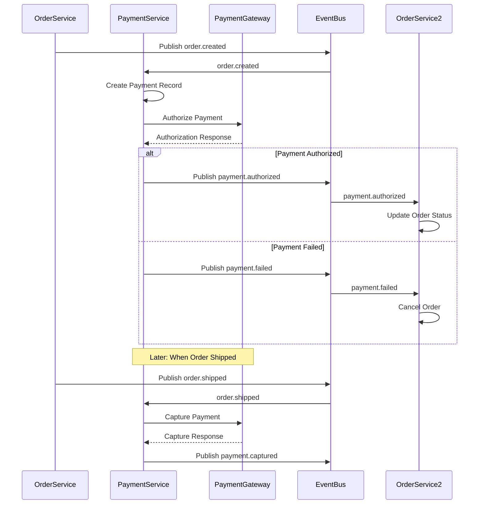
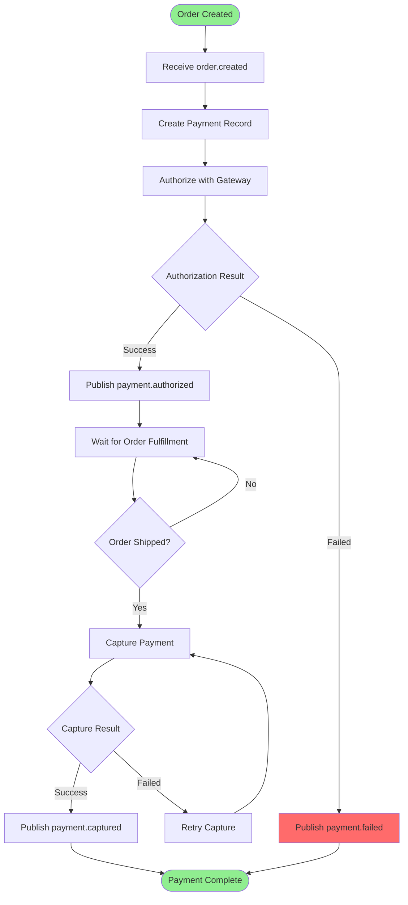

# Payment Processing Process

**Domain:** Payment (DDD)  
**Process ID:** `payment-processing`  
**Version:** `v1.0.0`  
**Last Updated:** 2025-11-17  
**Status:** Active

## Overview

### Business Context

The Payment Processing process handles payment authorization and capture for orders. This process integrates with external payment gateways (Stripe, PayPal) and manages payment transactions, refunds, and payment status updates.

### Success Criteria

- Payment is authorized successfully
- Payment is captured when order is fulfilled
- Payment status is tracked throughout order lifecycle
- Refunds are processed correctly
- Payment failures are handled gracefully

### Process Scope

**In Scope:**
- Payment authorization
- Payment capture
- Refund processing
- Payment status tracking
- Payment gateway integration

**Out of Scope:**
- Order creation (handled in Order Placement process)
- Order fulfillment (handled in Fulfillment process)

## Services Involved

| Service | Responsibility | Endpoints |
|---------|---------------|-----------|
| Payment Service | Payment processing | `POST /api/v1/payments/authorize`, `POST /api/v1/payments/capture` |
| Order Service | Order status updates | `PUT /api/v1/orders/{id}/status` |
| Gateway | Payment gateway webhooks | `POST /api/v1/payments/webhook` |

## Event Flow

### Event Sequence

| Step | Event Type | Topic | Publisher | Subscribers | Payload Schema |
|------|------------|-------|-----------|--------------|----------------|
| 1 | `order.order.created` | `order.created` | Order Service | Payment | [order.created.schema.json](../json-schema/order.created.schema.json) |
| 2 | `payment.payment.authorized` | `payment.authorized` | Payment Service | Order | [payment.authorized.schema.json](../json-schema/payment.authorized.schema.json) |
| 3 | `payment.payment.captured` | `payment.captured` | Payment Service | Order | [payment.captured.schema.json](../json-schema/payment.captured.schema.json) |
| 4 | `payment.payment.failed` | `payment.failed` | Payment Service | Order | [payment.failed.schema.json](../json-schema/payment.failed.schema.json) |

## Flow Charts

### Sequence Diagram

### Business Flow Diagram

## Detailed Flow

### Step 1: Payment Authorization

**Trigger:** `order.created` event received

**Actions:**
1. Create payment record
2. Authorize payment with gateway
3. Store authorization result
4. Publish `payment.authorized` or `payment.failed`

**Services:**
- Payment Service: Processes payment authorization

**Events:**
- Subscribes: `order.order.created`
- Publishes: `payment.payment.authorized` or `payment.payment.failed`

### Step 2: Payment Capture

**Trigger:** `order.shipped` event received

**Actions:**
1. Capture authorized payment
2. Update payment status
3. Publish `payment.captured`

**Services:**
- Payment Service: Captures payment

**Events:**
- Subscribes: `order.order.shipped`
- Publishes: `payment.payment.captured`

## Error Handling

### Failure Scenarios

| Scenario | Detection | Compensation | Retry Strategy |
|----------|-----------|--------------|----------------|
| Authorization fails | Gateway returns error | Publish `payment.failed`, cancel order | Retry 3 times with exponential backoff |
| Capture fails | Gateway returns error | Retry capture | Retry 5 times with exponential backoff |
| Gateway timeout | Request timeout | Retry request | Retry 3 times |

## Related Documentation

- [Payment Service Documentation](../services/payment-service.md)
- [Order Placement Process](./order-placement-process.md)
- [Refund Processing Process](./refund-processing-process.md)

