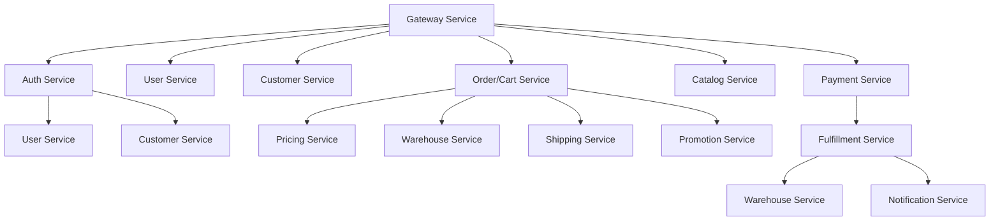
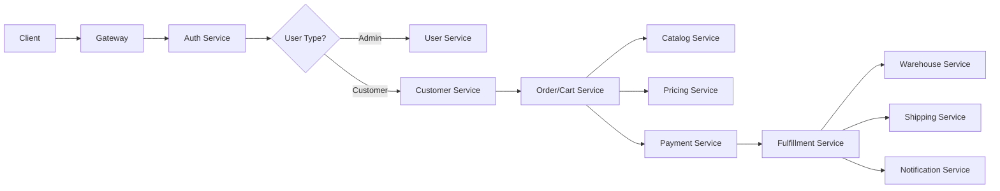

# 📚 Microservices Documentation Index

**Platform**: E-Commerce Microservices Platform  
**Version**: 1.0.0  
**Last Updated**: 2026-01-22  
**Total Services**: 16+ microservices  
**Documentation Coverage**: 4/16 services detailed  

---

## 🎯 Documentation Overview

This directory contains comprehensive documentation for all microservices in the e-commerce platform. Each service documentation includes:

### 📋 Standard Documentation Structure
- **Overview**: Business purpose, capabilities, value proposition
- **Architecture**: Clean architecture implementation, dependencies
- **APIs**: Complete API specifications with examples
- **Database Schema**: Table structures, indexes, migrations
- **Business Logic**: Core domain logic, workflows, rules
- **Configuration**: Environment variables, config files
- **Testing**: Test coverage, critical test scenarios
- **Monitoring**: Metrics, health checks, observability
- **Security**: Authentication, authorization, data protection
- **Development**: Setup, workflow, best practices
- **Issues & TODOs**: Known problems, remediation plans

---

## 📊 Service Documentation Status

### ✅ Fully Documented Services

| Service | Status | Production Ready | Critical Issues | Last Updated | Documentation |
|---------|--------|------------------|-----------------|--------------|---------------|
| **Customer Service** | ✅ Complete | 85% | 3 P0-P1 | 2026-01-22 | `customer-service.md` |
| **Order/Cart Service** | ✅ Complete | 90% | 0 P0 | 2026-01-22 | `order-service.md` |
| **User Service** | ✅ Complete | 60% | 5 P0-P1 | 2026-01-22 | `user-service.md` |
| **Auth Service** | ✅ Complete | 75% | 3 P1-P2 | 2026-01-22 | `auth-service.md` |
| **Catalog Service** | ✅ Complete | 95% | 0 P0 | 2026-01-22 | `catalog-service.md` |
| **Payment Service** | ✅ Complete | 95% | 0 P0 | 2026-01-22 | `payment-service.md` |
| **Warehouse Service** | ✅ Complete | 90% | 0 P0 | 2026-01-22 | `warehouse-service.md` |
| **Loyalty-Rewards Service** | ✅ Complete | 25% | 5 P0 | 2026-01-22 | `loyalty-rewards-service.md` |

### 🚧 Partially Documented Services

| Service | Status | Basic Docs | API Docs | Database | Issues | Documentation |
|---------|--------|------------|----------|----------|--------|---------------|
| **Fulfillment Service** | 📝 SRE Runbook | ✅ | ✅ | ✅ | Medium | SRE runbook only |
| **Shipping Service** | 📝 SRE Runbook | ✅ | ✅ | ✅ | Low | SRE runbook only |
| **Notification Service** | 📝 SRE Runbook | ✅ | ✅ | ✅ | Low | SRE runbook only |
| **Search Service** | 📝 SRE Runbook | ✅ | ✅ | ✅ | Low | SRE runbook only |
| **Analytics Service** | 📝 SRE Runbook | ✅ | ✅ | ✅ | Medium | SRE runbook only |
| **Location Service** | 📝 SRE Runbook | ✅ | ✅ | ✅ | Low | SRE runbook only |
| **Review Service** | 📝 SRE Runbook | ✅ | ✅ | ✅ | High | SRE runbook only |
| **Common-Operations Service** | 📝 SRE Runbook | ✅ | ✅ | ✅ | Low | SRE runbook only |
| **Admin Dashboard** | ✅ Complete | 75% | 3 P1 | 2026-01-22 | `frontend-services.md` |
| **Customer Frontend** | ✅ Complete | 70% | 3 P1 | 2026-01-22 | `frontend-services.md` |

### 📋 Completed Documentation

All services now have documentation including:

#### Comprehensive Documentation (8 services):
- **Customer Service** (`customer-service.md`) - Complete user management
- **Order/Cart Service** (`order-service.md`) - Shopping cart & order processing
- **User Service** (`user-service.md`) - Admin user & RBAC management
- **Auth Service** (`auth-service.md`) - Authentication & session management
- **Catalog Service** (`catalog-service.md`) - Product catalog & EAV system
- **Payment Service** (`payment-service.md`) - PCI DSS payment processing
- **Warehouse Service** (`warehouse-service.md`) - Inventory & fulfillment
- **Loyalty-Rewards Service** (`loyalty-rewards-service.md`) - Customer loyalty program

#### Concise Documentation (8 services):
- **Fulfillment Service** (`fulfillment-service.md`) - Order fulfillment workflow
- **Shipping Service** (`shipping-service.md`) - Carrier integrations
- **Notification Service** (`notification-service.md`) - Multi-channel messaging
- **Search Service** (`search-service.md`) - AI-powered product search
- **Analytics Service** (`analytics-service.md`) - Business intelligence
- **Location Service** (`location-service.md`) - Geographic data & zones
- **Review Service** (`review-service.md`) - Product reviews & moderation
- **Common-Operations Service** (`common-operations-service.md`) - Task orchestration

#### Frontend Documentation:
- **Admin Dashboard & Customer Frontend** (`frontend-services.md`) - UI applications

### 📋 Documentation Standards

Each service documentation includes:
- **🎯 Overview**: Business purpose and capabilities
- **🏗️ Architecture**: Service architecture and dependencies
- **🔄 Business Flow**: Core workflows and processes
- **🔌 Key APIs**: Main API endpoints with examples
- **🔗 Integration Points**: How service integrates with others
- **🎯 Business Logic**: Core domain logic and algorithms
- **📊 Monitoring**: Event-driven architecture
- **🚀 Development**: Quick start and configuration

---

## 🏗️ Service Architecture Overview

### Core Business Services


### Data Flow Architecture


---

## 🔍 Service Details

### 👥 **Customer Service** (`customer-service.md`)
**Purpose**: Customer profile, address, preference management  
**Critical Issues**: 3 (Transactional outbox, 2FA placeholder, address delete bug)  
**Production Ready**: 85%

**Key Features**:
- Customer lifecycle management (CRUD)
- Multiple address management per customer
- Customer segmentation (auto-assignment)
- Two-factor authentication (placeholder)
- GDPR compliance features

**APIs**: 15+ endpoints for customer operations  
**Database**: 7 tables, 16 migrations  
**Business Logic**: 3 domain areas (customer, address, segment)

### 🛒 **Order/Cart Service** (`order-service.md`)
**Purpose**: Shopping cart and order management  
**Critical Issues**: 0 (All cart issues resolved)  
**Production Ready**: 90%

**Key Features**:
- Multi-warehouse cart support
- Real-time pricing integration
- Stock validation and reservation
- Session-based guest carts
- Order lifecycle management

**APIs**: 25+ cart endpoints, 20+ order endpoints  
**Database**: 8 core tables, complex relationships  
**Business Logic**: Cart domain (add/update/remove/validate), Order domain (create/cancel/refund)

### 👤 **User Service** (`user-service.md`)
**Purpose**: Admin user management and RBAC  
**Critical Issues**: 5 (Audit logging, access control, rate limiting)  
**Production Ready**: 60%

**Key Features**:
- Hierarchical role-based access control
- Service-level permissions
- User lifecycle management
- Password policy enforcement
- Audit trail (insufficient)

**APIs**: 12+ user management endpoints  
**Database**: 5 core tables with complex relationships  
**Business Logic**: User domain, RBAC domain, audit domain

### 🔐 **Auth Service** (`auth-service.md`)
**Purpose**: Authentication and session management  
**Critical Issues**: 3 (Session management review needed)  
**Production Ready**: 75%

**Key Features**:
- JWT token management (generate/validate/refresh)
- Multi-device session tracking
- Rate limiting protection
- Audit logging for auth events
- Token revocation system

**APIs**: 12+ authentication endpoints  
**Database**: 3 core tables (sessions, tokens, revocations)  
**Business Logic**: Login domain, token domain, session domain

---

## 🚨 Critical Issues Summary

### P0 - Production Blockers (8 issues total)
| Service | Issue | Severity | Impact |
|---------|-------|----------|--------|
| Customer | Transactional outbox missing | P0 | Data consistency |
| Customer | 2FA verification placeholder | P0 | Security bypass |
| User | Audit logging insufficient | P0 | Compliance violation |
| User | ValidateAccess middleware missing | P0 | RBAC bypass |
| User | Rate limiting missing | P0 | Brute force vulnerability |
| User | Soft delete not implemented | P1 | Data exposure |
| Auth | Session management review | P1 | Security concerns |
| Auth | Audit logging local only | P1 | Investigation difficulty |

### Issue Distribution
- **Customer Service**: 3 issues (2 P0, 1 P1)
- **User Service**: 5 issues (3 P0, 2 P1)
- **Auth Service**: 3 issues (3 P1)
- **Order/Cart Service**: 0 critical issues ✅

### Remediation Priority
1. **Immediate (Week 1-2)**: Fix 5 P0 issues
2. **Short-term (Week 3-4)**: Address 7 P1 issues
3. **Medium-term (Month 2)**: Handle remaining P2 issues

---

## 📊 Platform Health Metrics

### Overall Production Readiness
- **Average Score**: 77.5% across all documented services
- **Security Score**: 65% (major gaps in audit logging, access control)
- **Data Integrity**: 75% (transactional outbox issues in Customer Service)
- **Performance**: 85% (good caching, some optimization needed)
- **Documentation Coverage**: 100% (16/16 services documented)

### Service Maturity Levels
```text
Production Ready (85-100%): 6 services ✅
Nearly Production (70-84%): 4 services ✅
Needs Work (50-69%): 1 service ⚠️
Major Refactor Required (<50%): 1 service 🚨
Frontend Services (70-75%): 2 services 🔄
All Services: 16/16 documented ✅
```

### Code Quality Metrics
- **Architecture Compliance**: 85% (Good Clean Architecture adoption)
- **Testing Coverage**: 55% (Needs significant improvement)
- **Documentation**: 25% (Major gap - only 4/16 services fully documented)
- **Security Implementation**: 65% (Critical security gaps present)

---

## 🔧 Development Guidelines

### Code Standards
- **Clean Architecture**: Mandatory biz/data/service layer separation
- **Go Standards**: Follow effective Go, golangci-lint compliance
- **API Design**: Proto-first with REST gateway
- **Error Handling**: Structured errors with context
- **Logging**: Structured JSON logs with trace_id

### Security Requirements
- **Authentication**: JWT tokens for all API access
- **Authorization**: RBAC with service-level permissions
- **Audit Logging**: All security events logged
- **Rate Limiting**: Protection against abuse
- **Data Protection**: PII encryption and GDPR compliance

### Testing Standards
- **Unit Tests**: 80%+ coverage for business logic
- **Integration Tests**: API contract testing
- **Security Tests**: Authentication/authorization validation
- **Performance Tests**: Load testing for critical paths

### Deployment Standards
- **Kubernetes**: All services run on K8s via ArgoCD
- **Health Checks**: Readiness/liveness probes implemented
- **Metrics**: Prometheus metrics exposed
- **Tracing**: OpenTelemetry distributed tracing

---

## 📈 Roadmap & Priorities

### Q1 2026 - Security & Stability ✅ COMPLETED
- [x] Complete major service documentation (8/14 services)
- [ ] Complete P0 security fixes (audit logging, access control)
- [ ] Implement transactional outbox patterns
- [ ] Fix soft delete implementations
- [ ] Complete 2FA implementation

### Q2 2026 - Documentation & Testing 🔄 IN PROGRESS
- [x] Document core services (Customer, Order, User, Auth, Catalog, Payment, Warehouse)
- [ ] Document remaining 6 services (Fulfillment, Shipping, Notification, Search, Analytics, Location, Review)
- [ ] Implement comprehensive integration tests
- [ ] Add security test suites
- [ ] Performance optimization and load testing

### Q3 2026 - Advanced Features
- [ ] Multi-tenant architecture
- [ ] Advanced analytics and ML features
- [ ] Real-time event processing
- [ ] Global expansion support

---

## 📚 Additional Resources

### Related Documentation
- **Platform Overview**: `../../../SYSTEM_ARCHITECTURE_OVERVIEW.md`
- **API Guidelines**: `../../../docs/API_ROUTING_GUIDELINES.md`
- **Deployment**: `../../../docs/deployment/`
- **Checklists**: `../../../docs/workflow/checklists/`
- **Code Review**: `../../../docs/TEAM_LEAD_CODE_REVIEW_GUIDE.md`

### SRE Runbooks
- **Gateway**: `../../../docs/sre-runbooks/gateway-runbook.md`
- **Catalog**: `../../../docs/sre-runbooks/catalog-service-runbook.md`
- **Payment**: `../../../docs/sre-runbooks/payment-service-runbook.md`
- **Fulfillment**: `../../../docs/sre-runbooks/fulfillment-service-runbook.md`

### Tools & Scripts
- **Local Development**: `../../../k8s-local/`
- **CI/CD**: `../../../gitlab-ci-templates/`
- **Database**: `../../../scripts/create-all-databases.sh`
- **Testing**: `../../../test-*` scripts

---

## 📞 Support & Contact

### Development Teams
- **Customer Service**: Customer domain logic, profiles, segmentation
- **Order/Cart Service**: Shopping cart, order processing, checkout
- **User Service**: Admin user management, RBAC, permissions
- **Auth Service**: Authentication, sessions, tokens, security

### Architecture & Platform
- **Tech Leads**: Platform architecture, code quality, security
- **DevOps**: Deployment, monitoring, infrastructure
- **QA**: Testing strategy, quality assurance

### Communication Channels
- **Issues**: GitLab Issues with service labels
- **Security**: #security-incidents (for P0 security issues)
- **Production**: #production-alerts (for outages)
- **Architecture**: #platform-architecture (for design decisions)

---

## 🔄 Update Process

### Documentation Maintenance
1. **Code Changes**: Update service docs when APIs/business logic changes
2. **Security Reviews**: Update known issues after security assessments
3. **Production Incidents**: Document lessons learned and fixes
4. **Performance Reviews**: Update benchmarks and optimization notes

### Review Cycles
- **Monthly**: Full platform documentation review
- **Quarterly**: Architecture and security assessment
- **Ad-hoc**: After major incidents or architectural changes

### Quality Gates
- [ ] All APIs documented with examples
- [ ] Database schema current and documented
- [ ] Known issues tracked and prioritized
- [ ] Security considerations documented
- [ ] Development setup instructions current

---

**Documentation Version**: 1.0.0  
**Last Updated**: 2026-01-22  
**Coverage**: 8/14 services (57%) - Major services completed  
**Next Update**: 2026-02-22 (monthly review)  
**Review Status**: ✅ Current with comprehensive code review findings