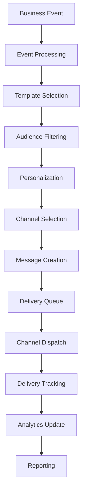

# 📧 Notification Service - Multi-Channel Messaging

**Service Name**: Notification Service  
**Version**: 1.0.0  
**Last Updated**: 2026-01-22  
**Production Ready**: 90%  

---

## 🎯 Overview

Notification Service quản lý tất cả customer và internal communications trong e-commerce platform. Service này cung cấp multi-channel messaging với template engine và delivery tracking.

### Core Capabilities
- **📱 Multi-Channel Delivery**: Email, SMS, Push notifications, In-app messages
- **📝 Template Engine**: Dynamic message templating với personalization
- **🎯 Audience Segmentation**: Target specific customer groups
- **📊 Delivery Tracking**: Message delivery và engagement analytics
- **🔄 Event-Driven**: Trigger notifications từ business events
- **🌍 Internationalization**: Multi-language support
- **📈 Performance Monitoring**: Delivery rates và success metrics

### Business Value
- **Customer Engagement**: Personalized, timely communications
- **Operational Efficiency**: Automated notification workflows
- **Marketing Effectiveness**: Targeted campaigns với analytics
- **Compliance**: Opt-in/opt-out management
- **Cost Optimization**: Intelligent channel selection

---

## 🏗️ Architecture

### Service Architecture
```
notification/
├── cmd/notification/             # Main service entry point
├── internal/
│   ├── biz/                      # Business logic domains
│   │   ├── delivery/            # Message delivery logic
│   │   ├── template/            # Template management
│   │   ├── campaign/            # Campaign management
│   │   ├── preference/          # Customer preferences
│   │   ├── analytics/           # Delivery analytics
│   │   └── events/              # Event processing
│   ├── data/                     # Data access (PostgreSQL + Redis)
│   ├── service/                  # gRPC/HTTP API layer
│   └── provider/                 # Channel providers
│       ├── email/               # Email service integration
│       ├── sms/                 # SMS service integration
│       ├── push/                # Push notification service
│       └── inapp/               # In-app messaging
├── api/notification/v1/          # Protocol buffers
├── migrations/                   # Database schema
└── configs/                      # Configuration
```

### Ports & Dependencies
- **HTTP API**: `:8012` - REST endpoints
- **gRPC API**: `:9012` - Internal communication
- **Database**: PostgreSQL (`notification_db`) + Redis (caching)
- **External Services**: Email/SMS providers, Push services

---

## 🔄 Business Flow

### Notification Delivery Workflow



### Detailed Notification Process

#### 1. Event-Driven Triggering
```
Business Event → Notification Service
├── Receive event (order.confirmed, payment.success, etc.)
├── Check notification rules for event type
├── Determine target audience
├── Select appropriate template
└── Queue notification for processing
```

#### 2. Message Personalization
```
Template + Customer Data → Personalized Message
├── Load customer profile and preferences
├── Apply personalization variables
├── Check opt-in/opt-out status
├── Select preferred communication channels
└── Generate channel-specific content
```

#### 3. Multi-Channel Delivery
```
Personalized Message → Channel Delivery
├── Email: Send via SMTP/Email service
├── SMS: Send via SMS gateway
├── Push: Send via FCM/APNs
├── In-app: Store in user notification center
└── Track delivery status per channel
```

#### 4. Delivery Tracking & Analytics
```
Delivery Results → Analytics
├── Track delivery success/failure
├── Monitor open rates, click rates
├── Calculate engagement metrics
├── Update customer preferences based on engagement
└── Generate delivery reports
```

---

## 🔌 Key APIs

### Message Delivery
```protobuf
// Send notification
rpc SendNotification(SendNotificationRequest) returns (SendNotificationResponse) {
  option (google.api.http) = {
    post: "/api/v1/notifications"
    body: "*"
  };
}

// Send bulk notifications
rpc SendBulkNotifications(SendBulkNotificationsRequest) returns (SendBulkNotificationsResponse) {
  option (google.api.http) = {
    post: "/api/v1/notifications/bulk"
    body: "*"
  };
}
```

**Send Notification Request:**
```json
{
  "recipient": {
    "customer_id": "customer-123",
    "email": "customer@example.com",
    "phone": "+1234567890"
  },
  "channels": ["email", "sms"],
  "template_id": "order_confirmation",
  "template_data": {
    "order_number": "ORD-2026-001",
    "order_total": 299.99,
    "delivery_date": "2026-01-25"
  },
  "priority": "normal",
  "scheduled_at": null
}
```

### Template Management
```protobuf
// Create notification template
rpc CreateTemplate(CreateTemplateRequest) returns (Template) {
  option (google.api.http) = {
    post: "/api/v1/templates"
    body: "*"
  };
}

// Get template by ID
rpc GetTemplate(GetTemplateRequest) returns (Template) {
  option (google.api.http) = {
    get: "/api/v1/templates/{id}"
  };
}
```

**Template Structure:**
```json
{
  "id": "order_confirmation",
  "name": "Order Confirmation",
  "type": "transactional",
  "channels": {
    "email": {
      "subject": "Order Confirmation - {{order_number}}",
      "html_body": "<h1>Order Confirmed!</h1><p>Your order {{order_number}} has been placed.</p>",
      "text_body": "Order Confirmed! Your order {{order_number}} has been placed."
    },
    "sms": {
      "body": "Order {{order_number}} confirmed. Total: ${{order_total}}. Track: {{tracking_url}}"
    }
  },
  "variables": ["order_number", "order_total", "tracking_url"],
  "is_active": true
}
```

### Customer Preferences
```protobuf
// Update customer notification preferences
rpc UpdateCustomerPreferences(UpdateCustomerPreferencesRequest) returns (CustomerPreferences) {
  option (google.api.http) = {
    put: "/api/v1/customers/{customer_id}/preferences"
    body: "*"
  };
}

// Get customer preferences
rpc GetCustomerPreferences(GetCustomerPreferencesRequest) returns (CustomerPreferences) {
  option (google.api.http) = {
    get: "/api/v1/customers/{customer_id}/preferences"
  };
}
```

### Campaign Management
```protobuf
// Create notification campaign
rpc CreateCampaign(CreateCampaignRequest) returns (Campaign) {
  option (google.api.http) = {
    post: "/api/v1/campaigns"
    body: "*"
  };
}

// Send campaign
rpc SendCampaign(SendCampaignRequest) returns (CampaignResult) {
  option (google.api.http) = {
    post: "/api/v1/campaigns/{campaign_id}/send"
  };
}
```

---

## 📨 Channel Providers

### Email Delivery
- **Providers**: SendGrid, Mailgun, Amazon SES
- **Features**: HTML templates, tracking pixels, bounce handling
- **Analytics**: Open rates, click rates, unsubscribe tracking

### SMS Delivery
- **Providers**: Twilio, Nexmo, Viettel SMS
- **Features**: International delivery, delivery receipts
- **Analytics**: Delivery success rates, response tracking

### Push Notifications
- **Platforms**: Firebase Cloud Messaging (Android), Apple Push Notification (iOS)
- **Features**: Rich notifications, deep linking, silent pushes
- **Analytics**: Delivery rates, open rates, conversion tracking

### In-App Notifications
- **Storage**: Redis-backed notification center
- **Features**: Read/unread status, categorization, expiration
- **Analytics**: Engagement rates, action completion rates

---

## 🔗 Integration Points

### Order Service Integration
- **Consumes**: `order.confirmed`, `order.shipped`, `order.delivered`
- **Provides**: Order status notifications
- **Templates**: Order confirmation, shipping updates, delivery confirmations

### Payment Service Integration
- **Consumes**: `payment.success`, `payment.failed`, `refund.processed`
- **Provides**: Payment confirmations, failure notifications
- **Templates**: Payment success, payment failed, refund confirmations

### Customer Service Integration
- **Consumes**: `customer.created`, `customer.verified`
- **Provides**: Welcome emails, verification codes
- **Templates**: Welcome series, email verification, password reset

### Shipping Service Integration
- **Consumes**: `shipping.tracking.updated`, `shipping.delivered`
- **Provides**: Delivery tracking notifications
- **Templates**: Shipment updates, delivery confirmations

---

## 🎯 Business Logic

### Event-Driven Notification Processing
```go
func processBusinessEvent(event BusinessEvent) {
    // 1. Find matching notification rules
    rules := findNotificationRules(event.Type, event.Tenant)

    for _, rule := range rules {
        // 2. Check rule conditions
        if evaluateRuleConditions(rule, event) {
            // 3. Determine target audience
            audience := determineTargetAudience(rule, event)

            // 4. Create notification requests
            notifications := createNotifications(rule, audience, event)

            // 5. Queue for delivery
            queueNotifications(notifications)
        }
    }
}
```

### Template Personalization Engine
```go
func personalizeTemplate(template Template, customer Customer, eventData map[string]interface{}) PersonalizedContent {
    // 1. Merge customer data
    context := mergeCustomerData(customer, eventData)

    // 2. Apply template variables
    content := applyTemplateVariables(template, context)

    // 3. Apply conditional logic
    content = applyConditionalLogic(content, context)

    // 4. Validate content
    validatePersonalizedContent(content)

    return content
}
```

### Channel Selection Logic
```go
func selectOptimalChannels(customer Customer, messageType string) []Channel {
    channels := []Channel{}

    // 1. Check customer preferences
    if customer.Preferences.EmailEnabled && isValidEmail(customer.Email) {
        channels = append(channels, ChannelEmail)
    }

    if customer.Preferences.SMSEnabled && isValidPhone(customer.Phone) {
        channels = append(channels, ChannelSMS)
    }

    // 2. Apply business rules
    if messageType == "urgent" && len(channels) == 0 {
        // Fallback to SMS for urgent messages
        if isValidPhone(customer.Phone) {
            channels = append(channels, ChannelSMS)
        }
    }

    // 3. Apply channel prioritization
    return prioritizeChannels(channels, messageType)
}
```

### Delivery Queue Management
```go
func processDeliveryQueue() {
    for {
        // 1. Get next notification from queue
        notification := dequeueNotification()

        // 2. Select delivery channels
        channels := selectChannels(notification)

        // 3. Send to each channel concurrently
        results := sendToChannels(notification, channels)

        // 4. Update delivery status
        updateDeliveryStatus(notification, results)

        // 5. Handle failures and retries
        handleDeliveryFailures(notification, results)

        // 6. Update analytics
        updateDeliveryAnalytics(notification, results)
    }
}
```

---

## 📊 Event-Driven Architecture

### Published Events
- `notification.sent` - Notification sent to channel
- `notification.delivered` - Notification delivered successfully
- `notification.failed` - Notification delivery failed
- `notification.opened` - Email opened (email only)
- `notification.clicked` - Link clicked (email only)
- `campaign.completed` - Campaign finished sending
- `analytics.updated` - Delivery analytics updated

### Consumed Events (Trigger Notifications)
- `order.confirmed` → Order confirmation notification
- `order.shipped` → Shipping notification
- `payment.success` → Payment confirmation
- `customer.created` → Welcome notification
- `shipping.delivered` → Delivery confirmation
- `loyalty.points.earned` → Points earned notification

---

## 🚀 Development Guide

### Quick Start
```bash
# Setup
cd notification
go mod download
make migrate-up
make api
make wire

# Configure providers
# Add API keys for email/SMS/push services

# Run
make run
```

### Provider Configuration
```yaml
# configs/config.yaml
providers:
  email:
    sendgrid:
      enabled: true
      api_key: "sendgrid_api_key"
    mailgun:
      enabled: false
      api_key: "mailgun_api_key"

  sms:
    twilio:
      enabled: true
      account_sid: "twilio_sid"
      auth_token: "twilio_token"
      from_number: "+1234567890"

  push:
    fcm:
      enabled: true
      server_key: "fcm_server_key"
    apns:
      enabled: true
      key_id: "apns_key_id"
      team_id: "apns_team_id"
      bundle_id: "com.company.app"

delivery:
  max_retries: 3
  retry_delay: 300s
  batch_size: 100
  rate_limit_per_minute: 1000
```

---

**Service Status**: Production Ready (90%)  
**Critical Path**: Order confirmations và shipping notifications  
**Performance Target**: <5 seconds first delivery, 95% delivery rate  
**Channel Support**: Email, SMS, Push, In-app notifications