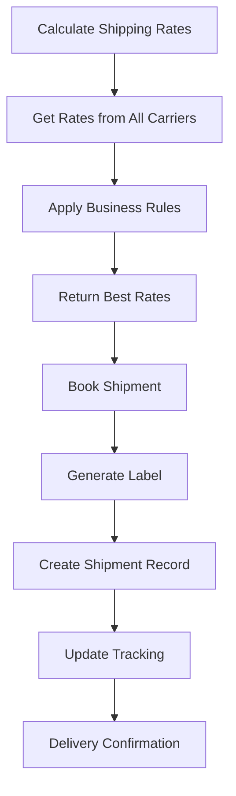

# 📦 Shipping Service - Carrier Integrations & Logistics

**Service Name**: Shipping Service  
**Version**: 1.0.0  
**Last Updated**: 2026-01-22  
**Production Ready**: 90%  

---

## 🎯 Overview

Shipping Service quản lý tất cả carrier integrations và shipment logistics trong e-commerce platform. Service này cung cấp rate shopping, label generation, và real-time tracking cho multiple shipping carriers.

### Core Capabilities
- **🚛 Multi-Carrier Integration**: Giao Hàng Nhanh (GHN), Grab, VNPay Shipping, MoMo
- **💰 Rate Shopping**: Best rate selection across carriers
- **🏷️ Label Generation**: Automated shipping label creation
- **📍 Tracking Integration**: Real-time shipment tracking
- **📊 Performance Analytics**: Carrier performance metrics
- **🔄 Return Shipping**: Reverse logistics support
- **🌍 International Shipping**: Global carrier support

### Business Value
- **Cost Optimization**: Best rate selection reduces shipping costs
- **Customer Experience**: Real-time tracking và delivery updates
- **Operational Efficiency**: Automated label generation và carrier communication
- **Scalability**: Support multiple carriers và international expansion

---

## 🏗️ Architecture

### Service Architecture
```
shipping/
├── cmd/shipping/                 # Main service entry point
├── internal/
│   ├── biz/                      # Business logic domains
│   │   ├── carrier/              # Carrier integrations
│   │   │   ├── ghn/             # GHN integration
│   │   │   ├── grab/            # Grab integration
│   │   │   ├── vnpay/           # VNPay integration
│   │   │   └── momo/            # MoMo integration
│   │   ├── shipment/             # Shipment management
│   │   ├── rate/                 # Rate calculation
│   │   └── tracking/             # Tracking integration
│   ├── data/                     # Data access (PostgreSQL)
│   ├── service/                  # gRPC/HTTP API layer
│   └── client/                   # External carrier APIs
├── api/shipping/v1/              # Protocol buffers
├── migrations/                   # Database schema
└── configs/                      # Configuration
```

### Ports & Dependencies
- **HTTP API**: `:8010` - REST endpoints
- **gRPC API**: `:9010` - Internal communication
- **Database**: PostgreSQL (`shipping_db`)
- **External APIs**: GHN, Grab, VNPay, MoMo carrier APIs

---

## 🔄 Business Flow

### Shipping Rate & Booking Workflow



### Detailed Shipping Process

#### 1. Rate Calculation
```
Client → Shipping Service
├── Receive rate request (origin, destination, weight, dimensions)
├── Query all configured carriers in parallel
├── Apply business rules (markup, minimum rates, carrier preferences)
├── Return sorted rates by cost/delivery time
└── Cache rates for future requests
```

#### 2. Shipment Booking
```
Rate Selected → Carrier Booking
├── Validate shipment details
├── Book with selected carrier API
├── Generate tracking number
├── Create shipping label
└── Return booking confirmation
```

#### 3. Tracking Updates
```
Carrier Webhooks → Shipping Service
├── Receive tracking updates from carriers
├── Parse and standardize tracking data
├── Update shipment status in database
├── Publish tracking events
└── Notify relevant services (Order, Fulfillment, Customer)
```

#### 4. Delivery & Returns
```
Package Delivered → Post-Delivery
├── Confirm delivery with carrier
├── Update shipment status
├── Trigger return window if needed
├── Process return shipping if applicable
└── Generate delivery analytics
```

---

## 🔌 Key APIs

### Rate Management
```protobuf
// Calculate shipping rates
rpc CalculateRates(CalculateRatesRequest) returns (CalculateRatesResponse) {
  option (google.api.http) = {
    post: "/api/v1/shipping/rates"
    body: "*"
  };
}

// Get carrier rates
rpc GetCarrierRates(GetCarrierRatesRequest) returns (GetCarrierRatesResponse) {
  option (google.api.http) = {
    get: "/api/v1/shipping/carriers/{carrier_id}/rates"
  };
}
```

**Rate Calculation Request:**
```json
{
  "origin": {
    "address": "123 Warehouse St, HCMC",
    "postal_code": "700000",
    "country_code": "VN"
  },
  "destination": {
    "address": "456 Customer Ave, HCMC",
    "postal_code": "700000",
    "country_code": "VN"
  },
  "package": {
    "weight_kg": 2.5,
    "length_cm": 30,
    "width_cm": 20,
    "height_cm": 10
  },
  "service_type": "standard"
}
```

### Shipment Management
```protobuf
// Book shipment
rpc BookShipment(BookShipmentRequest) returns (BookShipmentResponse) {
  option (google.api.http) = {
    post: "/api/v1/shipping/shipments"
    body: "*"
  };
}

// Get shipment details
rpc GetShipment(GetShipmentRequest) returns (Shipment) {
  option (google.api.http) = {
    get: "/api/v1/shipping/shipments/{id}"
  };
}

// Update shipment tracking
rpc UpdateTracking(UpdateTrackingRequest) returns (Shipment) {
  option (google.api.http) = {
    put: "/api/v1/shipping/shipments/{id}/tracking"
    body: "*"
  };
}
```

### Carrier Integration
```protobuf
// List available carriers
rpc ListCarriers(ListCarriersRequest) returns (ListCarriersResponse) {
  option (google.api.http) = {
    get: "/api/v1/shipping/carriers"
  };
}

// Get carrier capabilities
rpc GetCarrierCapabilities(GetCarrierCapabilitiesRequest) returns (CarrierCapabilities) {
  option (google.api.http) = {
    get: "/api/v1/shipping/carriers/{id}/capabilities"
  };
}
```

---

## 🚛 Carrier Integrations

### Supported Carriers

#### Giao Hàng Nhanh (GHN)
- **Coverage**: Vietnam nationwide
- **Services**: Standard, Express, COD
- **APIs**: Rate calculation, booking, tracking, webhooks
- **Features**: Real-time tracking, COD support

#### Grab
- **Coverage**: Southeast Asia
- **Services**: Same-day, next-day delivery
- **APIs**: Rate calculation, booking, tracking
- **Features**: Fast delivery, mobile-first experience

#### VNPay Shipping
- **Coverage**: Vietnam
- **Services**: Standard shipping, integrated payments
- **APIs**: Rate calculation, booking, tracking
- **Features**: Payment integration, COD support

#### MoMo Logistics
- **Coverage**: Vietnam
- **Services**: Express delivery, same-day
- **APIs**: Rate calculation, booking, tracking
- **Features**: Fast delivery, MoMo payment integration

### Carrier Selection Logic
```go
func selectOptimalCarrier(request ShippingRequest) Carrier {
    // 1. Filter carriers by coverage area
    availableCarriers := filterByCoverage(request.Origin, request.Destination)

    // 2. Get rates from all available carriers
    rates := getRatesFromCarriers(availableCarriers, request)

    // 3. Apply business rules
    scoredRates := applyBusinessRules(rates, request)

    // 4. Return best rate based on strategy
    return selectBestRate(scoredRates, strategy)
}
```

### Business Rules Engine
```go
type ShippingRules struct {
    // Cost optimization
    MaxCostThreshold float64
    PreferredCarriers []string

    // Service level requirements
    MaxDeliveryDays int
    RequiredTracking bool

    // Geographic preferences
    RegionalPreferences map[string]string

    // Business constraints
    MinMarkupPercentage float64
    MaxMarkupPercentage float64
}
```

---

## 🔗 Integration Points

### Fulfillment Service Integration
- **Consumes**: `fulfillment.packed` events
- **Provides**: Shipping rate options, booking confirmations
- **Data Flow**: Packing complete → Rate selection → Shipment booking → Label generation

### Order Service Integration
- **Consumes**: `order.shipped` updates
- **Provides**: Tracking information, delivery confirmations
- **Data Flow**: Shipment created → Tracking updates → Delivery status

### Customer Service Integration
- **Provides**: Delivery tracking information
- **Events**: Shipment updates, delivery confirmations
- **Data Flow**: Tracking updates → Customer notifications

### Notification Service Integration
- **Provides**: Shipping status notifications
- **Events**: Shipment created, in transit, out for delivery, delivered
- **Templates**: SMS tracking updates, email delivery confirmations

---

## 🎯 Business Logic

### Rate Shopping Algorithm
```go
func calculateShippingRates(request ShippingRequest) []ShippingRate {
    // 1. Validate request parameters
    validateShippingRequest(request)

    // 2. Get carrier rates in parallel
    carrierRates := getAllCarrierRates(request)

    // 3. Apply business markup and constraints
    businessRates := applyBusinessRules(carrierRates)

    // 4. Filter and sort by preferences
    filteredRates := filterAndSortRates(businessRates, request.Preferences)

    // 5. Cache results for future requests
    cacheRates(request, filteredRates)

    return filteredRates
}
```

### Shipment Booking Process
```go
func bookShipment(carrier Carrier, shipment ShipmentRequest) Shipment {
    // 1. Validate shipment data
    validateShipmentRequest(shipment)

    // 2. Create shipment record in database
    dbShipment := createShipmentRecord(shipment, carrier)

    // 3. Book with carrier API
    carrierBooking := carrier.BookShipment(shipment)

    // 4. Update shipment with carrier details
    updateShipmentWithBooking(dbShipment, carrierBooking)

    // 5. Generate shipping label
    label := generateShippingLabel(carrierBooking)

    // 6. Publish shipment events
    publishShipmentEvents(dbShipment)

    return dbShipment
}
```

### Tracking Update Processing
```go
func processTrackingUpdate(carrier string, trackingData TrackingUpdate) {
    // 1. Parse carrier-specific tracking data
    standardizedUpdate := standardizeTrackingData(carrier, trackingData)

    // 2. Find shipment in database
    shipment := findShipmentByTrackingNumber(standardizedUpdate.TrackingNumber)

    // 3. Update shipment status
    updateShipmentStatus(shipment, standardizedUpdate)

    // 4. Handle status-specific logic
    handleStatusSpecificLogic(shipment, standardizedUpdate.Status)

    // 5. Publish tracking events
    publishTrackingEvents(shipment, standardizedUpdate)

    // 6. Send notifications if needed
    sendStatusNotifications(shipment, standardizedUpdate)
}
```

---

## 📊 Event-Driven Architecture

### Published Events
- `shipping.rates.calculated` - Shipping rates calculated
- `shipping.shipment.booked` - Shipment booked with carrier
- `shipping.label.generated` - Shipping label created
- `shipping.tracking.updated` - Tracking information updated
- `shipping.delivered` - Package delivered to customer
- `shipping.delivery.failed` - Delivery attempt failed
- `shipping.return.initiated` - Return shipment initiated

### Consumed Events
- `fulfillment.packed` - Trigger shipment booking
- `order.cancelled` - Cancel shipment if applicable
- `customer.address.changed` - Update delivery address

---

## 🚀 Development Guide

### Quick Start
```bash
# Setup
cd shipping
go mod download
make migrate-up
make api
make wire

# Configure carriers
# Add API keys for GHN, Grab, VNPay, MoMo

# Run
make run
```

### Carrier Configuration
```yaml
# configs/config.yaml
carriers:
  ghn:
    enabled: true
    api_key: "ghn_api_key"
    api_secret: "ghn_api_secret"
    sandbox: false

  grab:
    enabled: true
    client_id: "grab_client_id"
    client_secret: "grab_client_secret"

  vnpay:
    enabled: true
    partner_code: "vnpay_partner"
    access_key: "vnpay_access_key"

shipping_rules:
  max_delivery_days: 7
  preferred_carriers: ["ghn", "grab"]
  markup_percentage: 10.0
```

---

**Service Status**: Production Ready (90%)  
**Critical Path**: Shipping rate calculation và booking  
**Performance Target**: <2 seconds rate calculation, <5 seconds booking  
**Carrier Coverage**: 4 major carriers (Vietnam focus)