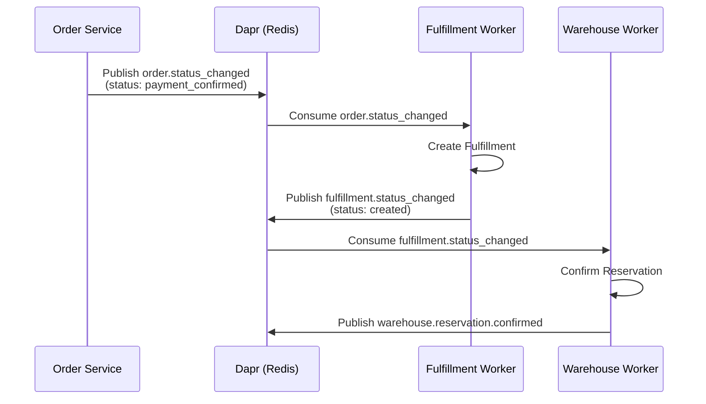
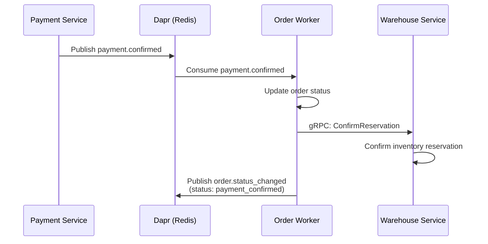

# Dapr Event-Driven Architecture - Overview

## Architecture Overview

Our microservices platform uses **Dapr (Distributed Application Runtime)** for event-driven communication between services. This document provides a comprehensive review of the Dapr and eventbus configuration across the Fulfillment, Order, and Warehouse services.

## Core Components

### 1. Dapr Pub/Sub Component

**Location**: [`/dapr/components/pubsub-redis.yaml`](file:///home/user/microservices/dapr/components/pubsub-redis.yaml)

```yaml
apiVersion: dapr.io/v1alpha1
kind: Component
metadata:
  name: pubsub-redis
spec:
  type: pubsub.redis
  version: v1
  metadata:
    - name: redisHost
      value: redis:6379
    - name: maxRetries
      value: "3"
    - name: redeliverInterval
      value: "60s"
    - name: processingTimeout
      value: "60s"
```

**Key Configuration:**
- **Component Name**: `pubsub-redis` (used across all services)
- **Transport**: Redis Pub/Sub
- **Retry Policy**: 3 max retries with 60s redelivery interval
- **Processing Timeout**: 60s per message

### 2. Common Eventbus Client

**Location**: [`/common/utils/eventbus/client.go`](file:///home/user/microservices/common/utils/eventbus/client.go)

The common eventbus package provides a shared abstraction over Dapr's gRPC SDK:

```go
type Client interface {
    AddConsumer(topic, pubsub string, fn ConsumeFn) error
    Start() error
}
```

**Key Features:**
- **Port**: gRPC server listens on `:5005` (standard across all workers)
- **CloudEvents Support**: Automatically handles CloudEvents envelope unwrapping
- **Flexible Payload Handling**: Supports `[]byte`, `string`, and `map[string]interface{}`
- **Retry Logic**: Returns `retry=true` on handler errors
- **Auto-routing**: Creates route as `/{topic}` for each subscription

## Worker Architecture Pattern

All three services (Fulfillment, Order, Warehouse) follow a consistent worker pattern:

### Worker Modes

Each worker supports 3 modes via `-mode` flag:

| Mode    | Description | Use Case |
|---------|-------------|----------|
| `cron`  | Only runs scheduled background jobs | Order COD auto-confirm, warehouse stock detection |
| `event` | Only runs Dapr event consumers | Real-time event processing |
| `all`   | Runs both cron jobs and event consumers | Production deployments |

### Common Worker Structure

```
cmd/worker/
├── main.go          # Entry point, mode selection, signal handling
└── wire.go          # Dependency injection, consumer registration
```

**Startup Flow:**
1. Parse config and worker mode flag
2. Initialize dependencies via Wire
3. Filter workers based on mode
4. Start eventbus gRPC server (once)
5. Register event subscriptions
6. Wait for shutdown signal
7. Graceful shutdown

---

## Service-Specific Details

### 1. Fulfillment Service

[📄 Full documentation](file:///home/user/microservices/docs/workfllow/fulfillment-service-dapr.md)

**Worker Mode**: `event` (default)

**Event Consumers:**
- `orders.order.status_changed` → Trigger fulfillment creation
- `picklist.status_changed` → Update picklist status

**Event Publishers:**
- `fulfillment.status_changed` → Notify order/warehouse of fulfillment updates
- `picklist.status_changed` → Notify warehouse of picklist updates
- `package.status_changed` → Notify shipping service

**Dapr Configuration:**
- **App ID (API)**: `fulfillment-service`
- **App ID (Worker)**: `fulfillment-worker`
- **Port (API)**: HTTP 8010
- **Port (Worker)**: gRPC 5005

---

### 2. Order Service

[📄 Full documentation](file:///home/user/microservices/docs/workfllow/order-service-dapr.md)

**Worker Mode**: `cron` (default) or `all`

**Event Consumers:**
- `payment.confirmed` → Update order to payment_confirmed, confirm warehouse reservations
- `payment.failed` → Update order to payment_failed, release warehouse reservations

**Event Publishers:**
- `orders.order.status_changed` → Notify fulfillment/warehouse of order status changes
- `order.return.*` → Return request events
- `order.exchange.*` → Exchange request events

**Cron Jobs:**
- Session cleanup (every 1h)
- Cart cleanup (every 1h)
- Order cleanup (every 1h)
- Reservation cleanup (every 30m)
- COD auto-confirm (every 5m)

**Dapr Configuration:**
- **App ID (API)**: `order-service`
- **App ID (Worker)**: `order-worker`
- **Port (API)**: HTTP 8000
- **Port (Worker)**: gRPC 5005

---

### 3. Warehouse Service

[📄 Full documentation](file:///home/user/microservices/docs/workfllow/warehouse-service-dapr.md)

**Worker Mode**: `all` (default)

**Event Consumers:**
- `orders.order.status_changed` → Create/release inventory reservations
- `product.created` → Initialize inventory for new products
- `fulfillment.status_changed` → Adjust inventory on fulfillment
- `return.completed` → Restore inventory on returns

**Event Publishers:**
- `warehouse.inventory.updated` → Notify catalog of stock changes
- `warehouse.reservation.*` → Reservation lifecycle events

**Cron Jobs:**
- Stock change detector (every 5m)
- Alert cleanup (daily)
- Daily summary report (daily)
- Weekly report (weekly)
- Reservation expiry worker (every 1m)
- Reservation warning worker (every 5m)

**Dapr Configuration:**
- **App ID (API)**: `warehouse-service`
- **App ID (Worker)**: `warehouse-worker`
- **Port (API)**: HTTP 8003
- **Port (Worker)**: gRPC 5005

---

## Event Flow Diagrams

### Order → Fulfillment → Warehouse Flow



### Payment → Order → Warehouse Flow



---

## Kubernetes Deployment Configuration

All workers are deployed as separate Kubernetes Deployments with Dapr sidecar injection.

### Common Dapr Annotations (Worker Pods)

```yaml
annotations:
  dapr.io/enabled: "true"
  dapr.io/app-id: "{service-name}-worker"
  dapr.io/app-port: "5005"
  dapr.io/app-protocol: "grpc"
```

### Init Containers

All workers wait for infrastructure readiness:

```yaml
initContainers:
  - name: wait-for-consul
  - name: wait-for-redis  
  - name: wait-for-postgres
```

### Worker Resource Allocation

| Service | CPU Request | Memory Request | CPU Limit | Memory Limit |
|---------|-------------|----------------|-----------|--------------|
| Fulfillment Worker | 200m | 256Mi | 500m | 512Mi |
| Order Worker | 100m | 128Mi | 200m | 256Mi |
| Warehouse Worker | 200m | 256Mi | 500m | 512Mi |

---

## Best Practices

### 1. Consumer Implementation

✅ **DO:**
- Use `commonEventbus.Client` from `/common/utils/eventbus`
- Return errors to trigger Dapr retry
- Use `log.WithContext(ctx)` for tracing
- Decode envelope data with `json.NewDecoder`
- Use Observer pattern for domain event handling

❌ **DON'T:**
- Don't create multiple gRPC servers (one per worker)
- Don't block the handler (process async if heavy)
- Don't swallow errors silently

### 2. Publisher Implementation

✅ **DO:**
- Use `DaprGRPCClient` with retry logic
- Publish to standardized topic names (e.g., `{service}.{entity}.{action}`)
- Include `event_type`, `timestamp`, and `metadata` fields
- Wrap in CloudEvents envelope for compatibility

❌ **DON'T:**
- Don't publish to arbitrary topic names
- Don't publish without retry logic
- Don't forget to log publish errors

### 3. Worker Deployment

✅ **DO:**
- Use separate `-worker` deployment
- Set appropriate worker mode via args
- Configure Dapr sidecar with correct app-id
- Add init containers for infrastructure readiness
- Use `revisionHistoryLimit: 1` to save resources

❌ **DON'T:**
- Don't run event consumers in API pods
- Don't forget Dapr annotations
- Don't use the same app-id for API and worker

---

## Troubleshooting

### Common Issues

#### 1. Events Not Consumed

**Symptoms**: Published events don't trigger handlers

**Checks**:
```bash
# Check if worker pod is running
kubectl get pods -l app.kubernetes.io/component=worker

# Check Dapr sidecar logs
kubectl logs <worker-pod> -c daprd

# Check worker logs
kubectl logs <worker-pod> -c worker

# Verify subscription
kubectl exec <worker-pod> -c daprd -- wget -qO- http://localhost:3500/dapr/subscribe
```

**Common Causes**:
- Dapr sidecar not injected (missing annotations)
- Wrong pubsub name in code vs component
- Topic name mismatch
- Port 5005 not exposed correctly

#### 2. Events Retrying Forever

**Symptoms**: Same event consumed repeatedly

**Checks**:
```bash
# Check Redis for pending messages
kubectl exec -it redis-0 -n infrastructure -- redis-cli
> KEYS *
> HGETALL dapr:pubsub:pubsub-redis:{topic}
```

**Common Causes**:
- Handler returning error without fixing issue
- Database deadlock or timeout
- Missing idempotency check

#### 3. Worker Not Starting

**Symptoms**: Worker pod crash loop or stuck in init

**Checks**:
```bash
# Check init container logs
kubectl logs <worker-pod> -c wait-for-redis
kubectl logs <worker-pod> -c wait-for-postgres

# Check worker startup logs
kubectl logs <worker-pod> -c worker
```

**Common Causes**:
- Infrastructure not ready (Consul, Redis, Postgres)
- Missing database credentials
- Config file not mounted
- Wire dependency injection failure

---

## Related Documentation

- [Event-Driven Architecture ADR](file:///home/user/microservices/docs/adr/ADR-001-event-driven-architecture.md)
- [Fulfillment Service Documentation](file:///home/user/microservices/docs/workfllow/fulfillment-service-dapr.md)
- [Order Service Documentation](file:///home/user/microservices/docs/workfllow/order-service-dapr.md)
- [Warehouse Service Documentation](file:///home/user/microservices/docs/workfllow/warehouse-service-dapr.md)
- [Event Contract Template](file:///home/user/microservices/docs/templates/event-contract-template.md)

---

## Appendix: Topic Naming Convention

All event topics follow this convention:

```
{source-service}.{entity}.{action}
```

**Examples**:
- `orders.order.status_changed`
- `fulfillment.picklist.status_changed`
- `warehouse.inventory.updated`
- `payment.confirmed`
- `payment.failed`

Special topics:
- `system.error` - System-wide errors
- `{service}.qc.performed` - Quality control events
