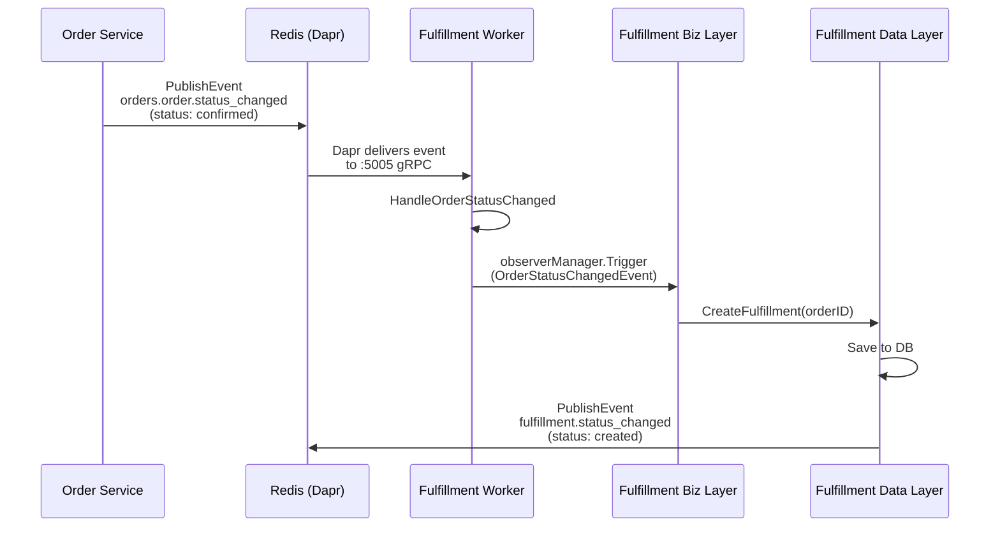
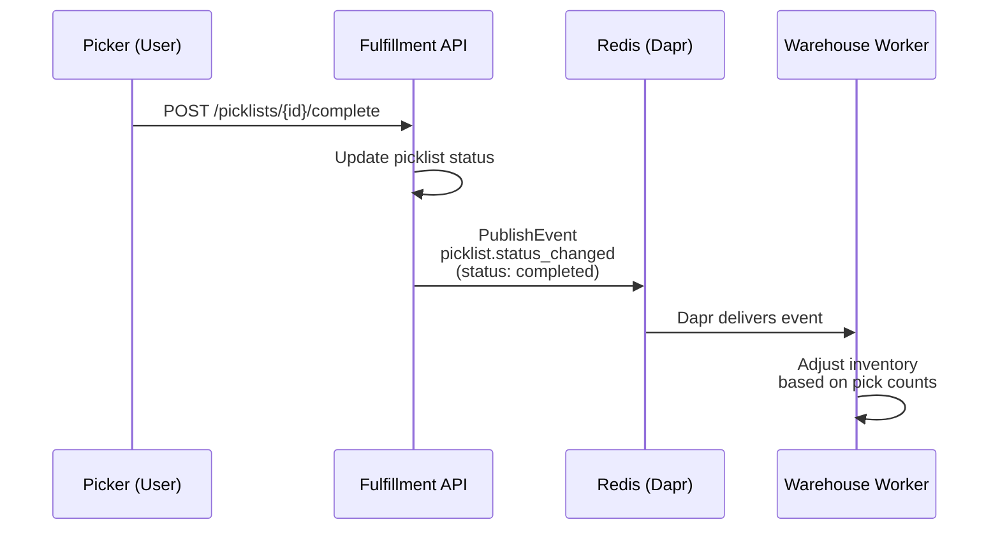

# Fulfillment Service - Dapr & Event Configuration

## Service Overview

The Fulfillment Service manages the order fulfillment process including picklist creation, package preparation, and quality control. It uses Dapr for event-driven communication with Order and Warehouse services.

## Worker Configuration

### Entry Point

**File**: [`cmd/worker/main.go`](file:///home/user/microservices/fulfillment/cmd/worker/main.go)

```go
Name: "fulfillment-worker"
Version: "v1.0.0"
DefaultMode: "event"  // Only event consumers, no cron jobs
```

### Worker Modes

| Mode | Components | Use Case |
|------|------------|----------|
| `event` | Order status consumer<br/>Picklist status consumer | Production (default) |
| `cron` | _(None currently)_ | N/A |
| `all` | All event consumers | Alternative mode |

### Dependency Injection

**File**: [`cmd/worker/wire.go`](file:///home/user/microservices/fulfillment/cmd/worker/wire.go)

**Provider Sets**:
```go
observerCommon.NewManager        // Observer pattern manager
events.ProviderSet               // Dapr gRPC client & publisher
dataPkg.ProviderSet             // Eventbus client & consumers
biz.ProviderSet                 // Business logic layer
observerPkg.ProviderSet         // Event subscriber registration
```

**Workers Created**:
1. `eventbusServerWorker` - Starts gRPC server on :5005
2. `orderStatusConsumerWorker` - Subscribes to order status events
3. `picklistStatusConsumerWorker` - Subscribes to picklist status events

> **Pattern**: Single gRPC server, multiple consumers that only register subscriptions

---

## Event Consumers

### 1. Order Status Changed Consumer

**File**: [`internal/data/eventbus/order_status_consumer.go`](file:///home/user/microservices/fulfillment/internal/data/eventbus/order_status_consumer.go)

**Topic**: `orders.order.status_changed` (from config)

**Config Path**:
```yaml
data:
  eventbus:
    topic:
      order_status_changed: orders.order.status_changed
```

**Handler Flow**:
```
1. Consume event from Dapr
2. Decode OrderStatusChangedEvent
3. Trigger observer event: constants.OrderStatusChangedEvent
4. Observer creates fulfillment if status = "confirmed" or "payment_confirmed"
```

**Event Schema**:
```go
type OrderStatusChangedEvent struct {
    OrderID    string
    NewStatus  string
    OldStatus  string
    Timestamp  time.Time
}
```

**Subscription Registration**:
```go
return c.AddConsumer(
    topic,                           // orders.order.status_changed
    pubsub,                          // pubsub-redis
    c.HandleOrderStatusChanged,      // Handler function
)
```

**Observer Integration**:
```go
c.observerManager.Trigger(ctx, constants.OrderStatusChangedEvent, eventData)
```

This triggers registered observers in [`internal/observer/`](file:///home/user/microservices/fulfillment/internal/observer/) which handle:
- Fulfillment creation
- Status validation
- Business logic execution

---

### 2. Picklist Status Changed Consumer

**File**: [`internal/data/eventbus/picklist_status_consumer.go`](file:///home/user/microservices/fulfillment/internal/data/eventbus/picklist_status_consumer.go)

**Topic**: Configured per deployment (typically `picklist.status_changed`)

**Handler Flow**:
```
1. Consume event from Dapr
2. Decode PicklistStatusChangedEvent
3. Trigger observer event
4. Update picklist status in database
```

---

## Event Publishers

### Dapr gRPC Client

**File**: [`internal/events/dapr_grpc_client.go`](file:///home/user/microservices/fulfillment/internal/events/dapr_grpc_client.go)

**Configuration**:
```go
DaprGRPCAddress: "localhost:50001"  // Dapr sidecar gRPC port
MaxRetries: 3
RetryDelay: 1s
PublishTimeout: 5s
```

**Retry Logic**:
```go
for attempt := 1; attempt <= maxRetries; attempt++ {
    err = daprClient.PublishEvent(attemptCtx, pubsubName, topic, dataBytes)
    if err == nil {
        return nil
    }
    time.Sleep(retryDelay * time.Duration(attempt))
}
```

### Event Publisher

**File**: [`internal/events/publisher.go`](file:///home/user/microservices/fulfillment/internal/events/publisher.go)

#### 1. Fulfillment Status Changed

**Topic**: `fulfillment.status_changed` (from constants)

**Published When**:
- Fulfillment created
- Fulfillment status updated
- Fulfillment completed/cancelled

**Event Schema**:
```go
type FulfillmentStatusChangedEvent struct {
    EventType      string                 `json:"event_type"`
    FulfillmentID  string                 `json:"fulfillment_id"`
    OrderID        string                 `json:"order_id"`
    OldStatus      string                 `json:"old_status"`
    NewStatus      string                 `json:"new_status"`
    Timestamp      time.Time              `json:"timestamp"`
    Metadata       map[string]interface{} `json:"metadata,omitempty"`
}
```

**Usage**:
```go
err := p.PublishFulfillmentStatusChanged(ctx, &FulfillmentStatusChangedEvent{
    FulfillmentID: "F123",
    OrderID: "O456",
    NewStatus: "picking_in_progress",
    OldStatus: "created",
    Timestamp: time.Now(),
})
```

#### 2. Picklist Status Changed

**Topic**: `picklist.status_changed`

**Published When**:
- Picklist created
- Picklist assigned to picker
- Picklist completed

**Event Schema**:
```go
type PicklistStatusChangedEvent struct {
    EventType      string                 `json:"event_type"`
    PicklistID     string                 `json:"picklist_id"`
    FulfillmentID  string                 `json:"fulfillment_id"`
    OldStatus      string                 `json:"old_status"`
    NewStatus      string                 `json:"new_status"`
    AssignedTo     *string                `json:"assigned_to,omitempty"`
    Timestamp      time.Time              `json:"timestamp"`
}
```

#### 3. Package Status Changed

**Topic**: `package.status_changed`

**Published When**:
- Package prepared
- Package shipped
- Package delivered

**Consumers**: Shipping Service

---

## Dapr Configuration

### API Deployment Annotations

```yaml
podAnnotations:
  dapr.io/enabled: "true"
  dapr.io/app-id: "fulfillment-service"
  dapr.io/app-port: "8010"
  dapr.io/app-protocol: "http"
```

### Worker Deployment Annotations

**File**: [`argocd/applications/fulfillment-service/values.yaml`](file:///home/user/microservices/argocd/applications/fulfillment-service/values.yaml#L159-L163)

```yaml
worker:
  podAnnotations:
    dapr.io/enabled: "true"
    dapr.io/app-id: "fulfillment-worker"
    dapr.io/app-port: "5005"
    dapr.io/app-protocol: "grpc"
```

**Key Points**:
- ✅ Different app-id for worker (`fulfillment-worker` vs `fulfillment-service`)
- ✅ gRPC protocol for event consumption
- ✅ Port 5005 for eventbus gRPC server

---

## Kubernetes Deployment

### Worker Deployment

**File**: [`argocd/applications/fulfillment-service/templates/worker-deployment.yaml`](file:///home/user/microservices/argocd/applications/fulfillment-service/templates/worker-deployment.yaml)

**Command**:
```bash
/app/bin/worker -conf /app/configs
```

**Environment Variables**:
```yaml
env:
  - name: WORKER_MODE
    value: "true"
  - name: ENABLE_CRON
    value: "true"
  - name: ENABLE_CONSUMER
    value: "true"
  - name: DATABASE_URL
    valueFrom:
      secretKeyRef:
        name: fulfillment-service
        key: database-url
```

**Init Containers**:
```yaml
- name: wait-for-consul
- name: wait-for-redis
- name: wait-for-postgres
```

**Resources**:
```yaml
resources:
  requests:
    cpu: 200m
    memory: 256Mi
  limits:
    cpu: 500m
    memory: 512Mi
```

---

## Configuration File

**File**: `/app/configs/config.yaml` (mounted from ConfigMap)

```yaml
server:
  http:
    addr: :8010
  grpc:
    addr: :9010

data:
  eventbus:
    default_pubsub: pubsub-redis
    topic:
      order_status_changed: orders.order.status_changed

fulfillment:
  default_priority: 5
  picklist_expiry_hours: 24
  enable_batch_processing: true

external_services:
  catalog_service:
    grpc_endpoint: catalog-service-core-business.core-business.svc.cluster.local:81
  notification_service:
    endpoint: http://notification-service-support-services.support-services.svc.cluster.local:80
```

---

## Event Flow Diagrams

### Order Confirmed → Fulfillment Created



### Picklist Completed → Notify Warehouse



---

## Observer Pattern

The fulfillment service uses the **Observer pattern** to decouple event handling from business logic.

### Observer Registration

**File**: [`internal/observer/provider.go`](file:///home/user/microservices/fulfillment/internal/observer/)

```go
func RegisterObservers(
    manager observerCommon.Manager,
    fulfillmentUc *biz.FulfillmentUsecase,
) {
    // Register order status changed observer
    manager.Subscribe(
        constants.OrderStatusChangedEvent,
        NewOrderStatusObserver(fulfillmentUc),
    )
}
```

### Observer Implementation

```go
type OrderStatusObserver struct {
    fulfillmentUc *biz.FulfillmentUsecase
}

func (o *OrderStatusObserver) Update(ctx context.Context, data interface{}) error {
    event := data.(OrderStatusChangedEvent)
    
    if event.NewStatus == "confirmed" {
        return o.fulfillmentUc.CreateFulfillmentForOrder(ctx, event.OrderID)
    }
    
    return nil
}
```

---

## Troubleshooting

### Worker Not Consuming Events

**Check Dapr subscription**:
```bash
kubectl exec fulfillment-worker-xxx -c daprd -- \
  wget -qO- http://localhost:3500/dapr/subscribe
```

**Expected Output**:
```json
[
  {
    "pubsubname": "pubsub-redis",
    "topic": "orders.order.status_changed",
    "route": "/orders.order.status_changed"
  }
]
```

### Events Not Being Published

**Check Dapr sidecar logs**:
```bash
kubectl logs fulfillment-service-xxx -c daprd
```

**Check for**:
- Connection to Redis
- Publish success/failure
- Component initialization errors

### Database Connection Issues

**Check worker logs**:
```bash
kubectl logs fulfillment-worker-xxx -c worker | grep -i database
```

**Common Issues**:
- Missing `DATABASE_URL` secret
- Incorrect database credentials
- PostgreSQL not ready (init container failed)

---

## Best Practices

### ✅ DO

1. **Use Observer Pattern** for domain event handling
2. **Retry Failed Events** by returning errors in handlers
3. **Log Event Processing** with context and event IDs
4. **Validate Event Schemas** before processing
5. **Use Separate Worker Deployment** with different app-id

### ❌ DON'T

1. **Don't Process Heavy Logic Synchronously** in event handlers
2. **Don't Share app-id** between API and worker deployments
3. **Don't Ignore Event Processing Errors** - let Dapr retry
4. **Don't Create Multiple gRPC Servers** - use one per worker
5. **Don't Forget Idempotency** - events may be delivered multiple times

---

## Related Files

### Code

- **Worker Entry**: [`cmd/worker/main.go`](file:///home/user/microservices/fulfillment/cmd/worker/main.go)
- **Wire DI**: [`cmd/worker/wire.go`](file:///home/user/microservices/fulfillment/cmd/worker/wire.go)
- **Event Publisher**: [`internal/events/publisher.go`](file:///home/user/microservices/fulfillment/internal/events/publisher.go)
- **Dapr Client**: [`internal/events/dapr_grpc_client.go`](file:///home/user/microservices/fulfillment/internal/events/dapr_grpc_client.go)
- **Order Consumer**: [`internal/data/eventbus/order_status_consumer.go`](file:///home/user/microservices/fulfillment/internal/data/eventbus/order_status_consumer.go)

### Configuration

- **Worker Deployment**: [`argocd/applications/fulfillment-service/templates/worker-deployment.yaml`](file:///home/user/microservices/argocd/applications/fulfillment-service/templates/worker-deployment.yaml)
- **Values**: [`argocd/applications/fulfillment-service/values.yaml`](file:///home/user/microservices/argocd/applications/fulfillment-service/values.yaml)
- **Dapr Component**: [`dapr/components/pubsub-redis.yaml`](file:///home/user/microservices/dapr/components/pubsub-redis.yaml)

### Documentation

- [Overview](file:///home/user/microservices/docs/workfllow/dapr-event-architecture-overview.md)
- [Order Service](file:///home/user/microservices/docs/workfllow/order-service-dapr.md)
- [Warehouse Service](file:///home/user/microservices/docs/workfllow/warehouse-service-dapr.md)
