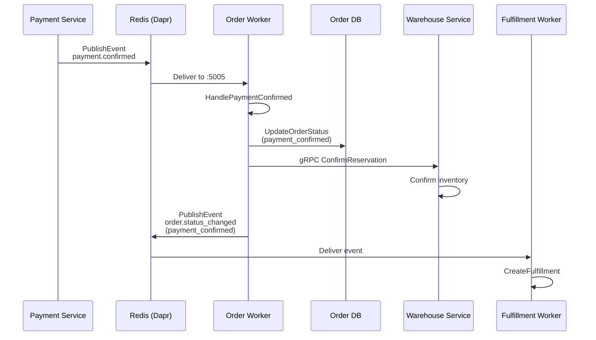
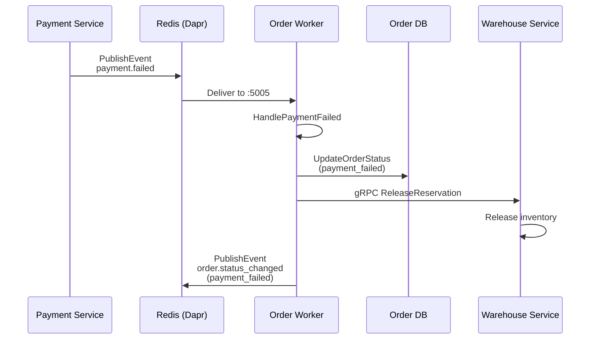
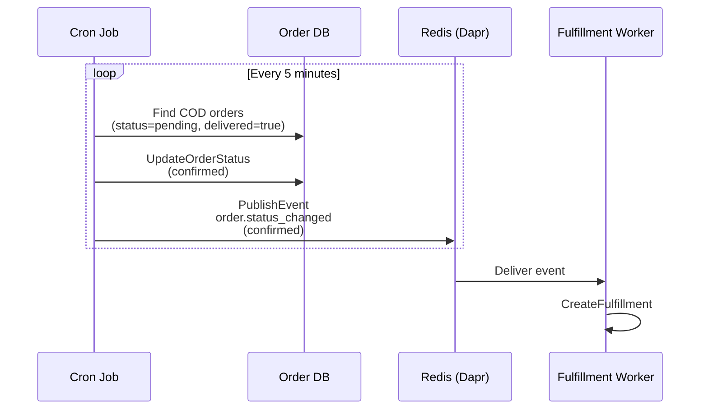

# Order Service - Dapr & Event Configuration

## Service Overview

The Order Service manages the complete order lifecycle from creation to completion. It uses both **cron jobs** for scheduled tasks and **Dapr event consumers** for real-time payment event processing.

## Worker Configuration

### Entry Point

**File**: [`cmd/worker/main.go`](file:///home/user/microservices/order/cmd/worker/main.go)

```go
Name: "order-worker"
Version: "v1.0.0"
DefaultMode: "cron"  // Default mode runs only background jobs
```

### Worker Modes

| Mode | Components | Use Case |
|------|------------|----------|
| `cron` | Session/Cart/Order<br/>cleanup jobs<br/>COD auto-confirm | Background processing (default) |
| `event` | Payment event<br/>consumers | Real-time payment processing |
| `all` | Cron jobs +<br/>Event consumers | **Production (recommended)** |

**Deployment Configuration**:
```yaml
# argocd/applications/order-service/values.yaml
worker:
  args:
    - "-mode"
    - "all"  # ← Production uses "all" mode
```

### Dependency Injection

**File**: [`cmd/worker/wire.go`](file:///home/user/microservices/order/cmd/worker/wire.go)

**Two Wire Functions**:

1. **wireJobManager** - For cron mode only
   ```go
   func wireJobManager(
       appConfig *config.AppConfig,
       logger log.Logger,
   ) (*server.JobManager, func(), error)
   ```

2. **wireWorkers** - For event/all modes
   ```go
   func wireWorkers(
       appConfig *config.AppConfig,
       logger log.Logger,
   ) (*WorkerManager, func(), error)
   ```

**WorkerManager Structure**:
```go
type WorkerManager struct {
    jobManager      *server.JobManager          // Cron jobs
    eventbusClient  eventbus.Client            // gRPC server
    paymentConsumer eventbus.PaymentConsumer    // Event handlers
    logger          *log.Helper
}
```

---

## Cron Jobs

All cron jobs are managed by `JobManager` in [`internal/server/job_manager.go`](file:///home/user/microservices/order/internal/server/).

### Job Schedule

| Job Name | Schedule | Purpose | Handler |
|----------|----------|---------|---------|
| **Session Cleanup** | Every 1 hour | Delete expired sessions (>24h old) | `CleanupExpiredSessions` |
| **Cart Cleanup** | Every 1 hour | Delete abandoned carts (>7 days old) | `CleanupAbandonedCarts` |
| **Order Cleanup** | Every 1 hour | Cancel pending orders (>24h old) | `CleanupExpiredOrders` |
| **Reservation Cleanup** | Every 30 minutes | Release expired warehouse reservations | `CleanupExpiredReservations` |
| **COD Auto Confirm** | Every 5 minutes | Auto-confirm COD orders after delivery | `CODAutoConfirmJob` |

### Cron Configuration

**File**: [`internal/server/job_manager.go`](file:///home/user/microservices/order/internal/server/)

```go
cronSchedules := map[string]string{
    "session_cleanup":      "0 * * * *",        // Every hour
    "cart_cleanup":         "0 * * * *",        // Every hour
    "order_cleanup":        "0 * * * *",        // Every hour
    "reservation_cleanup":  "*/30 * * * *",     // Every 30 min
    "cod_auto_confirm":     "*/5 * * * *",      // Every 5 min
}
```

### Example: COD Auto-Confirm Job

**Purpose**: Automatically move COD orders from `pending` to `confirmed` status after successful delivery verification.

**Flow**:
```
1. Find orders with status=pending AND payment_method=COD AND delivered=true
2. Update status to confirmed
3. Publish order.status_changed event
4. Trigger fulfillment creation
```

**Why Important**: COD orders need manual confirmation before fulfillment starts. This job automates the process after delivery proof is received.

---

## Event Consumers

### Payment Event Consumer

**File**: [`internal/data/eventbus/payment_consumer.go`](file:///home/user/microservices/order/internal/data/eventbus/payment_consumer.go)

#### 1. Payment Confirmed Consumer

**Topic**: `payment.confirmed`

**Event Schema**:
```go
type PaymentConfirmedEvent struct {
    EventType   string                 `json:"event_type"`
    PaymentID   string                 `json:"payment_id"`
    OrderID     string                 `json:"order_id"`
    OrderNumber string                 `json:"order_number,omitempty"`
    Amount      float64                `json:"amount"`
    Currency    string                 `json:"currency"`
    Status      string                 `json:"status"`
    Timestamp   time.Time              `json:"timestamp"`
    Metadata    map[string]interface{} `json:"metadata,omitempty"`
}
```

**Handler Flow**:
```
1. Decode PaymentConfirmedEvent
2. Update order status to "payment_confirmed"
3. Confirm warehouse reservations for all order items
4. Publish order.status_changed event
```

**Code**:
```go
func (c PaymentConsumer) processPaymentConfirmed(ctx context.Context, event *PaymentConfirmedEvent) error {
    // 1. Update order status
    _, err := c.orderUc.UpdateOrderStatus(ctx, &order_biz.UpdateOrderStatusRequest{
        OrderID: event.OrderID,
        Status:  "payment_confirmed",
        Reason:  "Payment confirmed",
        Notes:   fmt.Sprintf("Payment ID: %s", event.PaymentID),
    })
    
    // 2. Confirm warehouse reservations
    if err := c.confirmWarehouseReservations(ctx, event.OrderID); err != nil {
        c.log.Warnf("Failed to confirm reservations: %v", err)
    }
    
    return nil
}
```

**Warehouse Integration**:
```go
func (c PaymentConsumer) confirmWarehouseReservations(ctx context.Context, orderID string) error {
    order, err := c.orderUc.GetOrder(ctx, orderID)
    
    for _, item := range order.Items {
        if item.ReservationID != nil {
            c.warehouseClient.ConfirmReservation(ctx, *item.ReservationID)
        }
    }
}
```

#### 2. Payment Failed Consumer

**Topic**: `payment.failed`

**Event Schema**:
```go
type PaymentFailedEvent struct {
    EventType     string                 `json:"event_type"`
    PaymentID     string                 `json:"payment_id"`
    OrderID       string                 `json:"order_id"`
    OrderNumber   string                 `json:"order_number,omitempty"`
    Amount        float64                `json:"amount"`
    Currency      string                 `json:"currency"`
    FailureReason string                 `json:"failure_reason"`
    Timestamp     time.Time              `json:"timestamp"`
}
```

**Handler Flow**:
```
1. Decode PaymentFailedEvent
2. Update order status to "payment_failed"
3. Release warehouse reservations
4. Publish order.status_changed event
```

**Code**:
```go
func (c PaymentConsumer) processPaymentFailed(ctx context.Context, event *PaymentFailedEvent) error {
    // 1. Update order status
    _, err := c.orderUc.UpdateOrderStatus(ctx, &order_biz.UpdateOrderStatusRequest{
        OrderID: event.OrderID,
        Status:  "payment_failed",
        Reason:  fmt.Sprintf("Payment failed: %s", event.FailureReason),
    })
    
    // 2. Release warehouse reservations
    if err := c.releaseWarehouseReservations(ctx, event.OrderID); err != nil {
        c.log.Warnf("Failed to release reservations: %v", err)
    }
    
    return nil
}
```

---

## Event Publishers

### Event Publisher Implementation

**File**: [`internal/events/publisher.go`](file:///home/user/microservices/order/internal/events/publisher.go)

**Interface**:
```go
type EventPublisher interface {
    PublishEvent(ctx context.Context, topic string, event interface{}) error
    PublishOrderStatusChanged(ctx context.Context, event *OrderStatusChangedEvent) error
    // ... other publish methods
}
```

#### 1. Order Status Changed

**Topic**: `orders.order.status_changed` (from constants)

**Event Schema**:
```go
type OrderStatusChangedEvent struct {
    EventType   string    `json:"event_type"`
    OrderID     string    `json:"order_id"`
    OrderNumber string    `json:"order_number"`
    OldStatus   string    `json:"old_status"`
    NewStatus   string    `json:"new_status"`
    Timestamp   time.Time `json:"timestamp"`
    UserID      string    `json:"user_id,omitempty"`
    Reason      string    `json:"reason,omitempty"`
}
```

**Published When**:
- Order created (`pending`)
- Payment confirmed (`payment_confirmed`)
- Order confirmed (`confirmed`)
- Order shipped (`shipped`)
- Order delivered (`delivered`)
- Order cancelled (`cancelled`)

**Consumers**:
- **Fulfillment Service** - Creates fulfillment when status = `confirmed`
- **Warehouse Service** - Manages inventory reservations
- **Notification Service** - Sends customer notifications

#### 2. Return Events

**Topics**:
- `order.return.requested`
- `order.return.approved`
- `order.return.rejected`
- `order.return.completed`

**Consumers**: Warehouse Service (inventory adjustment)

#### 3. Exchange Events

**Topics**:
- `order.exchange.requested`
- `order.exchange.approved`
- `order.exchange.completed`

---

## Dapr Configuration

### API Deployment Annotations

```yaml
podAnnotations:
  dapr.io/enabled: "true"
  dapr.io/app-id: "order-service"
  dapr.io/app-port: "8000"
  dapr.io/app-protocol: "http"
```

### Worker Deployment Annotations

**File**: [`argocd/applications/order-service/values.yaml`](file:///home/user/microservices/argocd/applications/order-service/values.yaml#L171-L175)

```yaml
worker:
  podAnnotations:
    dapr.io/enabled: "true"
    dapr.io/app-id: "order-worker"
    dapr.io/app-port: "5005"
    dapr.io/app-protocol: "grpc"
```

**Key Points**:
- ✅ Unique app-id (`order-worker` ≠ `order-service`)
- ✅ gRPC protocol for event consumption
- ✅ Port 5005 for eventbus gRPC server

---

## Kubernetes Deployment

### Worker Deployment

**File**: [`argocd/applications/order-service/templates/worker-deployment.yaml`](file:///home/user/microservices/argocd/applications/order-service/templates/worker-deployment.yaml)

**Command**:
```bash
/app/bin/worker -conf /app/configs/config.yaml -mode all
```

**Environment Variables**:
```yaml
env:
  # Database
  - name: DATABASE_URL
    valueFrom:
      secretKeyRef:
        name: order-service
        key: database-url
  
  # Service Discovery
  - name: REDIS_ADDR
    value: redis.infrastructure.svc.cluster.local:6379
  - name: CONSUL_ADDR
    value: consul.infrastructure.svc.cluster.local:8500
  
  # External Services
  - name: ORDER_EXTERNALSERVICES_WAREHOUSESERVICE_GRPCENDPOINT
    value: warehouse-service:81
```

**Resources**:
```yaml
resources:
  requests:
    cpu: 100m
    memory: 128Mi
  limits:
    cpu: 200m
    memory: 256Mi
```

---

## Event Flow Diagrams

### Payment Confirmed Flow



### Payment Failed Flow



### COD Auto-Confirm Flow



---

## Configuration File

**File**: `/app/configs/config.yaml` (mounted from ConfigMap)

```yaml
server:
  http:
    addr: :8000
  grpc:
    addr: :9000

data:
  database:
    driver: postgres
  redis:
    addr: redis.infrastructure.svc.cluster.local:6379
    db: 0

business:
  order:
    max_items_per_order: 50
    order_timeout_minutes: 30
    auto_cancel_minutes: 1440
  payment:
    timeout_minutes: 15
  inventory:
    reservation_timeout_minutes: 30

external_services:
  warehouse_service:
    grpc_endpoint: warehouse-service:81
  payment_service:
    endpoint: http://payment-service:80
```

---

## Troubleshooting

### Cron Jobs Not Running

**Check JobManager logs**:
```bash
kubectl logs order-worker-xxx -c worker | grep -i "cron\|job"
```

**Expected Output**:
```
Starting cron jobs...
Registered job: session_cleanup (0 * * * *)
Registered job: cart_cleanup (0 * * * *)
Registered job: cod_auto_confirm (*/5 * * * *)
```

**Common Issues**:
- Worker started in `event` mode instead of `all`
- Database connection failure
- Missing cron schedule configuration

### Payment Events Not Consumed

**Check Dapr subscription**:
```bash
kubectl exec order-worker-xxx -c daprd -- \
  wget -qO- http://localhost:3500/dapr/subscribe
```

**Expected Output**:
```json
[
  {
    "pubsubname": "pubsub-redis",
    "topic": "payment.confirmed",
    "route": "/payment.confirmed"
  },
  {
    "pubsubname": "pubsub-redis",
    "topic": "payment.failed",
    "route": "/payment.failed"
  }
]
```

**Common Issues**:
- Worker not running in `event` or `all` mode
- Dapr sidecar not injected
- Redis pub/sub component not loaded

### Warehouse Reservation Errors

**Check worker logs** for failed gRPC calls:
```bash
kubectl logs order-worker-xxx -c worker | grep -i "reservation\|warehouse"
```

**Common Issues**:
- Incorrect warehouse service endpoint
- Network policy blocking gRPC traffic
- Warehouse service unavailable

---

## Best Practices

### ✅ DO

1. **Run in "all" Mode in Production** - Both cron jobs and events
2. **Handle gRPC Errors Gracefully** - Log warnings, don't fail event
3. **Idempotent Event Handlers** - Events may be delivered multiple times
4. **Monitor Cron Job Execution** - Use metrics/logging
5. **Set Appropriate Timeouts** - For warehouse gRPC calls

### ❌ DON'T

1. **Don't Block Event Handlers** - Keep handlers fast
2. **Don't Fail Events on External Service Errors** - Log and continue
3. **Don't Share Database Connections** - Each worker has its own pool
4. **Don't Forget to Clean Up Resources** - Expired sessions, carts, orders
5. **Don't Hard-code Service Endpoints** - Use environment variables

---

## Monitoring

### Key Metrics to Track

1. **Cron Job Execution**:
   - Jobs executed per hour
   - Items cleaned up (sessions, carts, orders)
   - Job execution duration

2. **Event Processing**:
   - Payment events consumed/failed
   - Warehouse reservation success rate
   - Event processing latency

3. **System Health**:
   - Worker restarts
   - Database connection pool usage
   - Redis connection status

### Logging Best Practices

**✅ Good Logging**:
```go
c.log.WithContext(ctx).Infof(
    "Processing payment confirmed: payment_id=%s, order_id=%s, amount=%.2f",
    event.PaymentID, event.OrderID, event.Amount,
)
```

**❌ Poor Logging**:
```go
log.Println("Processing payment")  // Missing context, details
```

---

## Related Files

### Code

- **Worker Entry**: [`cmd/worker/main.go`](file:///home/user/microservices/order/cmd/worker/main.go)
- **Wire DI**: [`cmd/worker/wire.go`](file:///home/user/microservices/order/cmd/worker/wire.go)
- **Payment Consumer**: [`internal/data/eventbus/payment_consumer.go`](file:///home/user/microservices/order/internal/data/eventbus/payment_consumer.go)
- **Event Publisher**: [`internal/events/publisher.go`](file:///home/user/microservices/order/internal/events/publisher.go)
- **Job Manager**: [`internal/server/job_manager.go`](file:///home/user/microservices/order/internal/server/)

### Configuration

- **Worker Deployment**: [`argocd/applications/order-service/templates/worker-deployment.yaml`](file:///home/user/microservices/argocd/applications/order-service/templates/worker-deployment.yaml)
- **Values**: [`argocd/applications/order-service/values.yaml`](file:///home/user/microservices/argocd/applications/order-service/values.yaml)
- **Dapr Component**: [`dapr/components/pubsub-redis.yaml`](file:///home/user/microservices/dapr/components/pubsub-redis.yaml)

### Documentation

- [Overview](file:///home/user/microservices/docs/workfllow/dapr-event-architecture-overview.md)
- [Fulfillment Service](file:///home/user/microservices/docs/workfllow/fulfillment-service-dapr.md)
- [Warehouse Service](file:///home/user/microservices/docs/workfllow/warehouse-service-dapr.md)
