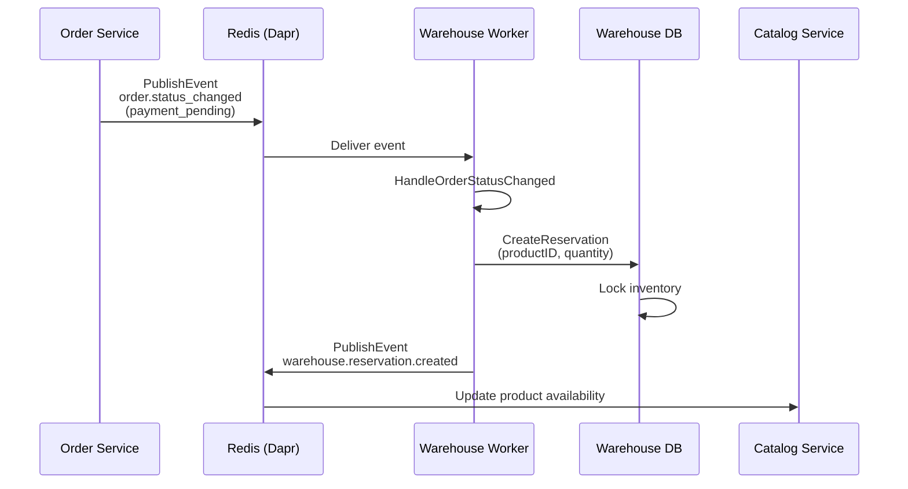
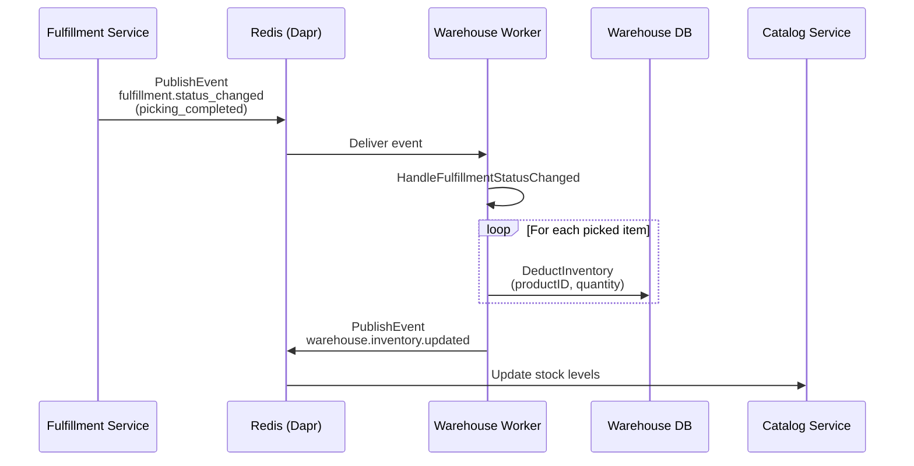
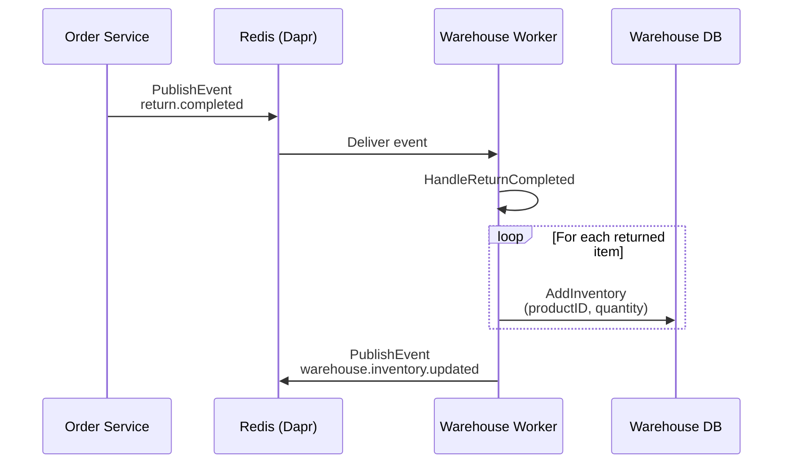
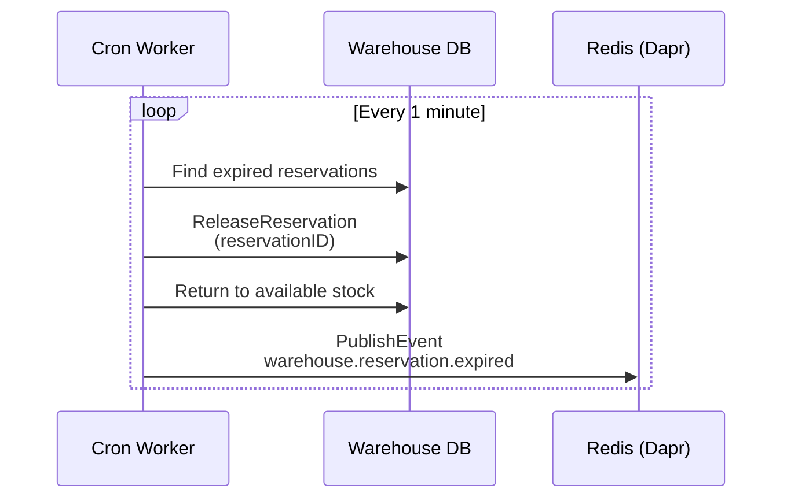

# Warehouse Service - Dapr & Event Configuration

## Service Overview

The Warehouse Service manages inventory, stock levels, reservations, and warehouse operations. It's the **most event-intensive service** in the platform, consuming events from Order, Catalog, Fulfillment, and Return services while publishing inventory updates.

## Worker Configuration

### Entry Point

**File**: [`cmd/worker/main.go`](file:///home/user/microservices/warehouse/cmd/worker/main.go)

```go
Name: "warehouse-worker"
Version: "v1.0.0"
DefaultMode: "all"  // Runs both cron jobs AND event consumers
```

### Worker Modes

| Mode | Components | Use Case |
|------|------------|----------|
| `cron` | Stock change detector<br/>Alert cleanup<br/>Daily/weekly reports | Background processing only |
| `event` | All 4 event consumers<br/>(order, product, fulfillment, return) | Real-time event processing |
| `all` | Cron jobs +<br/>Event consumers | **Production (default)** |

### Dependency Injection

**File**: [`cmd/worker/wire.go`](file:///home/user/microservices/warehouse/cmd/worker/wire.go)

**Provider Sets**:
```go
observerCommon.NewManager           // Observer pattern manager
data.ProviderSet                    // Eventbus Client + Consumers
client.NewCatalogClientProvider     // Catalog service client
inventory.ProviderSet               // Inventory business logic
reservation.ProviderSet             // Reservation management
transaction.ProviderSet             // Stock transactions
bizThroughput.ProviderSet          // Warehouse throughput
alert.ProviderSet                   // Alert management
observerPkg.ProviderSet            // Event subscriber registration
cron.ProviderSet                    // Cron job workers
expiry.ProviderSet                  // Expiry workers
```

**Workers Created**:
```go
func newWorkers(...) []base.Worker {
    return []base.Worker{
        // Cron workers
        stockChangeDetectorJob,
        alertCleanupJob,
        dailySummaryJob,
        weeklyReportJob,
        reservationExpiryWorker,
        reservationWarningWorker,
        // Event workers
        &eventbusServerWorker{client: eventbusClient},
        &orderStatusConsumerWorker{consumer: orderStatusConsumer},
        &productCreatedConsumerWorker{consumer: productCreatedConsumer},
        &fulfillmentStatusConsumerWorker{consumer: fulfillmentStatusConsumer},
        &returnConsumerWorker{consumer: returnConsumer},
    }
}
```

---

## Cron Jobs

### 1. Stock Change Detector Job

**Schedule**: Every 5 minutes
**Purpose**: Detect stock threshold breaches and trigger alerts

**Flow**:
```
1. Query all products with inventory
2. Check against low/high/out-of-stock thresholds
3. Create alerts for threshold breaches
4. Publish warehouse.inventory.alert events
```

**Why Important**: Proactive inventory management - notify staff before stockouts occur.

### 2. Alert Cleanup Job

**Schedule**: Daily (midnight)
**Purpose**: Archive or delete old resolved alerts

### 3. Daily Summary Job

**Schedule**: Daily (end of day)
**Purpose**: Generate daily inventory summary report

**Metrics**:
- Total transactions (in/out/adjustments)
- Stock levels by warehouse
- Reservation status
- Low stock items

### 4. Weekly Report Job

**Schedule**: Weekly (Sunday night)
**Purpose**: Comprehensive weekly inventory analytics

### 5. Reservation Expiry Worker

**Schedule**: Every 1 minute
**Purpose**: Auto-release expired inventory reservations

**Flow**:
```
1. Find reservations with status=pending AND expires_at < NOW()
2. Update status to expired
3. Return inventory to available stock
4. Publish warehouse.reservation.expired event
```

**Critical**: Prevents inventory from being locked indefinitely.

### 6. Reservation Warning Worker

**Schedule**: Every 5 minutes
**Purpose**: Send warnings for reservations expiring soon

**Flow**:
```
1. Find reservations expiring in next 10 minutes
2. Send notification alerts
3. Log warning for monitoring
```

---

## Event Consumers

### Consumer Summary

| Consumer | Topic | Publisher | Purpose |
|----------|-------|-----------|---------|
| Order Status | `orders.order.status_changed` | Order Service | Create/release reservations |
| Product Created | `product.created` | Catalog Service | Initialize inventory |
| Fulfillment Status | `fulfillment.status_changed` | Fulfillment Service | Adjust inventory on pick/pack |
| Return Completed | `return.completed` | Order Service | Restore inventory |

### 1. Order Status Consumer

**File**: [`internal/data/eventbus/order_status_consumer.go`](file:///home/user/microservices/warehouse/internal/data/eventbus/order_status_consumer.go)

**Topic**: `orders.order.status_changed`

**Event Schema**:
```go
type OrderStatusChangedEvent struct {
    EventType   string    `json:"event_type"`
    OrderID     string    `json:"order_id"`
    OrderNumber string    `json:"order_number"`
    OldStatus   string    `json:"old_status"`
    NewStatus   string    `json:"new_status"`
    Items       []OrderItem `json:"items"`
    Timestamp   time.Time `json:"timestamp"`
}
```

**Handler Logic**:
```go
switch event.NewStatus {
case "payment_pending":
    // Create inventory reservations for order items
    for _, item := range event.Items {
        reservation := CreateReservation(item.ProductID, item.Quantity, item.WarehouseID)
    }
    
case "payment_confirmed":
    // Confirm reservations (lock inventory)
    ConfirmReservations(event.OrderID)
    
case "cancelled", "payment_failed":
    // Release reservations (free up inventory)
    ReleaseReservations(event.OrderID)
}
```

**Observer Pattern**:
```go
c.observerManager.Trigger(ctx, constants.OrderStatusChangedEvent, eventData)
```

Observers handle:
- Reservation creation/confirmation/release
- Inventory locking/unlocking
- Stock level updates

---

### 2. Product Created Consumer

**File**: [`internal/data/eventbus/product_created_consumer.go`](file:///home/user/microservices/warehouse/internal/data/eventbus/product_created_consumer.go)

**Topic**: `product.created`

**Event Schema**:
```go
type ProductCreatedEvent struct {
    EventType   string    `json:"event_type"`
    ProductID   string    `json:"product_id"`
    SKU         string    `json:"sku"`
    Name        string    `json:"name"`
    Warehouses  []string  `json:"warehouses"`  // WarehouseIDs
    Timestamp   time.Time `json:"timestamp"`
}
```

**Handler Flow**:
```
1. Receive product.created event
2. For each warehouse in event.Warehouses:
   - Create inventory record with quantity=0
   - Set reorder_point and reorder_quantity defaults
   - Initialize stock tracking
3. Publish warehouse.inventory.created event
```

**Why Important**: Ensures all new products have inventory records before they can be ordered.

---

### 3. Fulfillment Status Consumer

**File**: [`internal/data/eventbus/fulfillment_status_consumer.go`](file:///home/user/microservices/warehouse/internal/data/eventbus/fulfillment_status_consumer.go)

**Topic**: `fulfillment.status_changed`

**Event Schema**:
```go
type FulfillmentStatusChangedEvent struct {
    EventType      string    `json:"event_type"`
    FulfillmentID  string    `json:"fulfillment_id"`
    OrderID        string    `json:"order_id"`
    OldStatus      string    `json:"old_status"`
    NewStatus      string    `json:"new_status"`
    PickedItems    []Item    `json:"picked_items,omitempty"`
    Timestamp      time.Time `json:"timestamp"`
}
```

**Handler Logic**:
```go
switch event.NewStatus {
case "picking_started":
    // Log start of picking process
    
case "picking_completed":
    // Deduct actual picked quantities from inventory
    for _, item := range event.PickedItems {
        DeductInventory(item.ProductID, item.ActualQuantity, item.WarehouseID)
    }
    
case "shipped":
    // Finalize inventory transaction
    FinalizeInventoryTransaction(event.FulfillmentID)
    
case "cancelled":
    // Return reserved inventory to available stock
    ReturnReservedInventory(event.OrderID)
}
```

**Critical**: This is where physical inventory is actually decremented.

---

### 4. Return Completed Consumer

**File**: [`internal/data/eventbus/return_consumer.go`](file:///home/user/microservices/warehouse/internal/data/eventbus/return_consumer.go)

**Topic**: `return.completed`

**Event Schema**:
```go
type ReturnCompletedEvent struct {
    EventType     string    `json:"event_type"`
    ReturnID      string    `json:"return_id"`
    OrderID       string    `json:"order_id"`
    ReturnedItems []Item    `json:"returned_items"`
    WarehouseID   string    `json:"warehouse_id"`
    Timestamp     time.Time `json:"timestamp"`
}
```

**Handler Flow**:
```
1. Receive return.completed event
2. For each returned item:
   - Increase available inventory
   - Record return transaction
   - Update product condition status (if damaged)
3. Publish warehouse.inventory.updated event
```

---

## Event Publishers

### Inventory Event Publisher

**File**: [`internal/biz/events/dapr_grpc_client.go`](file:///home/user/microservices/warehouse/internal/biz/events/dapr_grpc_client.go)

#### 1. Inventory Updated

**Topic**: `warehouse.inventory.updated`

**Event Schema**:
```go
type InventoryUpdatedEvent struct {
    EventType      string    `json:"event_type"`
    ProductID      string    `json:"product_id"`
    WarehouseID    string    `json:"warehouse_id"`
    OldQuantity    int64     `json:"old_quantity"`
    NewQuantity    int64     `json:"new_quantity"`
    AvailableStock int64     `json:"available_stock"`
    ReservedStock  int64     `json:"reserved_stock"`
    TransactionID  string    `json:"transaction_id"`
    Reason         string    `json:"reason"`
    Timestamp      time.Time `json:"timestamp"`
}
```

**Published When**:
- Inventory received (purchase order)
- Inventory adjusted (manual correction)
- Inventory picked (fulfillment)
- Inventory returned (customer return)

**Consumers**:
- **Catalog Service** - Updates product availability
- **Search Service** - Updates search index
- **Analytics Service** - Tracks inventory trends

#### 2. Reservation Events

**Topics**:
- `warehouse.reservation.created`
- `warehouse.reservation.confirmed`
- `warehouse.reservation.released`
- `warehouse.reservation.expired`

**Event Schema**:
```go
type ReservationEvent struct {
    EventType     string    `json:"event_type"`
    ReservationID string    `json:"reservation_id"`
    OrderID       string    `json:"order_id"`
    ProductID     string    `json:"product_id"`
    Quantity      int64     `json:"quantity"`
    WarehouseID   string    `json:"warehouse_id"`
    Status        string    `json:"status"`
    ExpiresAt     time.Time `json:"expires_at"`
    Timestamp     time.Time `json:"timestamp"`
}
```

---

## Dapr Configuration

### API Deployment Annotations

```yaml
podAnnotations:
  dapr.io/enabled: "true"
  dapr.io/app-id: "warehouse-service"
  dapr.io/app-port: "8003"
  dapr.io/app-protocol: "http"
```

### Worker Deployment Annotations

```yaml
worker:
  podAnnotations:
    dapr.io/enabled: "true"
    dapr.io/app-id: "warehouse-worker"
    dapr.io/app-port: "5005"
    dapr.io/app-protocol: "grpc"
```

---

## Kubernetes Deployment

### Worker Deployment

**File**: [`argocd/applications/warehouse-service/templates/worker-deployment.yaml`](file:///home/user/microservices/warehouse/argocd/applications/warehouse-service/templates/worker-deployment.yaml)

**Command**:
```bash
/app/bin/worker -conf /app/configs
```

**Environment Variables**:
```yaml
env:
  - name: WORKER_MODE
    value: "true"
  - name: ENABLE_CRON
    value: "true"
  - name: ENABLE_CONSUMER
    value: "true"
  - name: DATABASE_URL
    valueFrom:
      secretKeyRef:
        name: warehouse-service
        key: database-url
```

**Init Containers**:
```yaml
- name: wait-for-consul
- name: wait-for-redis
- name: wait-for-postgres
```

**Resources**:
```yaml
resources:
  requests:
    cpu: 200m
    memory: 256Mi
  limits:
    cpu: 500m
    memory: 512Mi
```

---

## Event Flow Diagrams

### Order Reservation Flow



### Fulfillment Inventory Deduction



### Return Inventory Restoration



### Reservation Expiry (Cron)



---

## Observer Pattern

Warehouse service uses observers extensively to decouple event handling from business logic.

### Observer Registration

**File**: [`internal/observer/provider.go`](file:///home/user/microservices/warehouse/internal/observer/)

```go
func RegisterObservers(
    manager observerCommon.Manager,
    inventoryUc *inventory.Usecase,
    reservationUc *reservation.Usecase,
) {
    // Order status changed
    manager.Subscribe(
        constants.OrderStatusChangedEvent,
        NewOrderStatusObserver(inventoryUc, reservationUc),
    )
    
    // Product created
    manager.Subscribe(
        constants.ProductCreatedEvent,
        NewProductCreatedObserver(inventoryUc),
    )
    
    // Fulfillment status changed
    manager.Subscribe(
        constants.FulfillmentStatusChangedEvent,
        NewFulfillmentStatusObserver(inventoryUc),
    )
}
```

### Observer Implementation Example

```go
type OrderStatusObserver struct {
    reservationUc *reservation.Usecase
}

func (o *OrderStatusObserver) Update(ctx context.Context, data interface{}) error {
    event := data.(OrderStatusChangedEvent)
    
    switch event.NewStatus {
    case "payment_pending":
        return o.reservationUc.CreateReservationsForOrder(ctx, event.OrderID)
    case "payment_confirmed":
        return o.reservationUc.ConfirmReservations(ctx, event.OrderID)
    case "cancelled":
        return o.reservationUc.ReleaseReservations(ctx, event.OrderID)
    }
    
    return nil
}
```

---

## Troubleshooting

### Inventory Not Updated After Fulfillment

**Symptoms**: Stock levels remain the same after order shipped

**Checks**:
```bash
# Check if fulfillment events are consumed
kubectl logs warehouse-worker-xxx -c worker | grep "fulfillment.status_changed"

# Check Dapr subscription
kubectl exec warehouse-worker-xxx -c daprd -- \
  wget -qO- http://localhost:3500/dapr/subscribe | jq '.[] | select(.topic=="fulfillment.status_changed")'
```

**Common Causes**:
- Fulfillment service not publishing events
- Topic name mismatch in config
- Observer not registered

### Reservations Not Expiring

**Symptoms**: Expired reservations still show as `pending`

**Checks**:
```bash
# Check cron job execution
kubectl logs warehouse-worker-xxx -c worker | grep "reservation-expiry-worker"

# Check database for expired reservations
psql -c "SELECT COUNT(*) FROM warehouse_reservations 
         WHERE status='pending' AND expires_at < NOW()"
```

**Common Causes**:
- Worker in `event` mode (cron jobs disabled)
- Database timezone mismatch
- Cron worker crashed

### Product Inventory Not Initialized

**Symptoms**: New product has no inventory record

**Checks**:
```bash
# Check product.created consumption
kubectl logs warehouse-worker-xxx -c worker | grep "product.created"

# Check database
psql -c "SELECT * FROM warehouse_inventory WHERE product_id='xxx'"
```

**Common Causes**:
- Catalog service not publishing product.created
- Event handler error
- Missing warehouse configuration

---

## Best Practices

### ✅ DO

1. **Run Worker in "all" Mode** - Critical for both real-time and batch processing
2. **Monitor Reservation Expiry** - Track expired reservation rate
3. **Use Database Transactions** - For inventory updates
4. **Implement Idempotency** - Events may be delivered multiple times
5. **Log All Inventory Changes** - Audit trail is critical
6. **Set Appropriate Reservation TTL** - Balance between lock time and user experience

### ❌ DON'T

1. **Don't Update Inventory Without Transactions** - Risk of inconsistency
2. **Don't Ignore Reservation Expiry** - Leads to inventory lock
3. **Don't Process Events Synchronously If Heavy** - Use async for analytics
4. **Don't Skip Validation** - Verify product/warehouse existence
5. **Don't Publish Events Without Retry** - May lose important updates

---

## Monitoring & Alerts

### Key Metrics

1. **Inventory Metrics**:
   - Stock-out rate (products with quantity=0)
   - Low stock items count
   - Inventory turnover rate

2. **Reservation Metrics**:
   - Active reservations count
   - Reservation expiry rate
   - Average reservation duration

3. **Event Processing**:
   - Events consumed per minute
   - Event processing latency
   - Failed event rate

4. **Cron Jobs**:
   - Job execution success rate
   - Items processed per job
   - Job execution duration

### Critical Alerts

```yaml
alerts:
  - name: HighReservationExpiryRate
    condition: expiry_rate > 10%
    action: Investigate order/payment flow
  
  - name: InventoryConsumerDown
    condition: events_consumed == 0 for 5m
    action: Restart worker
  
  - name: StockChangeDetectorFailed
    condition: job_execution_failed
    action: Check database connection
```

---

## Related Files

### Code

- **Worker Entry**: [`cmd/worker/main.go`](file:///home/user/microservices/warehouse/cmd/worker/main.go)
- **Wire DI**: [`cmd/worker/wire.go`](file:///home/user/microservices/warehouse/cmd/worker/wire.go)
- **Order Consumer**: [`internal/data/eventbus/order_status_consumer.go`](file:///home/user/microservices/warehouse/internal/data/eventbus/order_status_consumer.go)
- **Product Consumer**: [`internal/data/eventbus/product_created_consumer.go`](file:///home/user/microservices/warehouse/internal/data/eventbus/product_created_consumer.go)
- **Fulfillment Consumer**: [`internal/data/eventbus/fulfillment_status_consumer.go`](file:///home/user/microservices/warehouse/internal/data/eventbus/fulfillment_status_consumer.go)
- **Return Consumer**: [`internal/data/eventbus/return_consumer.go`](file:///home/user/microservices/warehouse/internal/data/eventbus/return_consumer.go)

### Configuration

- **Worker Deployment**: [`argocd/applications/warehouse-service/templates/worker-deployment.yaml`](file:///home/user/microservices/warehouse/argocd/applications/warehouse-service/templates/worker-deployment.yaml)
- **Values**: [`argocd/applications/warehouse-service/values.yaml`](file:///home/user/microservices/argocd/applications/warehouse-service/values.yaml)
- **Dapr Component**: [`dapr/components/pubsub-redis.yaml`](file:///home/user/microservices/dapr/components/pubsub-redis.yaml)

### Documentation

- [Overview](file:///home/user/microservices/docs/workfllow/dapr-event-architecture-overview.md)
- [Fulfillment Service](file:///home/user/microservices/docs/workfllow/fulfillment-service-dapr.md)
- [Order Service](file:///home/user/microservices/docs/workfllow/order-service-dapr.md)
