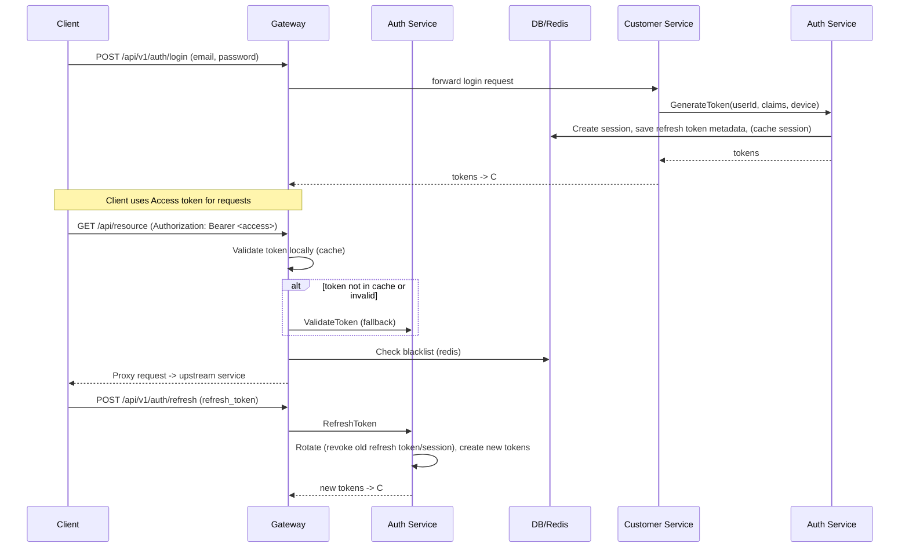

# Luồng Xác Thực (Auth Flow)

## 📌 Tổng quan
Tài liệu này mô tả **luồng xác thực** chính của hệ thống (login, token refresh, token revocation, token validation), các thành phần liên quan, điểm lỗi thường gặp và cách xử lý. Nội dung bằng tiếng Việt, ngắn gọn và có tham chiếu mã nguồn để đội dev nhanh xác định vị trí thực thi.

---

## 🧭 Thành phần chính
- **Client**: Browser / Mobile / Service
- **Gateway**: HTTP entrypoint, validate JWT, cache kết quả, kiểm tra blacklist
- **Auth Service**: Quản lý session, phát/revoke access & refresh token, token rotation, blacklist
- **User/Customer Service**: Endpoint đăng ký/đăng nhập (delegates token ops to Auth Service)
- **Redis**: Cache (session cache, token blacklist, rate limiter)
- **Postgres**: Persistent (user, sessions metadata)

> Tham khảo mã: 
- `auth/internal/biz/token/token.go` (refresh/rotate/revoke)
- `gateway/internal/router/utils/jwt_validator_wrapper.go` (JWT + blacklist + cache)
- `customer/internal/biz/customer/auth.go` (customer login flow)
- `auth/openapi.yaml` (Auth API)

---

## 🔁 Sequence (Luồng chính)

---

## ✅ Best practices & checks (Implementer checklist)
- [ ] Gateway: **JWT secret** configured via env `JWT_SECRET` and same secret used by Auth Service
- [ ] Gateway: Token cache + blacklist check before accepting token (implemented in `jwt_validator_wrapper.go`)
- [ ] Auth Service: **Refresh token rotation** must revoke old token/session *and* fail the refresh if revoke fails (consider making revoke strict)
- [ ] Auth Service: Publish `token.revoked` events after revoke for eventual consistency
- [ ] Session store: Use Redis for fast checks (cache) with Postgres as source of truth; plan migration if needed
- [ ] Login endpoints: Rate limiting + account lock on repeated failures (implementer to validate configs in `auth` and `customer` services)
- [ ] Add monitoring: JWT validation latency, token rotation failures, blacklist size, cache hit rate

---

## ⚠️ Failure modes & Mitigations
- Auth Service unavailable → Gateway fallback: local JWT validation only (short TTL) is allowed for emergency but must not bypass blacklist checks. Prefer failing fast for critical flows requiring revocation.
- Redis unavailable → reduce to DB-backed session checks (graceful fallback) and alert on increased latency
- Refresh rotation revoke fails → **risk of token reuse**, recommended to fail refresh and investigate revoke path

---

## 🔍 Troubleshooting quick commands
- Check JWT_SECRET: `docker compose exec auth-service env | grep JWT_SECRET` and `docker compose exec gateway-service env | grep JWT_SECRET`
- Clear token blacklist (emergency): `redis-cli --scan --pattern "jwt:blacklist:*" | xargs redis-cli DEL` (use caution)
- List active sessions (Auth API): `GET /api/v1/auth/sessions/user/{userId}`

> See runbook: `docs/sre-runbooks/auth-service-runbook.md` for operational steps.

---

## 💡 Notes & References
- Keep the workflow doc short and link to detailed files (code + runbooks)
- If bạn muốn, tôi có thể mở PR cập nhật `docs/checklists/auth-permission-flow-checklist.md` để align statuses/measures với trạng thái hiện tại của mã.

---

_Last updated: 2026-01-14_
