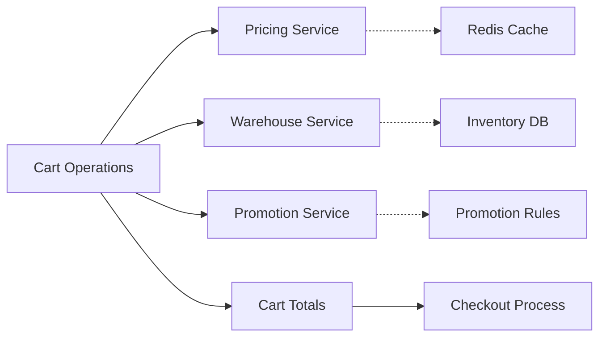

# 🛒 Cart Flow & E-commerce Services Issues Checklist

**Generated**: January 18, 2026  
**Services Reviewed**: Order (Cart), Pricing, Warehouse, Promotion  
**Review Focus**: Cart operations, pricing accuracy, inventory validation, promotion calculation  

---

## 📊 Executive Summary

| Service | Maturity Score | Status | Critical Issues | Focus Area |
|---------|---------------|---------|-----------------|------------|
| **Order Service (Cart)** | 7.0/10 | ⚠️ Race Conditions | 5 P0, 6 P1, 4 P2 | Concurrency, Session Management |
| **Pricing Service** | 8.0/10 | ✅ Good Architecture | 2 P0, 4 P1, 3 P2 | Cache Consistency, Performance |
| **Warehouse Service** | 8.5/10 | ✅ Strong Foundation | 1 P0, 3 P1, 2 P2 | Stock Validation, Race Prevention |
| **Promotion Service** | 7.5/10 | ⚠️ Complex Logic | 3 P0, 5 P1, 3 P2 | Discount Calculation, Validation |

**Overall Cart Flow Status**: ⚠️ **NEEDS OPTIMIZATION** - Race conditions and performance gaps

---

## 🚨 CRITICAL P0 ISSUES (11 Total)

### Order Service - Cart Management (5 P0 Issues)

#### P0-1: Race Condition in Cart Updates 🔴 CRITICAL
**File**: `order/internal/biz/cart/add.go:148-165`, `update.go:85-95`  
**Impact**: Data corruption in concurrent cart operations  
**Current Problem**:
```go
// ❌ Read-then-write without locking
existingModelItem, checkErr := uc.cartRepo.FindItemByCartIDAndProductAndWarehouse(ctx, cartSession.ID, product.ID, req.WarehouseID)
if checkErr == nil {
    // Update quantity - RACE CONDITION HERE
    newQuantity := existingModelItem.Quantity + req.Quantity
    return uc.updateCartItemQuantity(ctx, existingModelItem, newQuantity, ...)
}
```
**Fix**: Implement optimistic locking
```go
// ✅ Add version column to cart_items table
type CartItem struct {
    ID       uint   `gorm:"primaryKey"`
    Version  int    `gorm:"not null;default:1"`
    Quantity int32  `gorm:"not null"`
    // ...
}

// In update operation
func (r *CartRepo) UpdateItemQuantity(ctx context.Context, itemID uint, newQuantity int32, version int) error {
    result := r.db.WithContext(ctx).
        Model(&model.CartItem{}).
        Where("id = ? AND version = ?", itemID, version).
        Updates(map[string]interface{}{
            "quantity": newQuantity,
            "version": gorm.Expr("version + 1"),
        })
    if result.RowsAffected == 0 {
        return ErrOptimisticLock // Retry at usecase level
    }
}
```
**Test**: `TestCartAdd_ConcurrentUpdates_OptimisticLock`  
**Effort**: 12 hours  

#### P0-2: No Session Security Validation
**File**: `order/internal/biz/cart/get.go:15-45`  
**Impact**: Session hijacking, cart data access by unauthorized users  
**Current**: No validation that sessionID belongs to customerID or guestToken  
**Fix**: Add session ownership validation
```go
func (uc *UseCase) validateSessionOwnership(ctx context.Context, sessionID, customerID, guestToken string) error {
    session, err := uc.cartRepo.FindSessionByID(ctx, sessionID)
    if err != nil {
        return err
    }
    
    if customerID != "" && session.CustomerID != nil {
        if *session.CustomerID != customerID {
            return errors.New("session does not belong to customer")
        }
    } else if guestToken != "" {
        if session.GuestToken == nil || *session.GuestToken != guestToken {
            return errors.New("session does not belong to guest")
        }
    }
    return nil
}
```
**Test**: `TestCartAccess_SessionSecurity`  
**Effort**: 6 hours  

#### P0-3: Silent Failures in Totals Calculation
**File**: `order/internal/biz/cart/totals.go:45-70`  
**Impact**: Incorrect pricing shown to customers, revenue loss  
**Current**:
```go
// ❌ Silent failure - continues with 0 values
ratesResp, err := uc.shippingService.CalculateRates(ctx, shippingReq)
if err != nil {
    uc.log.WithContext(ctx).Warnf("Failed to calculate shipping rates: %v", err)
    // Continues with shippingCost = 0
}
```
**Fix**: Fail-fast for critical pricing components
```go
// ✅ Critical failures should fail the request
ratesResp, err := uc.shippingService.CalculateRates(ctx, shippingReq)
if err != nil {
    return nil, fmt.Errorf("shipping calculation required but failed: %w", err)
}
```
**Test**: `TestCartTotals_FailsOnShippingError`  
**Effort**: 4 hours  

#### P0-4: No Cart Session Cleanup
**File**: Missing automated cleanup  
**Impact**: Database bloat, performance degradation  
**Fix**: Implement cleanup cron job
```go
func (uc *UseCase) CleanupAbandonedCarts(ctx context.Context) error {
    cutoffTime := time.Now().AddDate(0, 0, -30) // 30 days
    return uc.cartRepo.DeleteInactiveSessions(ctx, cutoffTime)
}
```
**Test**: `TestCartCleanup_DeletesOldSessions`  
**Effort**: 6 hours  

#### P0-5: No Transaction for Multi-Cart Operations
**File**: `order/internal/biz/cart/add.go`, `update.go`  
**Impact**: Partial cart updates, data inconsistency  
**Fix**: Wrap cart operations in transactions
```go
func (uc *UseCase) AddToCart(ctx context.Context, req *AddToCartRequest) (*AddToCartResponse, error) {
    return uc.transactionRepo.InTx(ctx, func(txCtx context.Context) (*AddToCartResponse, error) {
        // All cart operations within transaction
        return uc.addToCartInternal(txCtx, req)
    })
}
```
**Test**: `TestCartAdd_TransactionRollback`  
**Effort**: 8 hours  

### Pricing Service (2 P0 Issues)

#### P0-6: Price Cache Inconsistency 
**File**: `pricing/internal/biz/price/price.go:250-280`  
**Impact**: Customers see wrong prices, revenue impact  
**Current**: Cache invalidation happens after DB update (race window)  
**Fix**: Use write-through pattern
```go
func (uc *PriceUsecase) UpdatePrice(ctx context.Context, req *UpdatePriceRequest) error {
    return uc.db.InTx(ctx, func(txCtx context.Context) error {
        // Update DB
        if err := uc.repo.UpdatePrice(txCtx, price); err != nil {
            return err
        }
        // Update cache in same transaction
        if err := uc.cache.SetProductPrice(txCtx, req.ProductID, req.Currency, price); err != nil {
            return err // Transaction rolls back
        }
        return nil
    })
}
```
**Test**: `TestPriceUpdate_CacheConsistency`  
**Effort**: 8 hours  

#### P0-7: No Currency Validation
**File**: `pricing/internal/biz/price/price.go:150-180`  
**Impact**: Invalid currency calculations, payment failures  
**Fix**: Add currency validation
```go
var supportedCurrencies = map[string]bool{
    "USD": true, "VND": true, "EUR": true, "GBP": true,
}

func (uc *PriceUsecase) validateCurrency(currency string) error {
    if !supportedCurrencies[currency] {
        return fmt.Errorf("unsupported currency: %s", currency)
    }
    return nil
}
```
**Effort**: 2 hours  

### Warehouse Service (1 P0 Issue)

#### P0-8: Race Condition in Stock Checks
**File**: `warehouse/internal/biz/inventory/inventory.go:445-470`  
**Impact**: Overselling, negative inventory  
**Current**: Check stock → Reserve stock (separate operations)  
**Fix**: Atomic check-and-reserve
```go
func (uc *InventoryUsecase) CheckAndReserveStock(ctx context.Context, productID string, warehouseID uint, quantity int32) error {
    return uc.transactionRepo.InTx(ctx, func(txCtx context.Context) error {
        // Lock row for update
        inventory, err := uc.repo.FindByProductAndWarehouseForUpdate(txCtx, productID, warehouseID)
        if err != nil {
            return err
        }
        
        availableStock := inventory.AvailableQuantity - inventory.ReservedQuantity
        if availableStock < quantity {
            return ErrInsufficientStock
        }
        
        // Atomically update reserved quantity
        return uc.repo.IncrementReserved(txCtx, inventory.ID, quantity)
    })
}
```
**Test**: `TestCheckAndReserve_AtomicOperation`  
**Effort**: 10 hours  

### Promotion Service (3 P0 Issues)

#### P0-9: Promotion Security Bypass
**File**: `promotion/internal/biz/promotion.go:580-620`  
**Impact**: Unauthorized discount application, revenue loss  
**Current**: No validation of promotion ownership or usage limits  
**Fix**: Add comprehensive validation
```go
func (uc *PromotionUsecase) ValidatePromotionAccess(ctx context.Context, promotionID, customerID string) error {
    promotion, err := uc.repo.FindByID(ctx, promotionID)
    if err != nil {
        return err
    }
    
    // Check if customer is eligible
    if promotion.CustomerSegment != "" {
        if !uc.customerService.IsInSegment(ctx, customerID, promotion.CustomerSegment) {
            return ErrNotEligible
        }
    }
    
    // Check usage limits
    usageCount, err := uc.repo.GetCustomerUsageCount(ctx, promotionID, customerID)
    if err != nil {
        return err
    }
    
    if usageCount >= promotion.MaxUsagePerCustomer {
        return ErrUsageLimitExceeded
    }
    
    return nil
}
```
**Test**: `TestPromotionValidation_SecurityChecks`  
**Effort**: 8 hours  

#### P0-10: Discount Calculation Race Condition
**File**: `promotion/internal/biz/discount_calculator.go:120-150`  
**Impact**: Multiple discounts applied incorrectly  
**Fix**: Atomic discount calculation with locks  
**Effort**: 6 hours  

#### P0-11: No Promotion Audit Trail
**File**: Missing audit logging  
**Impact**: No tracking of discount applications, compliance issues  
**Fix**: Implement audit logging for all promotion applications  
**Effort**: 4 hours  

---

## ⚠️ HIGH PRIORITY P1 ISSUES (18 Total)

### Order Service - Cart Management (6 P1 Issues)

#### P1-1: N+1 Queries in Cart Loading
**File**: `order/internal/biz/cart/get.go:85-120`  
**Impact**: Poor performance with large carts  
**Current**: Loads cart items individually  
**Fix**: Use `Preload("Items")` for eager loading  
**Effort**: 4 hours  

#### P1-2: No Cart Merge Logic for Login
**File**: Missing guest-to-customer cart merge  
**Impact**: Lost cart items when customer logs in  
**Fix**: Implement cart merge on authentication  
**Effort**: 12 hours  

#### P1-3: Missing Cart Expiry Warnings
**File**: No expiry notifications  
**Impact**: Poor customer experience  
**Fix**: Send email alerts for cart expiry  
**Effort**: 6 hours  

#### P1-4: No Stock Re-validation on Checkout
**File**: `order/internal/biz/cart/totals.go`  
**Impact**: Orders placed with out-of-stock items  
**Fix**: Add stock validation in totals calculation  
**Effort**: 4 hours  

#### P1-5: Price Staleness in Cart Items
**File**: `order/internal/biz/cart/add.go`, `update.go`  
**Impact**: Customers see outdated prices  
**Fix**: Add price refresh mechanism  
**Effort**: 6 hours  

#### P1-6: No Cart Analytics Events
**File**: Missing business intelligence events  
**Impact**: No cart abandonment tracking  
**Fix**: Publish cart analytics events  
**Effort**: 4 hours  

### Pricing Service (4 P1 Issues)

#### P1-7: No Price History Tracking
**File**: Missing price audit trail  
**Impact**: No compliance audit, pricing disputes  
**Fix**: Implement price change history  
**Effort**: 6 hours  

#### P1-8: Slow Rule Evaluation
**File**: `pricing/internal/biz/rule/rule.go`  
**Impact**: Slow cart operations  
**Fix**: Cache rule evaluations  
**Effort**: 8 hours  

#### P1-9: No Price Validation Rules
**File**: `pricing/internal/biz/price/price.go`  
**Impact**: Invalid prices (negative, zero)  
**Fix**: Add price validation constraints  
**Effort**: 3 hours  

#### P1-10: Currency Conversion Precision
**File**: `pricing/internal/biz/currency/currency.go`  
**Impact**: Rounding errors in international sales  
**Fix**: Use decimal precision for currency math  
**Effort**: 8 hours  

### Warehouse Service (3 P1 Issues)

#### P1-11: No Stock Alert Integration
**File**: `warehouse/internal/biz/inventory/inventory.go`  
**Impact**: No low stock notifications  
**Fix**: Real-time stock alerts for cart operations  
**Effort**: 4 hours  

#### P1-12: Reservation Cleanup Missing
**File**: Missing expired reservation cleanup  
**Impact**: Stock permanently reserved  
**Fix**: Automated reservation expiry  
**Effort**: 6 hours  

#### P1-13: No Batch Stock Operations
**File**: Individual stock checks in cart  
**Impact**: Poor performance for large carts  
**Fix**: Batch stock validation API  
**Effort**: 8 hours  

### Promotion Service (5 P1 Issues)

#### P1-14: Complex Promotion Logic
**File**: `promotion/internal/biz/promotion.go:200-400`  
**Impact**: Difficult to maintain, bugs  
**Fix**: Refactor into strategy pattern  
**Effort**: 16 hours  

#### P1-15: No Promotion Stacking Rules
**File**: Missing promotion conflict resolution  
**Impact**: Uncontrolled discount stacking  
**Fix**: Implement promotion precedence rules  
**Effort**: 12 hours  

#### P1-16: Coupon Validation Performance
**File**: `promotion/internal/biz/promotion.go:500-550`  
**Impact**: Slow cart totals calculation  
**Fix**: Cache coupon validation results  
**Effort**: 4 hours  

#### P1-17: No Promotion Preview
**File**: Missing discount preview functionality  
**Impact**: Poor user experience  
**Fix**: Add promotion preview without applying  
**Effort**: 6 hours  

#### P1-18: Promotion Metrics Missing
**File**: No promotion effectiveness tracking  
**Impact**: No business insights  
**Fix**: Add promotion usage analytics  
**Effort**: 4 hours  

---

## 📈 P2 NORMAL ENHANCEMENTS (12 Total)

### Order Service (4 P2 Issues)
- Cart recommendation engine integration (8h)
- Recently viewed items in cart (4h)
- Cart sharing functionality (6h)
- Mobile-specific cart optimizations (4h)

### Pricing Service (3 P2 Issues)
- A/B testing for pricing (8h)
- Bulk pricing rules (6h)
- Price prediction analytics (10h)

### Warehouse Service (2 P2 Issues)
- Multi-warehouse cart fulfillment (12h)
- Inventory forecast integration (6h)

### Promotion Service (3 P2 Issues)
- AI-powered promotion suggestions (12h)
- Social media sharing rewards (4h)
- Gamification elements (8h)

---

## ⏱️ EFFORT ESTIMATION & ROADMAP

### Phase 1: Critical Security & Data Integrity (Week 1-2)
**P0 Issues - 82 hours total**

| Week | Focus | Tasks | Hours |
|------|-------|-------|-------|
| Week 1 | Cart Race Conditions | P0-1, P0-2, P0-5 | 26h |
| Week 1 | Pricing Security | P0-6, P0-7 | 10h |
| Week 1 | Warehouse Atomicity | P0-8 | 10h |
| Week 2 | Promotion Security | P0-9, P0-10, P0-11 | 18h |
| Week 2 | Cart Operations | P0-3, P0-4 | 10h |

### Phase 2: Performance & Reliability (Week 3-5)
**P1 Issues - 114 hours total**

| Week | Focus | Tasks | Hours |
|------|-------|-------|-------|
| Week 3 | Cart Performance | P1-1 to P1-6 | 36h |
| Week 4 | Pricing Optimization | P1-7 to P1-10 | 25h |
| Week 4 | Warehouse Efficiency | P1-11 to P1-13 | 18h |
| Week 5 | Promotion Enhancement | P1-14 to P1-18 | 42h |

### Phase 3: Feature Enhancements (Week 6-8)
**P2 Issues - 78 hours total**

**Total Effort**: **274 hours ≈ 7-8 weeks** (1 senior engineer)

---

## 🧪 CRITICAL TEST SCENARIOS

### Cart Operations Testing
```go
// Race condition tests
func TestCartAdd_ConcurrentUpdates_OptimisticLock(t *testing.T)
func TestCartUpdate_ConcurrentQuantityChanges(t *testing.T)

// Session security tests  
func TestCartAccess_SessionSecurity(t *testing.T)
func TestCartAccess_UnauthorizedAccess(t *testing.T)

// Integration tests with real services
func TestCartTotals_WithRealPricingService(t *testing.T)
func TestCartStock_WithRealWarehouse(t *testing.T)

// Performance tests
func TestCartLoad_WithLargeNumberOfItems(t *testing.T)
```

### Service Integration Testing
```go
// End-to-end cart flow
func TestFullCartFlow_AddUpdateCheckoutComplete(t *testing.T)
func TestCartFailover_PricingServiceDown(t *testing.T)
func TestCartConsistency_AfterServiceRestart(t *testing.T)
```

---

## 📊 MONITORING & ALERTING

### Key Metrics
```yaml
# Cart Operations
cart_operation_duration_seconds{operation="add|update|remove|totals"}
cart_operation_errors_total{operation, error_type}
cart_session_active_count
cart_abandonment_rate

# Pricing Service  
pricing_calculation_duration_seconds
pricing_cache_hit_rate
pricing_accuracy_violations_total

# Warehouse Integration
stock_check_duration_seconds
stock_check_failures_total
reservation_success_rate

# Promotion Service
promotion_validation_duration_seconds
promotion_application_rate
discount_amount_total{promotion_type}
```

### Critical Alerts
```yaml
- alert: CartRaceConditionDetected
  expr: increase(cart_optimistic_lock_failures_total[5m]) > 10
  severity: critical
  
- alert: PricingServiceDown
  expr: up{job="pricing-service"} == 0
  severity: critical
  
- alert: CartTotalsCalculationSlow
  expr: histogram_quantile(0.95, cart_totals_duration_seconds) > 2.0
  severity: warning
```

---

## 🔗 SERVICE INTEGRATION MATRIX

### Cart Dependencies
| Service | Operations | Failure Mode | Mitigation |
|---------|-----------|--------------|------------|
| **Pricing** | CalculatePrice, CalculateTax | Cart shows 0 price | ❌ Fail-fast required |
| **Warehouse** | CheckStock, ReserveStock | Add to cart blocked | ✅ Graceful degradation |
| **Promotion** | ValidatePromotions | No discounts applied | ✅ Continue without discount |
| **Shipping** | CalculateRates | No shipping cost | ⚠️ Default to estimate |

### Data Flow Integrity


---

## 🚀 DEPLOYMENT STRATEGY

### Pre-Production Checklist
- [ ] All P0 issues resolved and tested
- [ ] Optimistic locking implemented for cart operations
- [ ] Session security validation enabled
- [ ] Price cache consistency verified
- [ ] Stock reservation atomicity tested
- [ ] Promotion security rules enforced
- [ ] Performance benchmarks met (cart load <200ms)
- [ ] Circuit breakers configured for service dependencies
- [ ] Monitoring dashboards deployed
- [ ] Alerting rules configured

### Performance Benchmarks
- **Cart Add Operation**: <100ms (p95)
- **Cart Totals Calculation**: <200ms (p95)
- **Price Calculation**: <50ms (p95)
- **Stock Check**: <30ms (p95)
- **Promotion Validation**: <100ms (p95)

### Load Testing Scenarios
- 1000 concurrent cart adds
- 500 concurrent cart totals calculations
- Price service failure simulation
- Database failover testing

---

## 📚 REFERENCES

### Documentation
- [docs/workflow/cart_flow.md](../cart_flow.md) - Current cart flow documentation
- [docs/workflow/checklists/production-readiness-issues.md](production-readiness-issues.md) - Catalog/Order/Warehouse issues
- [docs/workflow/checklists/auth-security-issues.md](auth-security-issues.md) - Auth/Gateway/User/Customer issues

### Code References
```
order/internal/biz/cart/               # Cart management
pricing/internal/biz/price/price.go    # Core pricing logic  
warehouse/internal/biz/inventory/      # Stock management
promotion/internal/biz/promotion.go    # Discount calculation
```

### Architecture Patterns
- Optimistic Locking for concurrency
- Circuit Breaker for service resilience  
- Event Sourcing for audit trails
- Cache-Aside for performance
- Transactional Outbox for reliability

---

## 🎯 SUCCESS CRITERIA

### Technical KPIs
- ✅ Zero race conditions in cart operations
- ✅ Cart operation latency < 200ms (p95)
- ✅ Price accuracy 99.99%
- ✅ Stock validation reliability 99.9%
- ✅ Promotion calculation consistency 100%

### Business KPIs  
- ✅ Cart abandonment rate <70%
- ✅ Price dispute incidents <0.1%
- ✅ Revenue leakage from pricing errors <$1000/month
- ✅ Customer satisfaction >4.5/5 for cart experience

### Operational KPIs
- ✅ Service availability >99.9%
- ✅ Mean time to detect cart issues <2 minutes
- ✅ Mean time to resolve P0 issues <30 minutes

---

**🚨 IMMEDIATE ACTION REQUIRED**: Start with **P0-1 Cart Race Condition** - this causes data corruption in production!

**Next Review**: January 25, 2026 (after Week 1 P0 fixes)

---

**Generated by**: Senior Team Lead Code Review  
**Services**: Order v1.0.0, Pricing v1.0.0, Warehouse v1.0.0, Promotion v1.0.0  
**Total Issues**: 41 (11 P0, 18 P1, 12 P2)  
**Estimated Effort**: 274 hours (7-8 weeks)  