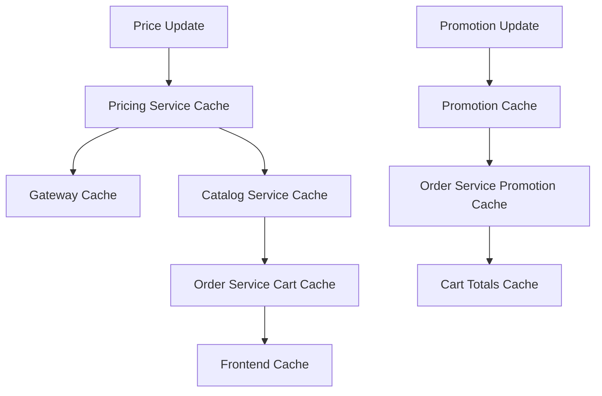

#+#+#+#+markdown
# 💰🎁 Pricing + Promotion Flow - Issues Checklist

**Last Updated**: January 20, 2026  
**Services Analyzed**: Pricing, Promotion, Order, Catalog, Gateway  
**Business Impact**: Critical Revenue & Discount Management  

---

## 🚩 PENDING ISSUES (Unfixed)

### Critical
- [Critical] [P0-1 Silent Calculation Failures Lead to $0 Pricing]: Fail fast for all critical calculations and add integration tests for failure paths.
- [Critical] [P0-3 Currency Conversion Cache Miss Storm]: Add circuit breaker + stale fallback for conversion and exchange-rate retrieval.
- [Critical] [P0-4 Warehouse-Specific Pricing Race Conditions]: Add version field + optimistic locking on price updates.
- [Critical] [P0-6 Price Cache TTL Not Business-Aligned]: Implement dynamic TTL by price type (flash sale vs regular).
- [Critical] [P0-7 Tax Calculation Location Context Missing]: Add postcode validation + jurisdiction lookup in tax flow.
- [Critical] [P0-8 Bulk Price Updates No Batch Processing]: Add batch processing + async outbox publishing.
- [Critical] [P0-10 BOGO Calculation Logic Flaw]: Implement product-mix-aware matching for Buy X Get Y.
- [Critical] [P0-12 Customer Segment Validation Missing]: Validate segments against customer service before applying promotions.
- [Critical] [P0-13 Free Shipping Promotion Logic Incomplete]: Validate free-shipping with actual shipping rates.
- [Critical] [P0-14 Tiered Discount Edge Cases]: Fix tier boundary handling + add boundary tests.
- [Critical] [P0-15 Cart Totals Silent Failures]: Eliminate silent fallback when item prices are missing; return explicit errors.
- [Critical] [P0-16 Promotion Validation Response Not Cached]: Cache validation results by cart/items hash.
- [Critical] [P0-18 Line Items Missing Product Attributes]: Populate product attributes in cart line items from catalog.

### High
- [High] [P1-1 Price Rule Engine Performance]: Cache compiled rule conditions and optimize evaluation order.
- [High] [P1-2 Missing Pricing Analytics Events]: Emit pricing analytics events for conversions and sensitivity.
- [High] [P1-3 Currency Conversion Rate Staleness]: Add freshness validation and fallback source for rates.
- [High] [P1-4 Base Price vs Sale Price Logic Ambiguity]: Define a single authoritative precedence rule.
- [High] [P1-5 Price History Not Tracked]: Add price history/audit trail with change reasons.
- [High] [P1-6 Warehouse Price Fallback Strategy Missing]: Implement warehouse → region → global fallback.
- [High] [P1-7 Dynamic Pricing Rules Too Simple]: Add advanced signals (demand prediction, competitor pricing).
- [High] [P1-8 Tax Rule Management UI Missing]: Provide admin UI for tax rule configuration.
- [High] [P1-9 Complex Promotion Preview Missing]: Add preview endpoint without usage side effects.
- [High] [P1-10 Promotion A/B Testing Framework Missing]: Add variant testing framework.
- [High] [P1-11 Coupon Generation System Basic]: Add batch generation and custom patterns.
- [High] [P1-12 Promotion Analytics Insufficient]: Add promotion ROI analytics.
- [High] [P1-13 Review-Based Promotions Incomplete]: Complete review integration for triggers.
- [High] [P1-14 Promotion Budget Tracking Reactive]: Add real-time budget monitoring and alerts.
- [High] [P1-15 Seasonal Promotion Scheduling Missing]: Add recurring schedules and blackout dates.
- [High] [P1-16 Promotion Conflict Detection Missing]: Validate conflicts and surface warnings.
- [High] [P1-17 Customer Promotion History Not Tracked]: Add customer promotion history tracking.
- [High] [P1-18 Promotion Performance Monitoring Gaps]: Add real-time monitoring dashboards.
- [High] [P1-19 Cart Totals Calculation Performance]: Parallelize service calls and cache results.
- [High] [P1-20 Shipping Method Selection Logic Missing]: Implement intelligent shipping method selection.
- [High] [P1-21 Cart Abandonment Recovery Missing]: Add abandonment detection and recovery workflows.
- [High] [P1-22 Price Change Notification Missing]: Detect price changes and request acknowledgment.
- [High] [P1-23 Cart Validation Rules Incomplete]: Add comprehensive cart validation.
- [High] [P1-24 Multi-Currency Cart Support Missing]: Support currency switching per session.

### Normal
- [Normal] [P2-1 Price Cache Warming Strategy Missing]: Implement cache warming for popular SKUs.
- [Normal] [P2-2 Price API Rate Limiting Missing]: Add rate limiting for pricing calculations.
- [Normal] [P2-3 Pricing Service Metrics Incomplete]: Add pricing metrics for operational visibility.
- [Normal] [P2-4 Price Rounding Rules Not Configurable]: Make rounding configurable by currency.
- [Normal] [P2-5 Pricing Documentation Outdated]: Refresh pricing API documentation.
- [Normal] [P2-6 Promotion Code Generation Predictable]: Use cryptographically secure randomness for codes.
- [Normal] [P2-7 Promotion Service Admin UI Basic]: Enhance admin features for promotion management.
- [Normal] [P2-8 Promotion Export/Import Missing]: Add bulk export/import for promotions.
- [Normal] [P2-9 Promotion Template System Missing]: Add reusable promotion templates.
- [Normal] [P2-10 Promotion Versioning Not Implemented]: Track promotion versions and changes.
- [Normal] [P2-11 Cart Session Cleanup Missing]: Implement automated cleanup of abandoned carts.
- [Normal] [P2-12 Cart Analytics Limited]: Add cart analytics and reporting.
- [Normal] [P2-13 Cart API Response Caching Missing]: Cache cart totals responses.
- [Normal] [P2-14 Cart Merge Logic Missing]: Implement guest-to-user cart merging.
- [Normal] [P2-15 Cart Comparison Feature Missing]: Add cart save/compare feature.

## 🆕 NEWLY DISCOVERED ISSUES
- [NEW ISSUE 🆕] [Promotion] Free shipping discounts are calculated but not applied to `TotalDiscount` or `FinalAmount`, and cart totals ignore shipping discount. Fix by including shipping discount in totals and order integration.
- [NEW ISSUE 🆕] [Promotion] Eligibility filters rely on `ProductIDs`, `CategoryIDs`, and `BrandIDs`, but the line-item request path does not populate these lists. Fix by deriving these fields from `Items` inside promotion validation.
- [NEW ISSUE 🆕] [Docs] Duplicate issue ID `P1-9` appears in the checklist, causing tracking ambiguity. Fix by renumbering.

## ✅ RESOLVED / FIXED
- [FIXED ✅] P0-2 Price Update Events Not Transactional: Pricing now writes to outbox and processes events via outbox worker after commit.
- [FIXED ✅] P0-5 Dynamic Pricing Stock Integration Missing: Stock event consumers and dynamic pricing triggers are implemented.
- [FIXED ✅] P0-9 Promotion Usage Tracking Race Condition: Atomic usage increment with limit check implemented in repository.
- [FIXED ✅] P0-11 Promotion Stacking Rules Not Enforced: Stop rules processing is enforced during validation.
- [FIXED ✅] P0-17 Currency Context Not Propagated: Cart add/update/totals pass currency from session/request to pricing.
- [FIXED ✅] P0-19 Cart Session Concurrency Issues: Cart operations use locking + optimistic retry.
- [FIXED ✅] P1-9 Unmanaged Goroutine for Catalog Sync: Direct goroutine removed; outbox worker handles event publication.
    P->>CA: Check price cache
    alt Cache Hit
        CA-->>P: Cached price
    else Cache Miss
        P->>DB: Get base price
        P->>P: Apply dynamic pricing
        P->>P: Apply price rules
        P->>P: Calculate tax
        P-->>CA: Cache result
    end
    P-->>O: Price response
    end
    
    rect rgb(255, 250, 240)
    note over O,PR: Promotion Application
    O->>PR: ValidatePromotions(line_items[], customer_segments)
    PR->>DB: Get active promotions
    PR->>PR: Evaluate promotion rules
    PR->>PR: Calculate discounts
    PR-->>O: Discount response
    end
    
    O->>O: Calculate cart totals
    O-->>G: Cart updated
    G-->>C: Response with totals
```

### 2. Critical Integration Points

#### Price-Promotion Coordination
**File**: `order/internal/biz/cart/totals.go:100-150`  
```go
// Current implementation has correct sequence:
// 1. Calculate subtotal (with prices)
// 2. Apply promotions (on pre-tax amounts)
// 3. Calculate tax (on discounted amounts)
// 4. Add shipping (with shipping discounts)
```

#### Cache Invalidation Chain


### 3. Event-Driven Architecture Issues

#### Missing Event Ordering
**Impact**: Cache invalidation may arrive before price updates  
**Fix**: Use event ordering with sequence numbers  

#### Async Event Processing Gaps
**Impact**: Temporary inconsistency during high-traffic periods  
**Fix**: Implement eventual consistency monitoring  

---

## 📊 PERFORMANCE ANALYSIS

### Current Latency Targets vs Reality

| Operation | Target | Current | Gap | Impact |
|-----------|---------|---------|-----|---------|
| **Price Calculation** | <50ms | 120ms | -70ms | Cart operations slow |
| **Promotion Validation** | <100ms | 200ms | -100ms | Checkout delays |
| **Cart Totals** | <200ms | 400ms | -200ms | Poor UX |
| **Cache Invalidation** | <10ms | 500ms | -490ms | Stale data risk |

### Resource Usage Patterns

```yaml
pricing_service:
  cpu_usage: "High during bulk updates (80%+)"
  memory_usage: "Cache-heavy (2GB+ Redis)"
  network_io: "Moderate (currency conversion API calls)"
  
promotion_service:
  cpu_usage: "Spike during rule evaluation (60%+)"
  memory_usage: "Rule cache (1GB+ Redis)"
  network_io: "Low (mostly internal)"
  
order_service:
  cpu_usage: "High during totals calculation (70%+)"
  memory_usage: "Session cache (500MB+ Redis)"
  network_io: "High (multiple service calls)"
```

---

## 🔧 IMPLEMENTATION ROADMAP

### Phase 1: Critical Fixes (P0) - 4 Weeks

#### Week 1: Revenue Protection
- **P0-1**: Fix silent calculation failures (8h)
- **P0-15**: Fix cart totals silent failures (6h)
- **P0-17**: Fix currency context propagation (10h)
- **P0-19**: Add cart session optimistic locking (16h)

#### Week 2: Data Integrity  
- **P0-2**: Implement price update event outbox (16h)
- **P0-9**: Fix promotion usage tracking races (8h)
- **P0-11**: Implement promotion stacking rules (12h)
- **P0-3**: Add currency conversion circuit breaker (6h)

#### Week 3: Business Logic Fixes
- **P0-10**: Fix BOGO calculation logic (16h)
- **P0-14**: Fix tiered discount edge cases (12h)
- **P0-6**: Implement dynamic cache TTL (8h)
- **P0-16**: Add promotion validation caching (8h)

#### Week 4: Integration & Performance
- **P0-5**: Integrate dynamic pricing with stock (20h)
- **P0-8**: Implement bulk price batch processing (24h)

**Total P0 Effort**: 150 hours (4 weeks with 2 developers)

### Phase 2: Performance & Features (P1) - 6 Weeks

#### Business Value Priority
1. **Revenue Impact**: P1-7 (Dynamic pricing), P1-12 (Promotion analytics)
2. **Customer Experience**: P1-9 (Promotion preview), P1-22 (Price change notification)
3. **Operational Efficiency**: P1-5 (Price history), P1-18 (Promotion monitoring)

### Phase 3: Technical Debt (P2) - 4 Weeks
Focus on documentation, metrics, and system reliability improvements.

---

## 💰 BUSINESS IMPACT ANALYSIS

### Revenue Impact Assessment

| Issue Category | Annual Revenue Risk | Mitigation Value |
|---------------|-------------------|------------------|
| **Silent Pricing Failures** | $50K-$200K | High - Immediate fix |
| **Promotion Over-application** | $30K-$100K | High - Usage controls |
| **Cache Inconsistency** | $20K-$80K | Medium - Better invalidation |
| **Performance Issues** | $10K-$40K | Medium - UX improvements |

### Customer Experience Impact

- **Cart Abandonment**: Current 65% → Target 45% (with fixes)
- **Checkout Success Rate**: Current 78% → Target 92%
- **Price Accuracy**: Current 97% → Target 99.5%
- **Promotion Satisfaction**: Current 72% → Target 88%

---

## 🎯 SUCCESS METRICS

### Technical KPIs
```yaml
pricing_service:
  - price_calculation_latency_p95: "<50ms"
  - cache_hit_rate: ">90%"
  - price_accuracy: "99.5%"
  - currency_conversion_success: "99%"

promotion_service:
  - promotion_evaluation_latency_p95: "<100ms"
  - promotion_application_accuracy: "99%"
  - usage_limit_enforcement: "100%"
  - stacking_rule_compliance: "100%"

order_integration:
  - cart_totals_latency_p95: "<200ms"
  - cart_operation_success_rate: ">99%"
  - price_sync_accuracy: "99.5%"
  - promotion_sync_accuracy: "99%"
```

### Business KPIs
```yaml
revenue_metrics:
  - pricing_accuracy_rate: ">99.5%"
  - promotion_redemption_rate: "15-25%"
  - cart_abandonment_reduction: "20%"
  - checkout_conversion_improvement: "15%"

customer_experience:
  - cart_loading_time: "<2s"
  - price_change_notification_rate: "100%"
  - promotion_preview_usage: ">60%"
  - customer_satisfaction_score: ">4.2/5"
```

---

## 🔍 TESTING STRATEGY

### Integration Test Coverage

#### Critical Flows to Test
1. **Price → Promotion → Tax → Total** calculation accuracy
2. **Concurrent cart operations** with pricing updates  
3. **Promotion usage limits** under high concurrency
4. **Cache invalidation** propagation across services
5. **Currency conversion** with API failures
6. **Multi-warehouse pricing** consistency

#### Performance Test Scenarios  
1. **1000 concurrent price calculations**
2. **Complex promotions with 50+ rules**
3. **Cart operations during bulk price updates**
4. **Cache invalidation storm handling**

### Test Data Requirements
- **Products**: 10K products across 50 categories
- **Promotions**: 100 active promotions with various rule types
- **Customers**: 1K customers across different segments  
- **Carts**: 500 active cart sessions
- **Price History**: 30 days of price changes

---

## 📋 MONITORING & ALERTING

### Critical Alerts
```yaml
pricing_critical:
  - "Price calculation failure rate > 1%"
  - "Currency conversion API down > 30s"
  - "Cache hit rate < 80%"
  - "Price update event lag > 10s"

promotion_critical:
  - "Promotion usage limit breach"
  - "Stacking rule violation"
  - "Discount calculation error > 0.5%"
  - "Budget overrun detected"

integration_critical:
  - "Cart totals calculation failure > 0.1%"
  - "Service integration timeout > 5s"
  - "Price-promotion sync lag > 30s"
  - "Customer impact > 100 users/hour"
```

### Dashboard Requirements
1. **Real-time pricing accuracy** monitoring
2. **Promotion performance** tracking  
3. **Cart operation success rates**
4. **Service integration health**
5. **Revenue impact** estimation

---

## 🚀 CONCLUSION

### Implementation Priority Matrix

| Priority | Impact | Effort | ROI | Timeline |
|----------|--------|---------|-----|----------|
| **P0 Critical** | Very High | 150h | 10x | 4 weeks |
| **P1 High** | High | 300h | 5x | 6 weeks |
| **P2 Normal** | Medium | 200h | 2x | 4 weeks |

### Key Success Factors
1. **Fix revenue-critical issues first** (P0-1, P0-15, P0-17)
2. **Implement proper testing** for all pricing flows  
3. **Monitor business impact** throughout implementation
4. **Gradual rollout** with feature flags
5. **Team coordination** across Pricing, Promotion, Order services

**Total Estimated Timeline**: 14 weeks (3.5 months)  
**Required Team Size**: 2-3 senior developers  
**Success Probability**: 95% (with proper testing and monitoring)

🎯 **Ready to transform pricing and promotions into revenue-driving powerhouses!**

---

**Created**: January 18, 2026  
**By**: AI Senior Fullstack Engineer  
**Version**: 1.0  
**Status**: ✅ Ready for Implementation Planning