# 🔄 Event Validation + DLQ Flow (Search + Shared Event Consumers)

**Last Updated**: 2026-01-20
**Owner**: Platform Engineering
**Scope**: Event processing reliability, validation, and dead letter queue handling across shared consumers (common package) and service-specific handlers
**Business Impact**: Prevents data inconsistency, enables poison message recovery

---

## 1) Goal & Business Value

### What Event Validation + DLQ Achieves
- **Data Consistency**: Invalid/poison events don't corrupt search index
- **System Resilience**: Failed events don't block processing pipeline
- **Operational Visibility**: Monitor and recover from event processing failures
- **Compliance**: Audit trail for all event processing attempts

### Business Impact
- **Revenue Protection**: $100K-$200K/year from preventing stale/incorrect search results
- **Operational Efficiency**: Reduce manual intervention for event processing failures
- **Customer Experience**: Consistent search results across all user sessions

---

## 2) Event Processing Flow Overview

### 2.1 Current State (Problems)


**Problems:**
- No validation of event payloads
- Failures logged but processing continues (no retry)
- Poison messages can block consumer goroutines
- No dead letter queue for failed events

### 2.2 Target State (With DLQ)


---

## 3) Detailed Event Processing Flow

### 3.1 Happy Path: Event Processing Success

```mermaid
sequenceDiagram
    autonumber
    participant P as Publisher (Catalog/Pricing/Warehouse)
    participant D as Dapr PubSub
    participant S as Search Service
    participant V as Event Validator
    participant PR as Event Processor
    participant ES as Elasticsearch
    participant M as Metrics

    P->>D: Publish Event (product.updated)
    D->>S: HTTP POST /api/v1/events/product/updated
    S->>V: Validate Event Payload
    V-->>S: Event Valid ✓
    S->>PR: Process Event with Timeout (30s)
    PR->>PR: Fetch Additional Data (if needed)
    PR->>ES: Index/Update Document
    ES-->>PR: Success
    PR-->>S: Processing Complete
    S->>M: Record Success Metrics
    S-->>D: HTTP 200 (Success)
    D-->>P: Acknowledged
```



### 3.2 Error Path: Event Validation Failure


### 3.3 Error Path: Processing Failure with DLQ


### 3.4 Recovery Flow: DLQ Processing


---

## 4) Event Types & Validation Rules

### 4.1 Product Events (Catalog Service)

| Event Type | Topic | Validation Rules | DLQ Topic |
|------------|-------|------------------|-----------|
| `product.created` | `catalog.product.created` | product_id, sku, name required | `catalog.product.created.dlq` |
| `product.updated` | `catalog.product.updated` | product_id, changes object | `catalog.product.updated.dlq` |
| `product.deleted` | `catalog.product.deleted` | product_id, sku required | `catalog.product.deleted.dlq` |
| `attribute.config_changed` | `catalog.attribute.config_changed` | attribute_id, code required | `catalog.attribute.config.dlq` |

### 4.2 Price Events (Pricing Service)

| Event Type | Topic | Validation Rules | DLQ Topic |
|------------|-------|------------------|-----------|
| `price.updated` | `pricing.price.updated` | product_id, new_price, currency | `pricing.price.updated.dlq` |
| `price.deleted` | `pricing.price.deleted` | product_id, currency | `pricing.price.deleted.dlq` |

### 4.3 Stock Events (Warehouse Service)

| Event Type | Topic | Validation Rules | DLQ Topic |
|------------|-------|------------------|-----------|
| `inventory.stock_changed` | `warehouse.inventory.stock_changed` | sku, warehouse_id, available_stock | `warehouse.stock.changed.dlq` |

### 4.4 CMS Events (Catalog Service)

| Event Type | Topic | Validation Rules | DLQ Topic |
|------------|-------|------------------|-----------|
| `cms.page.created` | `catalog.cms.page.created` | page_id, title, content | `catalog.cms.created.dlq` |
| `cms.page.updated` | `catalog.cms.page.updated` | page_id, changes | `catalog.cms.updated.dlq` |
| `cms.page.deleted` | `catalog.cms.page.deleted` | page_id | `catalog.cms.deleted.dlq` |

---

## 5) Component Architecture

### 5.1 Event Consumer Service Structure

```go
type EventConsumerService struct {
    // Core dependencies
    validator    EventValidator
    processor    EventProcessor
    dlqPublisher DLQPublisher
    metrics      MetricsRecorder

    // Circuit breaker
    circuitBreaker CircuitBreaker

    // Retry configuration
    retryConfig RetryConfig
}

func (s *EventConsumerService) HandleEvent(w http.ResponseWriter, r *http.Request) {
    // 1. Extract and validate event
    event, err := s.extractEvent(r)
    if err != nil {
        s.metrics.RecordValidationError()
        http.Error(w, "invalid event", http.StatusBadRequest)
        return
    }

    // 2. Check circuit breaker
    if !s.circuitBreaker.Allow() {
        s.metrics.RecordCircuitBreakerOpen()
        http.Error(w, "service unavailable", http.StatusServiceUnavailable)
        return
    }

    // 3. Process with retry and timeout
    ctx, cancel := context.WithTimeout(r.Context(), 30*time.Second)
    defer cancel()

    err = s.retryWithBackoff(ctx, func() error {
        return s.processor.ProcessEvent(ctx, event)
    })

    if err != nil {
        s.circuitBreaker.RecordFailure()

        // Check if retryable
        if s.isRetryableError(err) {
            s.metrics.RecordRetryableError()
            http.Error(w, "retryable error", http.StatusInternalServerError)
        } else {
            // Send to DLQ for manual inspection
            s.dlqPublisher.PublishToDLQ(event)
            s.metrics.RecordDLQMessage()
            http.Error(w, "non-retryable error", http.StatusBadRequest)
        }
        return
    }

    // 4. Success
    s.circuitBreaker.RecordSuccess()
    s.metrics.RecordSuccess()
    w.WriteHeader(http.StatusOK)
}
```

### 5.2 DLQ Consumer Service

```go
type DLQConsumerService struct {
    dlqRepo       DLQRepository
    eventBus      EventBusPublisher
    alertService  AlertService
    metrics       MetricsRecorder
}

func (s *DLQConsumerService) MonitorDLQ() {
    for {
        count := s.dlqRepo.GetMessageCount()
        if count > s.config.AlertThreshold {
            s.alertService.SendAlert(fmt.Sprintf("DLQ has %d messages", count))
        }

        // Check for recoverable messages
        recoverable := s.identifyRecoverableMessages()
        if len(recoverable) > 0 {
            s.attemptRecovery(recoverable)
        }

        time.Sleep(s.config.MonitorInterval)
    }
}
```

---

## 6) Configuration & Deployment

### 6.1 Dapr Subscription Configuration

```yaml
# argocd/applications/main/search/templates/dapr-subscriptions.yaml
apiVersion: dapr.io/v1alpha1
kind: Subscription
metadata:
  name: search-catalog-product-created
  namespace: {{ .Release.Namespace }}
spec:
  topic: catalog.product.created
  route: /api/v1/events/product/created
  pubsubname: pubsub-redis
  deadLetterTopic: catalog.product.created.dlq  # DLQ for poison messages
  bulkSubscribe:
    enabled: false
  scopes:
    - search
```

### 6.1.1 Common Consumer DLQ Metadata (Shared Package)

Services using the shared Dapr consumer in `common/events` must pass `deadLetterTopic` via metadata when registering subscriptions.

```go
// common/events ConsumerClient
client.AddConsumerWithMetadata(topic, pubsub, map[string]string{
    "deadLetterTopic": "<topic>.dlq",
}, handler)
```

### 6.2 Event Processing Configuration

```yaml
# argocd/applications/main/search/values-base.yaml
dapr:
  eventProcessing:
    validation:
      enabled: true
      strictMode: true
    retry:
      maxRetries: 3
      initialDelay: 1s
      maxDelay: 30s
    circuitBreaker:
      failureThreshold: 5
      recoveryTimeout: 60s
    dlq:
      monitorInterval: 5m
      alertThreshold: 10
```

---

## 7) Monitoring & Observability

### 7.1 Key Metrics

| Metric | Type | Description | Alert Threshold |
|--------|------|-------------|-----------------|
| `event_validation_errors_total` | Counter | Invalid event payloads | >10/min |
| `event_processing_duration_seconds` | Histogram | Processing time per event | P95 >30s |
| `event_processing_errors_total` | Counter | Processing failures | >5/min |
| `dlq_messages_total` | Counter | Messages sent to DLQ | >10 |
| `circuit_breaker_state` | Gauge | Circuit breaker status | =1 (open) |

### 7.2 Alert Rules

```yaml
# Prometheus alert rules
groups:
  - name: event-processing
    rules:
      - alert: EventValidationRateHigh
        expr: rate(event_validation_errors_total[5m]) > 0.1
        for: 2m
        labels:
          severity: warning
        annotations:
          summary: "High event validation error rate"

      - alert: DLQMessagesHigh
        expr: dlq_messages_total > 10
        for: 5m
        labels:
          severity: warning
        annotations:
          summary: "High number of DLQ messages"

      - alert: CircuitBreakerOpen
        expr: circuit_breaker_state == 1
        for: 1m
        labels:
          severity: critical
        annotations:
          summary: "Event processing circuit breaker open"
```

### 7.3 Dashboard Panels

```json
// Grafana dashboard panels
{
  "title": "Event Processing Health",
  "panels": [
    {
      "title": "Event Processing Success Rate",
      "type": "stat",
      "targets": [
        {
          "expr": "rate(event_processing_success_total[5m]) / (rate(event_processing_success_total[5m]) + rate(event_processing_errors_total[5m])) * 100",
          "legendFormat": "Success Rate %"
        }
      ]
    },
    {
      "title": "DLQ Message Count",
      "type": "stat",
      "targets": [
        {
          "expr": "dlq_messages_total",
          "legendFormat": "DLQ Messages"
        }
      ]
    }
  ]
}
```

---

## 8) Failure Scenarios & Recovery

### 8.1 Scenario 1: Invalid Event Payload
**Trigger**: Publisher sends malformed event
**Detection**: Event validator rejects payload
**Response**: HTTP 400, no redelivery, metrics logged
**Recovery**: Publisher fixes event format

### 8.2 Scenario 2: Temporary Service Unavailable
**Trigger**: Catalog/Pricing service down during processing
**Detection**: Processing timeout or 5xx response
**Response**: Circuit breaker opens, retry with backoff
**Recovery**: Service recovers, circuit breaker closes

### 8.3 Scenario 3: Permanent Processing Error
**Trigger**: Event contains invalid business data
**Detection**: Processing returns non-retryable error
**Response**: Send to DLQ, alert operator
**Recovery**: Manual inspection, data fix, republish

### 8.4 Scenario 4: High Error Rate
**Trigger**: >10% events failing validation
**Detection**: Prometheus alert on error rate
**Response**: Circuit breaker opens, alert team
**Recovery**: Investigate root cause, fix publisher

---

## 9) Performance Characteristics

### 9.1 Latency Budget
- **Event Validation**: <100ms
- **Event Processing**: <30s (with timeout)
- **DLQ Publishing**: <500ms
- **Circuit Breaker Check**: <10ms

### 9.2 Throughput Targets
- **Event Processing**: 100 events/second
- **Validation**: 500 events/second
- **DLQ Monitoring**: Check every 5 minutes

### 9.3 Resource Usage
- **Memory**: +50MB for DLQ message storage
- **CPU**: +10% for validation/monitoring
- **Storage**: Minimal (DLQ messages only)

---

## 10) Integration Points

### 10.1 Service Dependencies
- **Dapr PubSub**: Event transport and DLQ
- **Prometheus**: Metrics collection
- **AlertManager**: Alert notifications
- **Grafana**: Monitoring dashboards

### 10.2 External Systems
- **Catalog Service**: Product data validation
- **Pricing Service**: Price data validation
- **Warehouse Service**: Stock data validation

### 10.3 Data Flow
```
Event Source → Dapr PubSub → Search Service → Validation → Processing → Elasticsearch
                                      ↓
                                   DLQ (on failure)
                                      ↓
                                Alert → Manual Recovery
```

---

**Business Value**: This flow prevents $100K-$200K annual revenue loss from search data inconsistencies and enables automated recovery from event processing failures.

**Next Steps**: Implement checklist in `docs/workflow/checklists/event-validation-dlq-implementation-checklist.md`