# 📦 Inventory Management Flow - Standard Operating Procedures

**Version**: 1.0  
**Last Updated**: January 18, 2026  
**Owner**: Warehouse Team  
**Audience**: BA, PM, Developers, Operations

---

## 🎯 Overview

This document describes the **standard inventory flow** across the microservices platform, covering:
- Stock availability checking
- Reservation management
- Order fulfillment
- Inventory updates
- Error handling & rollback scenarios

**Key Services Involved**:
- 🛒 **Order Service**: Manages cart and checkout
- 📦 **Warehouse Service**: Controls inventory and reservations
- 💰 **Pricing Service**: Provides product pricing
- 📋 **Fulfillment Service**: Handles order picking and packing

---

## 🔄 Complete Inventory Lifecycle

```mermaid
stateDiagram-v2
    [*] --> Available: Product Added to Catalog
    Available --> Reserved: Customer Adds to Cart → Checkout
    Reserved --> Fulfilled: Order Confirmed → Picked & Packed
    Reserved --> Available: Reservation Expired/Cancelled
    Fulfilled --> Shipped: Order Shipped
    Shipped --> [*]: Delivery Completed
    
    Available --> Adjustment: Stock Adjustment/Transfer
    Adjustment --> Available: Adjustment Completed
    
    Shipped --> Returned: Customer Returns Item
    Returned --> Available: Return Accepted & Restocked
```



---

## 📊 Flow 1: Stock Availability Check (Add to Cart)

### 1.1 User Journey
```
Customer → Add Product to Cart → System Checks Stock → Add Success/Failure
```

### 1.2 System Flow


### 1.3 Implementation Details

**Order Service** (`internal/biz/cart/add.go`):
```go
func (uc *UseCase) AddToCart(ctx context.Context, req *AddToCartRequest) (*AddToCartResponse, error) {
    // 1. Validate product exists
    product, err := uc.productService.GetProduct(ctx, req.ProductID)
    
    // 2. Check stock availability
    err := uc.warehouseInventoryService.CheckStock(ctx, 
        req.ProductID, req.WarehouseID, req.Quantity)
    if err != nil {
        return nil, fmt.Errorf("insufficient stock: %w", err)
    }
    
    // 3. Get pricing
    priceCalc, err := uc.pricingService.CalculatePrice(ctx, ...)
    
    // 4. Create/Update cart item (NO reservation yet)
    cartItem := &model.CartItem{
        ProductID: req.ProductID,
        Quantity:  req.Quantity,
        UnitPrice: priceCalc.UnitPrice,
        InStock:   true,  // Stock checked above
    }
    
    // 5. Save cart
    return uc.cartRepo.UpdateOrCreateItem(ctx, cartItem)
}
```

**Warehouse Service** (`internal/biz/inventory/inventory.go`):
```go
// CheckStock verifies availability WITHOUT creating reservation
func (uc *InventoryUsecase) CheckStock(ctx context.Context, 
    productID, warehouseID string, quantity int32) error {
    
    inventory, err := uc.repo.FindByWarehouseAndProduct(ctx, warehouseID, productID)
    if inventory == nil {
        return fmt.Errorf("product not found in warehouse")
    }
    
    // Calculate truly available stock
    available := inventory.QuantityAvailable - inventory.QuantityReserved
    if available < quantity {
        return fmt.Errorf("insufficient stock: available=%d, requested=%d", 
            available, quantity)
    }
    
    return nil
}
```

### 1.4 Business Rules

| Rule | Description | Implementation |
|------|-------------|----------------|
| **Stock Availability** | Must have (Available - Reserved) >= Requested | Warehouse Service check |
| **Real-Time Check** | Stock checked at add-to-cart, NOT reserved yet | No reservation until checkout |
| **Multi-Warehouse** | Customer can choose warehouse, prices vary | Pricing by warehouse_id |
| **Out of Stock** | Show "Out of Stock", block add to cart | UI + API validation |

### 1.5 Error Scenarios

| Error | HTTP Code | Response | User Action |
|-------|-----------|----------|-------------|
| Product Not Found | 404 | `{"error": "product_not_found"}` | Refresh page |
| Product Inactive | 400 | `{"error": "product_not_available"}` | Contact support |
| Insufficient Stock | 400 | `{"error": "insufficient_stock", "available": 5}` | Reduce quantity |
| Warehouse Service Down | 503 | `{"error": "service_unavailable"}` | Retry later |

---

## 🔒 Flow 2: Stock Reservation (Checkout Start)

### 2.1 User Journey
```
Customer → Click "Checkout" → System Reserves Stock → Checkout Page Loaded
```

### 2.2 System Flow


### 2.3 Implementation Details

**Order Service** (`internal/biz/checkout/start.go`):
```go
func (uc *UseCase) StartCheckout(ctx context.Context, req *StartCheckoutRequest) (*CheckoutSession, error) {
    // 1. Get cart and validate
    cart, err := uc.cartUseCase.GetCart(ctx, req.SessionID, ...)
    
    // 2. Reserve stock for all items
    var reservations []*Reservation
    for _, item := range cart.Items {
        reservation, err := uc.warehouseInventoryService.ReserveStock(ctx, &ReserveStockRequest{
            WarehouseID:     *item.WarehouseID,
            ProductID:       item.ProductID,
            Quantity:        item.Quantity,
            ReservationType: "order",
            ReferenceType:   "checkout",
            ReferenceID:     checkoutSessionID,
            PaymentMethod:   &cart.PaymentMethod,  // For TTL calculation
        })
        if err != nil {
            // Rollback: Release all previous reservations
            uc.rollbackReservations(ctx, reservations)
            return nil, fmt.Errorf("failed to reserve stock: %w", err)
        }
        reservations = append(reservations, reservation)
    }
    
    // 3. Create checkout session
    session := &CheckoutSession{
        SessionID:    checkoutSessionID,
        CartID:       cart.ID,
        Status:       "pending",
        Reservations: reservations,
        ExpiresAt:    calculateExpiry(cart.PaymentMethod),
    }
    
    return uc.checkoutRepo.Create(ctx, session)
}
```

**Warehouse Service** (`internal/biz/reservation/reservation.go`):
```go
// ⚠️ CRITICAL: This implementation has P0 race condition issues (see code review)
// Fixed version:
func (uc *ReservationUsecase) ReserveStock(ctx context.Context, req *ReserveStockRequest) (*model.StockReservation, *model.Inventory, error) {
    var created *model.StockReservation
    var updated *model.Inventory
    
    // MUST use transaction wrapper
    err := uc.tx.InTx(ctx, func(txCtx context.Context) error {
        // 1. Lock inventory row
        inventory, err := uc.inventoryRepo.FindByWarehouseAndProductForUpdate(txCtx, req.WarehouseID, req.ProductID)
        if err != nil || inventory == nil {
            return fmt.Errorf("inventory not found: %w", err)
        }
        
        // 2. Check availability (with lock held)
        available := inventory.QuantityAvailable - inventory.QuantityReserved
        if available < req.Quantity {
            return fmt.Errorf("insufficient stock: available=%d, requested=%d", available, req.Quantity)
        }
        
        // 3. INCREMENT RESERVED FIRST (prevent TOCTOU race condition)
        err = uc.inventoryRepo.IncrementReserved(txCtx, inventory.ID.String(), req.Quantity)
        if err != nil {
            return fmt.Errorf("failed to increment reserved: %w", err)
        }
        
        // 4. Create reservation record
        reservation := &model.StockReservation{
            WarehouseID:      uuid.MustParse(req.WarehouseID),
            ProductID:        uuid.MustParse(req.ProductID),
            SKU:              req.SKU,
            QuantityReserved: req.Quantity,
            ReferenceID:      uuid.MustParse(req.ReferenceID),
            ExpiresAt:        calculateExpiry(req.PaymentMethod),
            Status:           "active",
        }
        
        created, err = uc.repo.Create(txCtx, reservation)
        if err != nil {
            return err
        }
        
        // 5. Get updated inventory
        updated, err = uc.inventoryRepo.FindByID(txCtx, inventory.ID.String())
        return err
    })
    
    return created, updated, err
}
```

### 2.4 Business Rules

| Rule | Description | Configuration |
|------|-------------|---------------|
| **Reservation TTL** | Time customer has to complete payment | 15 min (COD), 30 min (bank), 1 hour (card) |
| **Max Reservations** | Prevent abuse, one active reservation per customer | Configurable, default 3 |
| **Auto-Release** | Background job releases expired reservations | Runs every 5 minutes |
| **Concurrent Reservations** | Two users can reserve different products from same warehouse | Row-level locking |
| **Over-Reservation Prevention** | MUST NOT reserve more than available stock | Transaction + lock |

### 2.5 Reservation Expiry Rules

**Payment Method TTL Mapping** (`warehouse/internal/biz/reservation/reservation.go:120-140`):
```go
func (uc *ReservationUsecase) GetExpiryDuration(paymentMethod string) (time.Duration, error) {
    ttls := map[string]time.Duration{
        "cod":          15 * time.Minute,  // Cash on delivery - fastest
        "bank_transfer": 30 * time.Minute,  // Bank transfer - need time to transfer
        "credit_card":   1 * time.Hour,     // Credit card - standard checkout
        "e_wallet":      30 * time.Minute,  // E-wallet - medium speed
        "installment":   2 * time.Hour,     // Installment - longest approval time
    }
    
    if ttl, ok := ttls[paymentMethod]; ok {
        return ttl, nil
    }
    return 15 * time.Minute, nil  // Default
}
```

### 2.6 Error Scenarios & Rollback

| Scenario | Action | Rollback Procedure |
|----------|--------|-------------------|
| **Insufficient Stock** | Abort checkout | No rollback needed (no reservation created) |
| **Partial Reservation Failure** | Rollback all reservations | Call `ReleaseReservation` for each created |
| **Payment Gateway Timeout** | Keep reservation, allow retry | Reservation expires automatically |
| **Order Creation Failure** | Release all reservations | Transaction rollback + manual release |
| **Database Deadlock** | Retry entire operation | Built-in GORM retry (3 attempts) |

**Rollback Implementation**:
```go
func (uc *UseCase) rollbackReservations(ctx context.Context, reservations []*Reservation) {
    for _, res := range reservations {
        if err := uc.warehouseInventoryService.ReleaseReservation(ctx, res.ID); err != nil {
            // Log error but continue rollback
            uc.log.Errorf("Failed to release reservation %s: %v", res.ID, err)
            // TODO: Add to DLQ for manual review
        }
    }
}
```

---

## ✅ Flow 3: Reservation Confirmation (Order Confirmed)

### 3.1 User Journey
```
Customer → Complete Payment → System Confirms Reservations → Order Created
```

### 3.2 System Flow


### 3.3 Implementation Details

**Order Service** (`internal/biz/checkout/confirm.go`):
```go
func (uc *UseCase) ConfirmCheckout(ctx context.Context, req *ConfirmCheckoutRequest) (*Order, error) {
    // 1. Get checkout session
    session, err := uc.checkoutRepo.GetByID(ctx, req.SessionID)
    
    // 2. Validate reservations not expired
    if time.Now().After(session.ExpiresAt) {
        // Auto-release handled by background worker
        return nil, fmt.Errorf("checkout session expired")
    }
    
    // 3. Authorize payment (with idempotency key)
    authResult, err := uc.paymentService.AuthorizePayment(ctx, &PaymentAuthorizationRequest{
        IdempotencyKey: fmt.Sprintf("checkout:%s:auth", session.SessionID),
        Amount:         session.TotalAmount,
        PaymentMethod:  session.PaymentMethod,
    })
    if err != nil {
        // Payment failed, reservations will auto-expire
        return nil, fmt.Errorf("payment authorization failed: %w", err)
    }
    
    var createdOrder *Order
    
    // 4. Create order + confirm reservations in transaction
    err = uc.transactionManager.WithTransaction(ctx, func(txCtx context.Context) error {
        // 4a. Create order
        createdOrder, err = uc.orderRepo.Create(txCtx, &Order{
            CustomerID:    session.CustomerID,
            TotalAmount:   session.TotalAmount,
            PaymentMethod: session.PaymentMethod,
            Status:        "pending",
        })
        
        // 4b. Confirm all reservations
        for _, resID := range session.ReservationIDs {
            _, err := uc.warehouseInventoryService.ConfirmReservation(txCtx, resID, createdOrder.ID)
            if err != nil {
                return fmt.Errorf("failed to confirm reservation %s: %w", resID, err)
            }
        }
        
        return nil
    })
    
    if err != nil {
        // Rollback payment authorization
        uc.paymentService.VoidAuthorization(ctx, authResult.AuthorizationID)
        return nil, err
    }
    
    // 5. Capture payment (outside transaction)
    _, err = uc.paymentService.CapturePayment(ctx, authResult.AuthorizationID, createdOrder.ID)
    if err != nil {
        // Order created but payment capture failed - manual intervention needed
        uc.log.Errorf("Payment capture failed for order %s: %v", createdOrder.ID, err)
        // TODO: Add to DLQ for retry
    }
    
    // 6. Create fulfillment task (async via event)
    uc.eventPublisher.Publish(ctx, "order.created", OrderCreatedEvent{
        OrderID:     createdOrder.ID,
        WarehouseID: session.WarehouseID,
        Items:       session.Items,
    })
    
    return createdOrder, nil
}
```

**Warehouse Service** (`internal/biz/reservation/reservation.go:230-280`):
```go
func (uc *ReservationUsecase) ConfirmReservation(ctx context.Context, reservationID, orderID string) (*model.StockReservation, error) {
    var updated *model.StockReservation
    
    err := uc.tx.InTx(ctx, func(txCtx context.Context) error {
        // 1. Get reservation
        reservation, err := uc.repo.FindByID(txCtx, reservationID)
        if reservation.Status != "active" {
            return fmt.Errorf("reservation not active: %s", reservation.Status)
        }
        
        // 2. Update status to confirmed
        reservation.Status = "confirmed"
        reservation.ConfirmedAt = &time.Now()
        reservation.OrderID = &orderID
        
        err = uc.repo.Update(txCtx, reservation, nil)
        if err != nil {
            return err
        }
        
        updated = reservation
        
        // 3. Save event to outbox (for catalog sync, etc.)
        eventPayload, _ := json.Marshal(events.StockReservedConfirmedEvent{
            ReservationID: reservationID,
            ProductID:     reservation.ProductID.String(),
            WarehouseID:   reservation.WarehouseID.String(),
            Quantity:      reservation.QuantityReserved,
            OrderID:       orderID,
        })
        
        return uc.outboxRepo.Create(txCtx, &outbox.OutboxEvent{
            AggregateType: "reservation",
            AggregateID:   reservationID,
            Type:          "warehouse.reservation.confirmed",
            Payload:       string(eventPayload),
        })
    })
    
    return updated, err
}
```

### 3.4 Business Rules

| Rule | Description | Failure Action |
|------|-------------|----------------|
| **Payment First** | Must authorize payment before creating order | Rollback: Release reservations |
| **Atomic Order Creation** | Order + order items + reservations in one transaction | Rollback: Void payment |
| **Capture After Order** | Payment captured AFTER order created | Manual intervention if capture fails |
| **Fulfillment Async** | Fulfillment task created via event (not blocking) | Retry via event bus |

---

## 📋 Flow 4: Order Fulfillment (Pick, Pack, Ship)

### 4.1 User Journey
```
Order Confirmed → Warehouse Picks Items → Packs Order → Ships → Stock Decremented
```

### 4.2 System Flow


### 4.3 Implementation Details

**Warehouse Service** (`internal/biz/reservation/reservation.go:295-360`):
```go
// FulfillReservation marks items as fulfilled and decrements inventory
func (uc *ReservationUsecase) FulfillReservation(ctx context.Context, reservationID string, quantity int32) (*model.StockReservation, *model.Inventory, error) {
    var updated *model.StockReservation
    var inventory *model.Inventory
    
    err := uc.tx.InTx(ctx, func(txCtx context.Context) error {
        // 1. Get reservation with lock
        reservation, err := uc.repo.FindByIDForUpdate(txCtx, reservationID)
        if reservation.Status != "confirmed" {
            return fmt.Errorf("reservation not confirmed: %s", reservation.Status)
        }
        
        // 2. Validate quantity
        unfulfilled := reservation.QuantityReserved - reservation.QuantityFulfilled
        if quantity > unfulfilled {
            return fmt.Errorf("cannot fulfill more than reserved: requested=%d, unfulfilled=%d", quantity, unfulfilled)
        }
        
        // 3. Update fulfilled quantity
        reservation.QuantityFulfilled += quantity
        
        // 4. Mark as fully fulfilled if complete
        if reservation.QuantityFulfilled >= reservation.QuantityReserved {
            reservation.Status = "fulfilled"
            now := time.Now()
            reservation.FulfilledAt = &now
        }
        
        err = uc.repo.Update(txCtx, reservation, nil)
        if err != nil {
            return err
        }
        
        updated = reservation
        
        // 5. Decrement inventory (reserved → fulfilled transition)
        err = uc.inventoryRepo.FulfillReserved(txCtx, 
            reservation.WarehouseID.String(),
            reservation.ProductID.String(),
            quantity,
        )
        if err != nil {
            return fmt.Errorf("failed to decrement inventory: %w", err)
        }
        
        // 6. Create stock transaction record
        txRecord := &model.StockTransaction{
            WarehouseID:    reservation.WarehouseID,
            ProductID:      reservation.ProductID,
            TransactionType: "fulfillment",
            QuantityChange: -quantity,
            ReferenceType:  "reservation",
            ReferenceID:    reservation.ID.String(),
        }
        err = uc.transactionRepo.Create(txCtx, txRecord)
        if err != nil {
            return err
        }
        
        // 7. Get updated inventory
        inventory, err = uc.inventoryRepo.FindByWarehouseAndProduct(txCtx, 
            reservation.WarehouseID.String(),
            reservation.ProductID.String(),
        )
        
        return err
    })
    
    return updated, inventory, err
}
```

**Inventory Update Trigger** (database trigger):
```sql
-- Trigger: Decrement both reserved and available when fulfilled
CREATE OR REPLACE FUNCTION fulfill_reservation_trigger()
RETURNS TRIGGER AS $$
BEGIN
    -- When reservation status changes to 'fulfilled'
    IF NEW.status = 'fulfilled' AND OLD.status = 'confirmed' THEN
        UPDATE inventory
        SET 
            quantity_reserved = quantity_reserved - NEW.quantity_reserved,
            quantity_available = quantity_available - NEW.quantity_reserved,
            updated_at = NOW()
        WHERE warehouse_id = NEW.warehouse_id
          AND product_id = NEW.product_id;
    END IF;
    
    RETURN NEW;
END;
$$ LANGUAGE plpgsql;
```

### 4.4 Business Rules

| Rule | Description | Exception Handling |
|------|-------------|-------------------|
| **Sequential Status** | pending → picked → packed → shipped | Cannot skip steps |
| **Partial Fulfillment** | Can fulfill less than reserved (split orders) | Update quantity_fulfilled, keep status=confirmed |
| **Stock Decrement Timing** | Available stock decrements when status=fulfilled | Prevents overselling during fulfillment |
| **Transaction History** | All inventory changes logged in stock_transactions | Audit trail required |

---

## ❌ Flow 5: Reservation Cancellation & Rollback

### 5.1 Cancellation Triggers

1. **Checkout Session Expired** (no payment within TTL)
2. **Payment Authorization Failed**
3. **Customer Cancelled Order** (before fulfillment)
4. **System Error** (partial reservation failure)
5. **Fraud Detection** (suspicious activity)

### 5.2 System Flow


### 5.3 Implementation Details

**Warehouse Service** (`internal/biz/reservation/reservation.go:180-220`):
```go
func (uc *ReservationUsecase) ReleaseReservation(ctx context.Context, reservationID string) (*model.StockReservation, *model.Inventory, error) {
    var updated *model.StockReservation
    var inventory *model.Inventory
    
    err := uc.tx.InTx(ctx, func(txCtx context.Context) error {
        // 1. Get reservation with lock
        reservation, err := uc.repo.FindByIDForUpdate(txCtx, reservationID)
        if err != nil || reservation == nil {
            return fmt.Errorf("reservation not found")
        }
        
        if reservation.Status != "active" && reservation.Status != "confirmed" {
            return fmt.Errorf("reservation cannot be released: status=%s", reservation.Status)
        }
        
        // 2. Calculate unreserved quantity
        unreservedQty := reservation.QuantityReserved - reservation.QuantityFulfilled
        
        // 3. Update reservation status
        reservation.Status = "cancelled"
        now := time.Now()
        reservation.CancelledAt = &now
        
        err = uc.repo.Update(txCtx, reservation, nil)
        if err != nil {
            return err
        }
        
        updated = reservation
        
        // 4. Decrement reserved quantity in inventory
        if unreservedQty > 0 {
            err = uc.inventoryRepo.DecrementReserved(txCtx,
                reservation.WarehouseID.String(),
                reservation.ProductID.String(),
                unreservedQty,
            )
            if err != nil {
                return fmt.Errorf("failed to decrement reserved: %w", err)
            }
        }
        
        // 5. Create transaction record
        txRecord := &model.StockTransaction{
            WarehouseID:     reservation.WarehouseID,
            ProductID:       reservation.ProductID,
            TransactionType: "cancellation",
            QuantityChange:  unreservedQty,  // Positive (returned to available)
            ReferenceType:   "reservation",
            ReferenceID:     reservationID,
            Notes:           fmt.Sprintf("Reservation cancelled, %d items returned", unreservedQty),
        }
        err = uc.transactionRepo.Create(txCtx, txRecord)
        if err != nil {
            return err
        }
        
        // 6. Get updated inventory
        inventory, err = uc.inventoryRepo.FindByWarehouseAndProduct(txCtx,
            reservation.WarehouseID.String(),
            reservation.ProductID.String(),
        )
        
        return err
    })
    
    return updated, inventory, err
}
```

**Auto-Expiry Worker** (`warehouse/cmd/worker/main.go`):
```go
// Background worker that releases expired reservations every 5 minutes
func ExpiredReservationWorker(ctx context.Context, uc *reservation.ReservationUsecase) {
    ticker := time.NewTicker(5 * time.Minute)
    defer ticker.Stop()
    
    for {
        select {
        case <-ctx.Done():
            return
        case <-ticker.C:
            expired, err := uc.FindExpired(ctx, 100)
            if err != nil {
                log.Errorf("Failed to find expired reservations: %v", err)
                continue
            }
            
            for _, res := range expired {
                _, _, err := uc.ReleaseReservation(ctx, res.ID.String())
                if err != nil {
                    log.Errorf("Failed to release reservation %s: %v", res.ID, err)
                    // Continue with next reservation
                }
            }
            
            log.Infof("Released %d expired reservations", len(expired))
        }
    }
}
```

### 5.4 Business Rules

| Scenario | Behaviour | Inventory Impact |
|----------|-----------|------------------|
| **Expired Reservation** | Auto-released by worker | quantity_reserved -= quantity |
| **Payment Failed** | Immediate release | quantity_reserved -= quantity |
| **Partial Fulfillment + Cancel** | Release unfulfilled quantity only | quantity_reserved -= (reserved - fulfilled) |
| **Already Fulfilled** | Cannot release | No change |
| **Double Release** | Idempotent (no error, no change) | No change |

---

## 🔄 Flow 6: Returns & Restocking

### 6.1 Return Process


### 6.2 Business Rules

| Rule | Description | Implementation |
|------|-------------|----------------|
| **Return Window** | 30 days from delivery | Validate return_created_at <= delivered_at + 30 days |
| **Restocking Fee** | 15% for change-of-mind returns | Apply to refund calculation |
| **Condition Check** | Items must be unused/unopened | Manual inspection by warehouse |
| **Restocking Timing** | Add back to inventory AFTER approval | UPDATE inventory in RestockInventory() |

---

## 📊 Inventory Metrics & Monitoring

### Key Performance Indicators (KPIs)

| Metric | Target | Measurement | Alert Threshold |
|--------|--------|-------------|-----------------|
| **Stock Availability** | 95%+ | (Available / Total) * 100 | < 90% |
| **Reservation Conversion** | 70%+ | Confirmed / Created | < 60% |
| **Reservation Expiry Rate** | < 20% | Expired / Created | > 30% |
| **Fulfillment Speed** | < 24h | avg(fulfilled_at - confirmed_at) | > 48h |
| **Stock Accuracy** | 99%+ | Physical count vs system | < 95% |
| **Oversell Incidents** | 0 | Count of negative available stock | > 0 |

### Monitoring Dashboard

```
┌─ Inventory Health ─────────────────────────────────────┐
│                                                         │
│  Available Stock:      15,234 items                    │
│  Reserved Stock:        1,450 items (9.5%)             │
│  Low Stock Alerts:         23 products                 │
│  Out of Stock:              5 products                 │
│                                                         │
│  Reservations (Last 24h):                              │
│    Created:              850                           │
│    Confirmed:            612 (72%)                     │
│    Expired:              187 (22%)                     │
│    Cancelled:             51 (6%)                      │
│                                                         │
│  Fulfillment (Last 24h):                               │
│    Pending:               45 orders                    │
│    Picked:               120 orders                    │
│    Packed:                98 orders                    │
│    Shipped:              580 orders                    │
│    Avg Fulfillment Time: 18.5 hours                   │
│                                                         │
└─────────────────────────────────────────────────────────┘
```

---

## ⚠️ Error Handling & Edge Cases

### Critical Scenarios

| Scenario | Impact | Detection | Resolution |
|----------|--------|-----------|------------|
| **Database Deadlock** | Medium | GORM error code 40001 | Automatic retry (3x with backoff) |
| **Oversell Condition** | HIGH | quantity_available < 0 | P0 alert, manual review, compensate customer |
| **Reservation Leak** | Medium | Reservations active > 24h | Auto-release worker, investigate root cause |
| **Outbox Event Stuck** | Medium | Event status=PENDING > 1h | Retry worker, check Dapr connectivity |
| **Race Condition** | HIGH | Concurrent reservation conflicts | P0 fix required (see warehouse review) |
| **Transaction Timeout** | Low | GORM timeout error | Increase timeout, optimize query |

### Health Checks

**Warehouse Service Health** (`/health/ready`):
```go
func (h *HealthHandler) CheckInventoryHealth(ctx context.Context) error {
    // 1. Check database connectivity
    if err := h.db.Ping(ctx); err != nil {
        return fmt.Errorf("database unhealthy: %w", err)
    }
    
    // 2. Check for stuck reservations
    stuckCount, err := h.reservationRepo.CountStuck(ctx, 24*time.Hour)
    if err != nil || stuckCount > 100 {
        return fmt.Errorf("too many stuck reservations: %d", stuckCount)
    }
    
    // 3. Check outbox worker health
    pendingCount, err := h.outboxRepo.CountPending(ctx)
    if err != nil || pendingCount > 1000 {
        return fmt.Errorf("outbox backlog too large: %d", pendingCount)
    }
    
    // 4. Check for negative inventory
    negativeCount, err := h.inventoryRepo.CountNegative(ctx)
    if err != nil || negativeCount > 0 {
        return fmt.Errorf("CRITICAL: negative inventory detected: %d products", negativeCount)
    }
    
    return nil
}
```

---

## 📚 API Reference

### Order Service - Cart API

```http
POST /api/v1/cart/add
Content-Type: application/json

{
  "session_id": "uuid",
  "product_id": "uuid",
  "quantity": 2,
  "warehouse_id": "uuid"
}

Response 200:
{
  "cart": {
    "items": [...],
    "totals": {
      "subtotal": 100.00,
      "discount": 10.00,
      "tax": 9.00,
      "total": 99.00
    }
  }
}
```

### Warehouse Service - Reservation API

```http
POST /api/v1/reservations/reserve
Content-Type: application/json

{
  "warehouse_id": "uuid",
  "product_id": "uuid",
  "sku": "PROD-123",
  "quantity": 2,
  "reference_type": "checkout",
  "reference_id": "checkout-session-uuid",
  "payment_method": "credit_card"
}

Response 200:
{
  "reservation": {
    "id": "uuid",
    "status": "active",
    "quantity_reserved": 2,
    "quantity_fulfilled": 0,
    "expires_at": "2026-01-18T15:00:00Z"
  },
  "inventory": {
    "quantity_available": 100,
    "quantity_reserved": 2
  }
}
```

```http
POST /api/v1/reservations/{id}/confirm
Content-Type: application/json

{
  "order_id": "uuid"
}

Response 200:
{
  "reservation": {
    "id": "uuid",
    "status": "confirmed",
    "confirmed_at": "2026-01-18T14:30:00Z",
    "order_id": "uuid"
  }
}
```

```http
POST /api/v1/reservations/{id}/fulfill
Content-Type: application/json

{
  "quantity": 2
}

Response 200:
{
  "reservation": {
    "id": "uuid",
    "status": "fulfilled",
    "quantity_fulfilled": 2,
    "fulfilled_at": "2026-01-18T16:00:00Z"
  },
  "inventory": {
    "quantity_available": 98,
    "quantity_reserved": 0
  }
}
```

---

## 🔗 Related Documentation

- [Code Review: Warehouse Service](checklists/production-readiness-issues.md#warehouse-service)
- [Code Review: Order Service](checklists/production-readiness-issues.md#order-service)
- [Code Review: Catalog Service](checklists/production-readiness-issues.md#catalog-service)
- [Database Schema: Inventory Tables](../database/warehouse-schema.md)
- [Event Specifications: Stock Events](../events/warehouse-events.md)

---

## 📝 Change Log

| Version | Date | Changes | Author |
|---------|------|---------|--------|
| 1.0 | 2026-01-18 | Initial comprehensive inventory flow documentation | Team Lead |

---

**Document Maintained By**: Platform Engineering Team  
**Review Cycle**: Quarterly  
**Next Review**: April 2026