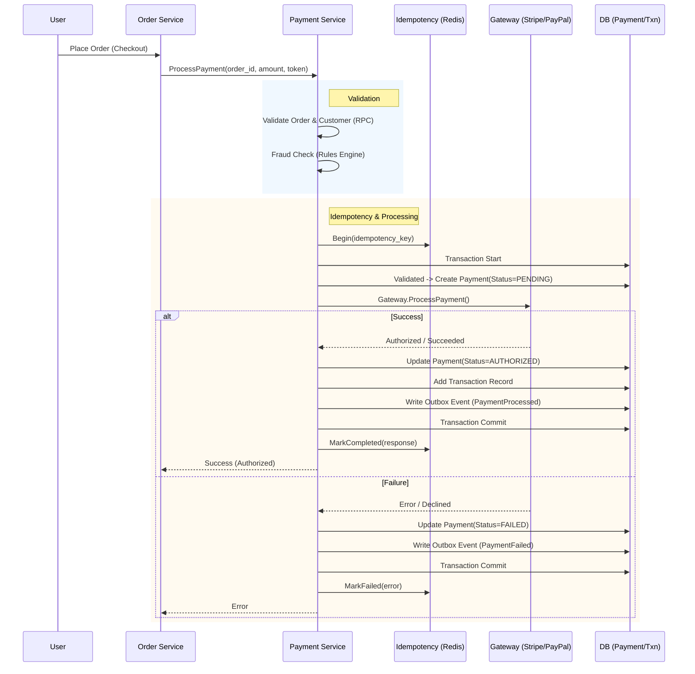

# Payment Flow

## 1. Overview
The **Payment Service** handles multiple payment methods, gateway integrations (Stripe, PayPal), and ensures transaction integrity via the **Outbox Pattern** and **Idempotency**.

## 2. Actors
- **User/Client**: Initiates payment via Web/Mobile App.
- **Order Service**: Orchestrates the checkout process and requests payment.
- **Payment Service**: Manages payment lifecycle, talks to gateways.
- **Payment Gateway**: External providers (Stripe, PayPal, VNPay, MoMo).
- **Background Worker**: Handles asynchronous events (webhooks, outbox events).

## 3. Core Process Flows

### 3.1. Payment Authorization (Checkout)
This flow occurs when the user clicks "Place Order".

### 3.2. Payment Capture (Post-Fulfillment)
This flow typically happens when the warehouse confirms shipment, or immediately if `AutoCapture` is enabled.

1. **Trigger**: `Fulfillment Service` (or Order Service) requests capture after shipping.
2. **Action**: `PaymentService.CapturePayment(payment_id, amount)`.
3. **Logic**:
    - Validate status is `AUTHORIZED`.
    - Call `Gateway.CapturePayment`.
    - Update status to `CAPTURED`.
    - Publish `PaymentCaptured` event.

### 3.3. Asynchronous Webhooks
Gateways send webhooks for status updates (e.g., async payment method success, refunds, chargebacks).

1. **Endpoint**: `POST /api/v1/webhooks/{provider}`
2. **Security**: Validate signature (Note: PayPal currently has partial validation).
3. **Processing**:
    - Identify Payment ID from payload.
    - Map gateway status to internal status.
    - Update `Payment` record.
    - Publish `PaymentStatusChanged` event via Outbox.

## 4. Key Mechanics

### 4.1. Idempotency (Redis)
- Prevents double-charging for the same request.
- **Keys**: `payment:idempotency:{scope}:{key}`
- **TTL**: 24 hours.
- **States**: `in_progress`, `completed` (returns cached response), `failed` (allows retry).

### 4.2. Transactional Outbox
- Ensures distributed data consistency.
- Events (`PaymentProcessed`, `PaymentFailed`) are written to `outbox` table in the same DB transaction as the Payment record update.
- **Worker** processes outbox table and publishes to Dapr PubSub.

### 4.3. Circuit Breaker
- Protects the system from cascading failures when Gateways are down.
- Implemented per-gateway using `Internal/Client/CircuitBreaker`.
- Wraps all external gateway calls.

## 5. State Machine

- **PENDING**: Initial state created in DB.
- **AUTHORIZED**: Funds reserved (Hold).
- **CAPTURED**: Funds transferred to merchant.
- **FAILED**: Gateway declined or error.
- **CANCELLED**: User cancelled or voided before capture.
- **REFUNDED**: Post-capture return.
- **REQUIRES_ACTION**: 3D Secure / Redirect flow needed.
