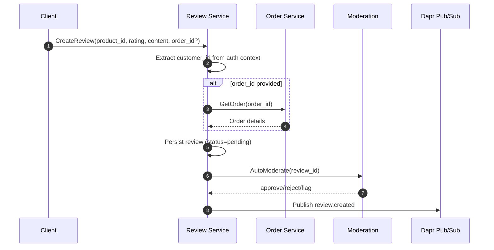

# Review Service Flow

**Last Updated**: 2026-01-19  
**Scope**: Review, Rating, Moderation, Helpful Votes, Reports (Review service)

This document describes the end-to-end review flow, from review creation through moderation, rating aggregation, and helpful voting. It also highlights integration points with Order/Catalog services and event publishing.

---

## Core Components

- **Review Service**: Review CRUD, rating aggregation, helpful votes, moderation reports.
- **Order Service**: Purchase verification for verified reviews.
- **Catalog Service**: Product existence (recommended check).
- **Pub/Sub (Dapr)**: Review + rating events (`review.created`, `review.updated`, `rating.updated`).

---

## 1) Create Review Flow

1. Client calls `CreateReview` with product, rating, content.
2. Service extracts `customer_id` from auth context if not provided.
3. If `order_id` provided, verify purchase and product in order.
4. Persist review with `pending` status.
5. (Optional) Auto-moderation updates status to `approved` / `rejected` / `flagged`.
6. Publish `review.created` event.

---

## 2) Moderation & Reports Flow

1. Users create reports for abusive reviews.
2. Moderation service lists pending reports.
3. Moderators approve/reject reviews and update status.
4. Publish `review.approved` or `review.rejected` events.

---

## 3) Helpful Vote Flow

1. Users vote helpful or not helpful on a review.
2. Store/update helpful vote and update counts.
3. Return new helpful counts to client.

---

## 4) Rating Aggregation Flow

1. Rating service recalculates aggregates for a product.
2. Publishes `rating.updated` event.
3. Downstream services (Catalog/Search) consume to update product rating display.

---

## 5) Read Paths

- `GetReview`: fetch single review by ID.
- `ListReviews`: filter by product/customer/status/ratings.
- `GetRating`: fetch aggregated rating per product.

---

## Issues Checklist

See [docs/workflow/checklists/review_issues.md](docs/workflow/checklists/review_issues.md) for current gaps and risks.
