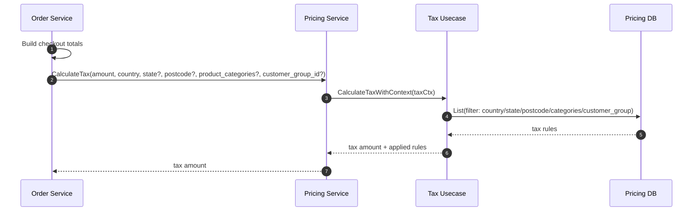

# Tax Calculation Flow

**Last Updated**: 2026-01-18
**Status**: Verified vs Code

## Overview

This document describes the current tax calculation flow, from the initiating service (`order`) to the processing service (`pricing`).

Tax is conceptually part of the **price finalization** pipeline, but the current implementation includes an explicit tax RPC call from Order → Pricing.

---

## Target Architecture (Recommended)

### Option A (Preferred): Tax included in `CalculatePrice`
- Order calls Pricing `CalculatePrice` for each line item with full context.
- Pricing computes base/dynamic/rules **and tax**.
- Order aggregates totals.

### Option B: Separate tax calculation with full context
- Order calls Pricing `CalculateTax` (RPC).
- Pricing internally uses `TaxUsecase.CalculateTaxWithContext`.
- Request should include: address (country/state/postcode), product categories, and customer group (if used by rules).

---

## Current Flow (Verified)

The tax calculation is triggered during the checkout totals calculation in the `order` service.

1.  **Initiator**: `order/internal/biz/checkout/calculations.go`
    - The `calculateTax` function is called.
2.  **API Call**: The function calls `uc.pricingService.CalculateTax(...)`.
3.  **Processing**: `pricing/internal/service/pricing.go`
    - Builds `tax.TaxCalculationContext` and calls `TaxUsecase.CalculateTaxWithContext`.
4.  **Rule Selection**: `pricing/internal/biz/tax/tax.go`
    - Uses a filter that supports postcode, categories, and customer group.

## Identified Gaps (P0/P1 - Correctness)

- **Order often sends incomplete context**
    - Checkout totals path currently passes `product_categories=[]` (TODO in code).
    - Order-edit totals path also lacks categories.
- **Order misuses `customer_group_id`**
    - Multiple call sites pass `customer_id` into the `customer_group_id` slot.
    - This can accidentally filter out valid tax rules and produce $0$ tax or wrong results.

## Recommendation

- **Short-term**: Do not pass `customer_id` as `customer_group_id`; pass `nil` until a real customer-group lookup exists.
- **Medium-term**: Populate `ProductCategories` in checkout and order-edit paths (store category IDs on cart/order items or resolve via Catalog).
- **Optional**: If tax must be computed per-line with different categories, prefer tax as part of `CalculatePrice` aggregation.

### Additional notes
- If tax rules depend on product category, using the deprecated API can lead to systematically wrong tax amounts.
- If postcode-level rules exist, `ListSimple` filtering by only country/state is not sufficient.

