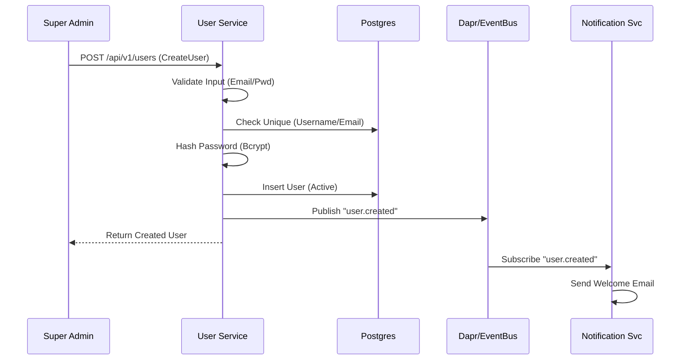
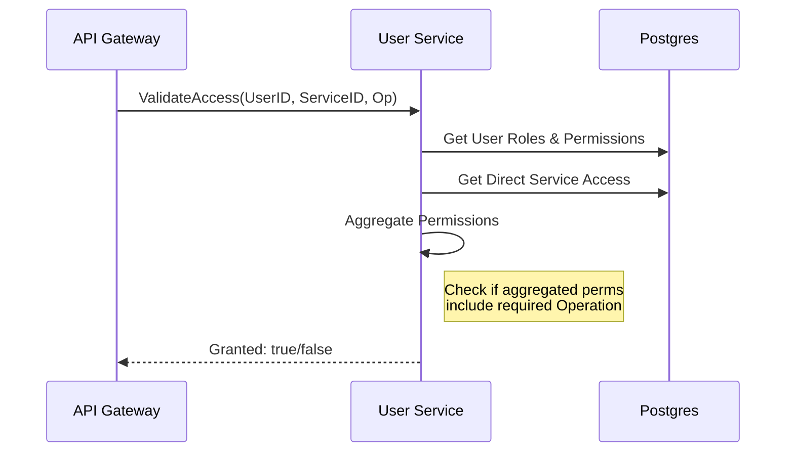

# User Management (Admin) & RBAC Flow

## Overview
The `user` service is responsible for managing internal administrator identities, roles, and permissions across the platform. It serves as the central authority for:
1.  **Identity Management**: Creating and managing admin user accounts.
2.  **RBAC (Role-Based Access Control)**: Assigning roles and permissions to users.
3.  **Service Access Control**: Validating if a user can access specific microservices or operations.
4.  **Authentication Support**: Validating credentials for the `auth` service.

## Core Workflows

### 1. Admin User Creation

This flow describes how a new administrator is onboarded.
1.  **Request**: Super Admin sends `CreateUserRequest` to `POST /api/v1/users`.
2.  **Validation**: `user` service validates email format, password strength (if provided), and ensures username/email uniqueness.
3.  **Persistence**:
    *   Hashes password (bcrypt).
    *   Stores user profile with `status=ACTIVE` (default).
    *   Assigns initial roles (optional).
4.  **Event**: Emits `user.created` event via Dapr (subscribed by `notification` service to send welcome email).

### 2. Role Assignment (RBAC)
This flow allows adding or removing roles from a user.
1.  **Assign**: `POST /api/v1/users/{id}/roles`
    *   Validates `user_id` and `role_id` exist.
    *   Adds mapping in `user_roles` table.
    *   Emits `user.role.assigned` event.
2.  **Revoke**: `DELETE /api/v1/users/{id}/roles/{role_id}`
    *   Removes mapping.
    *   Emits `user.role.revoked` event.

### 3. Service Access Validation (Internal)

Used by other services (via `gateway` or direct gRPC) to check permissions.
1.  **Request**: `ValidateAccess(user_id, service_id, operation)`
2.  **Logic**:
    *   Fetches user's Roles.
    *   Aggregates permissions from all roles.
    *   Checks if the accumulated permissions include the required `operation` for `service_id`.
    *   Also checks direct `ServiceAccess` grants (overrides/add-ons).
3.  **Response**: Returns `granted: true/false` and list of effective permissions.

### 4. Authentication Validation (Internal)
Used by the `auth` service during login.
1.  **Request**: `auth` service calls `ValidateUserCredentials(email, password)`.
2.  **Check**:
    *   Finds user by email.
    *   Compares password hash.
    *   Checks `status` (must be `ACTIVE`).
3.  **Result**: Returns valid user object and their roles/permissions for token generation.

### 5. Service-Specific Access Grant
Allows granular access control beyond roles (e.g., "User X can access `reporting` service").
1.  **Grant**: `POST /api/v1/users/{id}/service-access`
    *   Grants specific permissions for a single service ID.

## Data Structures

### User Status
- `ACTIVE`: Normal access.
- `INACTIVE`: Cannot login.
- `SUSPENDED`: Temporarily blocked (security risk).
- `DELETED`: Soft deleted.

### Role Scope
- `GLOBAL`: Applies platform-wide.
- `SERVICE_SPECIFIC`: Applies to single service.
- `READ_ONLY`: Restricted modification rights.

## Integration Points

| Service | Interaction | Method |
| :--- | :--- | :--- |
| **Auth** | Validates credentials during login | gRPC `ValidateUserCredentials` |
| **Gateway** | Enforces RBAC on protected endpoints | gRPC `ValidateAccess` |
| **Notification** | Sends welcome emails, password resets | Dapr Event `user.created`, `user.password_reset` |

## Security Considerations
- **Password Storage**: Bcrypt with unique salt.
- **Permission Caching**: User permissions are versioned (`permissions_version`) to allow effective cache invalidation at the Gateway/Auth layer.
- **Audit**: All role changes and access grants should be logged (partially implemented in domain logic).
